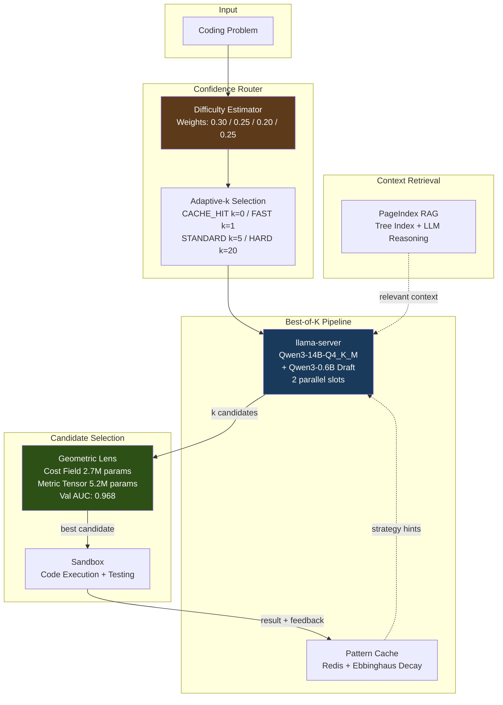

# ATLAS -- Adaptive Test-time Learning and Autonomous Specialization

ATLAS achieves 36-41% LiveCodeBench pass@1 with a frozen 14B model on a single consumer GPU through intelligent test-time compute allocation.

---

## V2 Results (Verified)

| Benchmark | Score | Tasks | Notes |
|-----------|-------|-------|-------|
| LiveCodeBench v5 | 36-41% pass@1 | 599 evals / ~600 problems | k=3, Geometric Lens selection, 4 epochs (100+200+200+99) |
| GPQA Diamond | 47.0% | 198 | k=5, multiple-choice knowledge reasoning |
| SciCode (sub-problems) | 14.7% | 341 | Cross-domain scientific coding |

**Lens learning curve (LiveCodeBench, k=3):**

| Epoch | Tasks | Pass Rate | First-Pick Accuracy | Energy Gap (pass vs fail) |
|-------|-------|-----------|---------------------|---------------------------|
| 0 (baseline, no Lens) | 100 | 36.0% | n/a | n/a |
| 1 (1st retrain) | 200 | 38.0% | 82.9% | 5.3 |
| 2 (2nd retrain) | 200 | 35.5% | 78.9% | 11.5 |
| 3 (3rd retrain) | 99 | 41.4% | 78.0% | 11.3 |

First-pick accuracy = how often the Lens's lowest-energy candidate actually passes. The energy gap between pass and fail candidates doubled after retraining (5.3 to 11.3), showing the Lens learned to separate passing from failing code. Val AUC reached 0.968 at epoch 3.

**Hardware:** RTX 5060 Ti 16GB VRAM. Total cost: ~$500 GPU.
**Runtime:** 109 tasks/hr aggregate throughput on V2 benchmark.
**Run ID:** `v2_run_20260217_125310`.

All results from a single benchmark run. Not averaged across multiple runs. Variance unknown. LCB "36-41%" reflects epoch 0 to epoch 3 of Geometric Lens retraining on 100-200 task batches, not a confidence interval.

## Architecture Overview



Full architecture details: [docs/architecture-diagram.md](docs/architecture-diagram.md) | [docs/ARCHITECTURE.md](docs/ARCHITECTURE.md)

### API Portal

The system includes an API Portal (`api-portal` service, port 3000, NodePort 30000) for multi-user access. It provides user registration and login with JWT authentication, API key management (`sk-llm-*` keys), and an OpenAI-compatible `/v1/models` endpoint. The `rag-api` validates API keys against the portal on every `/v1/*` request. A web UI is included for key management.

## The Geometric Lens

The Lens implements an ARM-EBM (Adaptive Riemannian Metric / Energy-Based Model) duality. A cost field C(x) maps code embeddings to a scalar energy: passing code concentrates near energy 5.00, failing code near 14.04 (training targets were 2.0/25.0; measured outputs converged to 5.00/14.04). A metric tensor G(x) defines a Riemannian geometry over embedding space, enabling gradient-based correction via the update rule dx = -alpha * G^{-1} * grad(C). The theoretical framing draws on Riemannian geometry and energy-based models; the implementation uses standard PyTorch autograd gradient descent.

In practice, the model generates k candidates, the Lens scores each one, and the sandbox tests them in energy order (lowest first), stopping at the first pass. **First-pick accuracy** measures how often the lowest-energy candidate is a passer: ~80% on LiveCodeBench after retraining, with an average of 1.3 sandbox calls per task. The Lens retrains on each epoch's pass/fail data — the energy gap between passing and failing code doubled from 5.3 to 11.3 over three retraining rounds, all without changing the frozen LLM weights.

## Quick Start

1. **Clone the repository**
   ```bash
   git clone https://github.com/itigges22/atlas.git && cd atlas
   ```

2. **Configure**
   ```bash
   cp atlas.conf.example atlas.conf
   # Edit atlas.conf: set MODEL_PATH, DATA_DIR, GPU device
   ```

3. **Install dependencies**
   ```bash
   sudo ./scripts/install.sh
   ```

4. **Verify installation**
   ```bash
   ./scripts/verify-install.sh
   ```

5. **Run the V2 benchmark**
   ```bash
   benchmark/run_v2_benchmark.sh
   ```

See [docs/SETUP.md](docs/SETUP.md) for full installation instructions.

## Hardware Requirements

| Resource | Minimum | Tested |
|----------|---------|--------|
| Python | 3.10+ | 3.11 |
| GPU VRAM | 16 GB | RTX 5060 Ti 16 GB |
| System RAM | 14 GB | 16 GB |
| Storage | ~20 GB | 150 GB SSD |
| OS | RHEL 9 / Ubuntu 24 | RHEL 9 (Proxmox VM) |

## Project Structure

```
api-portal/      -- API key management portal (JWT auth, web UI)
benchmark/       -- V2 benchmark suite (LCB, GPQA, SciCode, Custom, IFBench)
docs/            -- Architecture, setup, configuration, troubleshooting
manifests/       -- K3s deployment manifests
rag-api/         -- Core API: Geometric Lens, router, RAG, cache
llama-server/    -- llama.cpp server container
atlas/sandbox/   -- Isolated code execution environment
scripts/         -- Installation and management scripts
tests/           -- Test suite
```

## Known Issues (V2)

- Per-slot context is 20,480 tokens (40,960 / 2 parallel slots) — inherent to running 2 parallel slots for Best-of-K pipelining

## V3 Roadmap

V3 targets 70%+ LiveCodeBench through diversity-driven generation, adaptive compute allocation, and novel inference-time theory formation. The core thesis: a frozen model with the right selection and routing infrastructure can match models 10x its size.

## License

Licensed under the ATLAS Source Available License v1.0 -- see [LICENSE](LICENSE).
