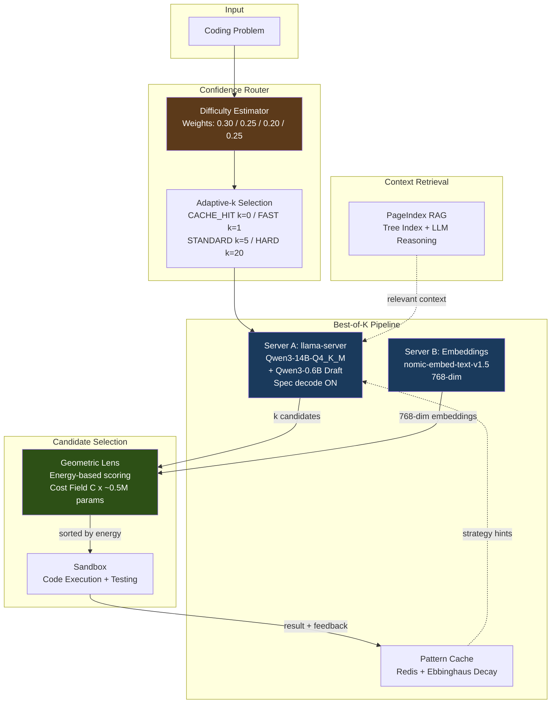

# A.T.L.A.S

**Adaptive Test-time Learning and Autonomous Specialization**

A.T.L.A.S achieves 36-41% LiveCodeBench pass@1 with a frozen 14B model on a single consumer GPU through intelligent test-time compute allocation. No fine-tuning, no API calls, no cloud -- just a $500 GPU and smart inference.

---

## Benchmark Results

> Run ID: `v2_run_20260217_125310` | Hardware: RTX 5060 Ti 16GB | Throughput: 109 tasks/hr

| Benchmark | Score | Tasks | Method |
|-----------|-------|-------|--------|
| **LiveCodeBench v5** | **36-41% pass@1** | 599 | k=3, Geometric Lens selection, 4 epochs |
| **GPQA Diamond** | **47.0%** | 198 | k=5, multiple-choice knowledge reasoning |
| **SciCode** | **14.7%** (sub-problems) | 341 | k=1, cross-domain scientific coding |

Single run, not averaged. LCB range reflects epoch 0-3 of Lens retraining, not a confidence interval.

<details>
<summary><b>Lens learning curve (LiveCodeBench, k=3)</b></summary>

| Epoch | Tasks | Pass Rate | First-Pick Accuracy | Energy Gap |
|-------|-------|-----------|---------------------|------------|
| 0 (baseline, no Lens) | 100 | 36.0% | n/a | n/a |
| 1 (1st retrain) | 200 | 38.0% | 82.9% | 5.3 |
| 2 (2nd retrain) | 200 | 35.5% | 78.9% | 11.5 |
| 3 (3rd retrain) | 99 | 41.4% | 78.0% | 11.3 |

First-pick accuracy = how often the Lens's lowest-energy candidate actually passes. The energy gap between pass and fail candidates doubled after retraining (5.3 to 11.3), showing the Lens learned to separate passing from failing code. Val AUC reached 0.968 at epoch 3.

**Caveat**: The V2.5 ablation study found that while C(x) learns real energy separation, this did not translate to statistically significant candidate selection improvement under 768-dim nomic embeddings (37.7% vs 37.1% random, within seed variance). Most tasks are all-pass or all-fail across k=3 candidates, so ordering has limited effect. The pass rate improvement across epochs is primarily driven by Best-of-K diversity, not Lens ranking.

> **V2.5.1 Investigation**: This result may be an artifact of switching from Qwen3-14B self-embeddings (5120-dim) to nomic-embed-text-v1.5 (768-dim) in V2.5, not a fundamental Lens failure. Self-embeddings encode the model's internal confidence; external embeddings encode only surface semantics. V2.5.1 will run a confirmation ablation with original self-embeddings to test this hypothesis. See [V2_5_ABLATION_STUDY.md](docs/V2_5_ABLATION_STUDY.md) for details.

</details>

<details>
<summary><b>V2.5 Ablation Study</b></summary>

A systematic ablation (2026-02-21) tested whether the Geometric Lens C(x) energy scoring provides real candidate selection value beyond diversity. **Result: Under 768-dim nomic embeddings, Lens scoring is statistically indistinguishable from random selection** -- energy-sorted candidates achieve 37.7% pass@1 vs 37.1% for random ordering (0.6pp gap within the 3.4pp seed-to-seed variance, mean 36.0% +/- 1.7% across 3 seeds). The Best-of-K diversity benefit (generating 3 candidates at temp=0.6) accounts for nearly all improvement.

> **⚠️ V2.5.1 INVESTIGATION — EMBEDDING SOURCE HYPOTHESIS**: This ablation was conducted after switching from Qwen3-14B self-embeddings (5120-dim) to nomic-embed-text-v1.5 (768-dim). Self-embeddings encode the model's internal confidence and reasoning state; nomic encodes only output text semantics. The Lens may have lost its discriminative signal when it lost access to the model's internal representation. V2.5.1 is a focused investigation milestone to test this hypothesis by re-running the ablation with original self-embeddings. This is the highest-priority open question in the project.

The study also discovered that llama.cpp's `--embeddings` flag was silently breaking speculative decoding (forcing n_batch=512, causing 0% draft token acceptance). This led to a two-server sidecar architecture: generation with spec decode (~100 tok/s) on the main server, embeddings via a lightweight nomic-embed-text-v1.5 sidecar (~300 MiB VRAM). C(x) energy does correlate with task difficulty (58.5% vs 18.9% pass rate across energy tiers) and will be repurposed for difficulty-adaptive routing (or candidate selection, pending V2.5.1 results).

Full results: [V2_5_ABLATION_STUDY.md](docs/V2_5_ABLATION_STUDY.md) | Architecture change: [V2_TO_V2_5_MIGRATION.md](docs/V2_TO_V2_5_MIGRATION.md)

</details>

---

## Architecture



A.T.L.A.S runs entirely on K3s with a single GPU. The **Confidence Router** estimates task difficulty from 4 signals and selects how many candidates to generate (k=0 to k=20). The **Best-of-K Pipeline** generates candidates via speculative decoding (~100 tok/s), scores them with the **Geometric Lens** energy field, and tests them in an isolated **Sandbox** with early exit on first pass. A **Pattern Cache** with Ebbinghaus memory decay stores successful strategies for future routing.

The system also includes an optional **MaaS layer** (API Portal + LLM Proxy) for multi-user access with JWT auth, API key management, and rate limiting.

Full architecture details: **[docs/ARCHITECTURE.md](docs/ARCHITECTURE.md)**

---

## The Geometric Lens

The Lens implements an ARM-EBM (Adaptive Riemannian Metric / Energy-Based Model) duality. A cost field C(x) maps code embeddings to scalar energy: passing code concentrates near energy 5.00, failing code near 14.04.

| | |
|---|---|
| **What it learns** | C(x) achieves strong energy separation between passing and failing code (Val AUC 0.968, energy gap doubling from 5.3 to 11.3 over 3 retraining epochs). Real learned structure, not an artifact. |
| **What it doesn't do (under nomic)** | Under 768-dim nomic embeddings, energy-sorted candidate selection is statistically indistinguishable from random ordering (37.7% vs 37.1%, within 3.4pp seed variance). **V2.5.1 is investigating** whether restoring Qwen3-14B self-embeddings (5120-dim) recovers discrimination — the embedding source switch is the leading hypothesis for this result. |
| **What it's good for** | C(x) energy correlates strongly with task difficulty (58.5% vs 18.9% pass rate across energy tiers). Currently used as a difficulty predictor for adaptive routing; may also serve as a candidate ranker if V2.5.1 confirms the embedding source hypothesis. |

G(x) metric tensor is currently dormant (loaded but unused by the benchmark pipeline).

---

## Quick Start

```bash
# 1. Clone
git clone https://github.com/itigges22/A.T.L.A.S.git && cd A.T.L.A.S

# 2. Configure
cp A.T.L.A.S.conf.example A.T.L.A.S.conf
# Edit A.T.L.A.S.conf: set MODEL_PATH, DATA_DIR, GPU device

# 3. Install
sudo ./scripts/install.sh

# 4. Verify
./scripts/verify-install.sh

# 5. Run benchmark
benchmark/run_v2_benchmark.sh
```

See **[docs/SETUP.md](docs/SETUP.md)** for full installation instructions.

---

## Hardware Requirements

| Resource | Minimum | Tested |
|----------|---------|--------|
| Python | 3.10+ | 3.11 |
| GPU VRAM | 16 GB | RTX 5060 Ti 16 GB |
| System RAM | 14 GB | 16 GB |
| Storage | ~20 GB | 150 GB SSD |
| OS | RHEL 9 / Ubuntu 24 | RHEL 9 (Proxmox VM) |

---

## Project Structure

```
api-portal/      API key management portal (JWT auth, web UI)
benchmark/       V2 benchmark suite (LCB, GPQA, SciCode, Custom, IFBench)
docs/            Architecture, setup, configuration, troubleshooting
manifests/       K3s deployment manifests
rag-api/         Core API: Geometric Lens, router, RAG, cache
llama-server/    llama.cpp server container
A.T.L.A.S/sandbox/   Isolated code execution environment
scripts/         Installation and management scripts
tests/           Test suite
```

---

## Documentation

| Document | Description |
|----------|-------------|
| **[ARCHITECTURE.md](docs/ARCHITECTURE.md)** | Full system architecture, component deep-dives, data flows |
| **[V2_5_ABLATION_STUDY.md](docs/V2_5_ABLATION_STUDY.md)** | Geometric Lens ablation results and analysis |
| **[V2_TO_V2_5_MIGRATION.md](docs/V2_TO_V2_5_MIGRATION.md)** | Two-server sidecar migration details |
| **[SETUP.md](docs/SETUP.md)** | Installation and deployment guide |
| **[CONFIGURATION.md](docs/CONFIGURATION.md)** | Configuration reference |
| **[API.md](docs/API.md)** | API endpoint documentation |
| **[TROUBLESHOOTING.md](docs/TROUBLESHOOTING.md)** | Common issues and solutions |

---

## Roadmap

### V2.5.1 — Embedding Source Hypothesis Investigation (blocking)

V2.5.1 is a focused investigation milestone to determine whether the V2.5 ablation finding (Lens ≈ random for candidate selection) is an artifact of switching embedding sources. **This is the highest-priority open question** and a blocking dependency for V3 Phase 4 strategy.

- **Confirmation ablation**: Re-run V2.5 ablation methodology with Qwen3-14B self-embeddings (5120-dim) to test whether discrimination recovers
- **Success criteria**: Selection accuracy exceeding random by ≥5pp on mixed-result tasks; spec decode ≥80 tok/s; VRAM ≤16 GiB
- **If confirmed**: Implement self-embedding restoration (hidden state extraction, post-generation embedding, or draft model embeddings) while maintaining spec decode throughput
- **If rejected**: Current V3 strategy stands — build multi-signal verifier from scratch

### V3 — Performance Target

V3 targets 70%+ LiveCodeBench through diversity-driven generation, adaptive compute allocation, and novel inference-time theory formation. The core thesis: a frozen model with the right selection and routing infrastructure can match models 10x its size. V3 Phase 4 strategy (build multi-signal verifier vs. validate restored Lens discrimination) depends on V2.5.1 results.

---

## License

Licensed under the A.T.L.A.S Source Available License v1.0 -- see [LICENSE](LICENSE).
