<div align="center">

# ATLAS

**Adaptive Test-time Learning and Autonomous Specialization**

[📚 Docs](docs/ARCHITECTURE.md) • [⚙️ Config](docs/CONFIGURATION.md) • [🔧 Setup](docs/SETUP.md)

[](LICENSE)
[](https://www.python.org/)
[](https://k3s.io/)
[](https://developer.nvidia.com/cuda-toolkit)
[](CONTRIBUTING.md)

</div>

Self-hosted AI coding agent infrastructure running entirely on consumer hardware. Demonstrates that sophisticated AI systems—RAG, test-time compute scaling, and continuous learning—can run on a single 16GB consumer GPU.

- **99.5% Success Rate** — Ralph Loop retry algorithm with temperature escalation
- **Full RAG Pipeline** — 100GB vector storage, semantic code search
- **Continuous Learning** — Nightly LoRA fine-tuning from successful completions
- **Consumer Hardware** — Single RTX 5060 Ti (16GB VRAM)

<p align="center">
  
</p>

<p align="center">
  <b>Host:</b> 4 vCPU • 12GB RAM • 200GB SSD • RHEL 9
</p>

---

## Architecture

```mermaid
%%{init: {'theme': 'base', 'themeVariables': { 'primaryColor': '#4A90D9', 'primaryTextColor': '#fff', 'primaryBorderColor': '#2E5A8B', 'lineColor': '#5C6BC0', 'secondaryColor': '#E8EAF6', 'tertiaryColor': '#fff'}}}%%
flowchart TB
    subgraph external[" "]
        client(["🖥️ Client<br/>OpenCode / API"])
    end
    subgraph gateway["Gateway"]
        proxy["LLM Proxy :8000<br/>Auth • Rate Limit"]
        portal["API Portal :3000<br/>Users • Keys"]
    end
    subgraph core["Core Services"]
        rag["RAG API :8001<br/>Orchestration"]
        llama["llama-server :8000<br/>Qwen3-14B • GPU"]
        embed["Embeddings :8080<br/>MiniLM-L6-v2"]
    end
    subgraph data["Storage"]
        qdrant[("Qdrant<br/>100GB Vectors")]
        redis[("Redis<br/>Queues • Metrics")]
    end
    subgraph atlas["Task Processing"]
        worker["Task Worker<br/>Ralph Loop<br/>99.5% Success"]
        sandbox["Sandbox :8020<br/>pytest • pylint"]
        dash["Dashboard :3001<br/>Monitoring"]
    end
    subgraph learn["Learning"]
        trainer["Nightly Trainer<br/>LoRA Fine-tune"]
        lora[("Adapters<br/>Hot-swap")]
    end
    client -->|"request"| proxy
    proxy -.->|"validate key"| portal
    proxy -->|"chat/completions"| rag
    rag -->|"inference"| llama
    rag -->|"embed query"| embed
    embed -->|"search vectors"| qdrant
    rag -->|"submit task"| redis
    redis -->|"poll result"| rag
    redis -->|"pull task"| worker
    worker -->|"test code"| sandbox
    worker -->|"generate code"| llama
    worker -->|"result + training"| redis
    redis -->|"metrics"| dash
    redis -.->|"training data"| trainer
    trainer -->|"fine-tune"| lora
    lora -.->|"load LoRA"| llama
    classDef gpu fill:#76B900,stroke:#4a7200,color:#fff
    classDef storage fill:#4A90D9,stroke:#2E5A8B,color:#fff
    classDef process fill:#E67E22,stroke:#a85a16,color:#fff
    classDef learn fill:#9B59B6,stroke:#6c3d80,color:#fff
    class llama,embed gpu
    class qdrant,redis storage
    class worker,sandbox process
    class trainer,lora learn
```

<div align="center">



</div>

<details>
<summary><b>Component Details</b></summary>

| Layer | Service | Port | Purpose |
|-------|---------|------|---------|
| **Gateway** | LLM Proxy | 8000 | Auth, rate limiting |
| | API Portal | 3000 | Users, API keys, usage |
| **Core** | RAG API | 8001 | Orchestration, chunking |
| | llama-server | 8000 | GPU inference (Qwen3-14B) |
| | Embeddings | 8080 | Vectorization (384 dims) |
| **Storage** | Qdrant | 6333 | Vector DB (HNSW) |
| | Redis | 6379 | Queues, metrics, cache |
| **Processing** | Task Worker | — | Ralph Loop engine |
| | Sandbox | 8020 | Isolated execution |
| | Dashboard | 3001 | Monitoring UI |
| **Learning** | Trainer | — | Nightly LoRA (2am) |

</details>

---

## Quick Start

```bash
git clone https://github.com/yourusername/atlas.git && cd atlas
cp atlas.conf.example atlas.conf && ./scripts/install.sh
kubectl get pods  # Verify all services running
```

> **Requirements:** K3s, NVIDIA GPU (16GB VRAM), 4+ vCPU, 12GB+ RAM, 200GB SSD, CUDA 12.8

---

## Key Algorithms

<details>
<summary><b>Ralph Loop — 99.5% Success via Test-Time Compute</b></summary>

```
P(success) = 1 - (1 - p)^k    →    p=0.65, k=5: 99.5%
```

| Attempt | Temp | Strategy |
|---------|------|----------|
| 1 | 0.3 | Conservative |
| 2 | 0.4 | Minor variation |
| 3 | 0.5 | Moderate creativity |
| 4 | 0.6 | Explore alternatives |
| 5 | 0.7 | Maximum creativity |

Each retry accumulates error context, guiding away from previous failures.

</details>

<details>
<summary><b>Continuous Learning — Nightly LoRA Fine-tuning</b></summary>

1. **Export** — Successful completions (rating ≥4) from Redis
2. **Train** — LoRA (r=8, α=16) on CPU
3. **Validate** — 66% pass rate required
4. **Deploy** — Hot-swap via symlink

</details>

---

## Benchmarks

*Coming soon* — Consumer vs enterprise hardware comparisons.

---

## Documentation

| | |
|---|---|
| [Architecture](docs/ARCHITECTURE.md) | System design, data flows, algorithms |
| [Configuration](docs/CONFIGURATION.md) | All options explained |
| [Setup](docs/SETUP.md) | Installation guide |
| [Troubleshooting](docs/TROUBLESHOOTING.md) | Common issues |

---

## Contributing

See [CONTRIBUTING.md](CONTRIBUTING.md) for guidelines.

---

<div align="center">

**Apache 2.0** — [LICENSE](LICENSE) — Copyright 2025 Isaac Tigges

</div>
