<div align="center">

# A.T.L.A.S

**Adaptive Test-time Learning and Autonomous Specialization**

[📚 Docs](docs/ARCHITECTURE.md) • [⚙️ Config](docs/CONFIGURATION.md) • [🔧 Setup](docs/SETUP.md)

[](LICENSE)
[](https://www.python.org/)
[](https://k3s.io/)
[](https://developer.nvidia.com/cuda-toolkit)
[](CONTRIBUTING.md)

</div>

Self-hosted AI coding agent infrastructure running entirely on consumer hardware. Demonstrates that sophisticated AI systems—RAG, test-time compute scaling, and continuous learning—can run on a single 16GB consumer GPU.

- **99.5% Success Rate** — Ralph Loop retry algorithm with temperature escalation
- **Full RAG Pipeline** — 100GB vector storage, semantic code search
- **Continuous Learning** — Nightly LoRA fine-tuning from successful completions
- **Consumer Hardware** — Single RTX 5060 Ti (16GB VRAM)

<p align="center">
  
</p>

<p align="center">
  <b>Host:</b> 4 vCPU (AMD RYZEN 5 2600) • 12GB DDR4 RAM • 150GB SSD • RHEL 9
</p>

---

## Architecture

```mermaid
%%{init: {'theme': 'base', 'themeVariables': { 'primaryColor': '#2196F3', 'primaryTextColor': '#212121', 'primaryBorderColor': '#1565C0', 'lineColor': '#455A64', 'secondaryColor': '#E3F2FD', 'tertiaryColor': '#ECEFF1', 'edgeLabelBackground': '#ECEFF1'}}}%%
flowchart TB
    subgraph external[" "]
        client(["Client<br/>OpenCode / API"])
    end
    subgraph gateway["Gateway"]
        proxy["LLM Proxy :8000<br/>Auth • Rate Limit"]
        portal["API Portal :3000<br/>Users • Keys"]
    end
    subgraph core["Core Services"]
        rag["RAG API :8001<br/>Orchestration"]
        embed["Embeddings :8080<br/>MiniLM-L6-v2"]
    end

    %% Central inference engine - outside subgraphs for central positioning
    llama["llama-server :8000<br/>Qwen3-14B • GPU"]

    subgraph data["Storage"]
        qdrant[("Qdrant<br/>100GB Vectors")]
        redis[("Redis<br/>Queues • Metrics")]
    end
    subgraph atlas["Task Processing"]
        worker["Task Worker<br/>Ralph Loop<br/>99.5% Success"]
        sandbox["Sandbox :8020<br/>pytest • pylint"]
        dash["Dashboard :3001<br/>Monitoring"]
    end
    subgraph learn["Learning"]
        trainer["Nightly Trainer<br/>LoRA Fine-tune"]
        lora[("Adapters<br/>Hot-swap")]
    end
    %% Gateway flow
    client -->|"request"| proxy
    proxy -.->|"validate key"| portal
    proxy -->|"chat/completions"| rag

    %% RAG API calls llama-server for inference
    rag -->|"inference"| llama
    rag -->|"embed query"| embed
    embed -->|"search vectors"| qdrant

    %% Task submission to Redis
    rag -->|"submit task"| redis
    redis -->|"poll result"| rag

    %% Ralph Loop: Task Worker flow
    redis -->|"pull task"| worker
    worker -->|"generate code"| llama
    worker -->|"test code"| sandbox
    worker -->|"result + training"| redis

    %% Monitoring
    redis -->|"metrics"| dash

    %% Learning pipeline
    redis -.->|"training data"| trainer
    trainer -->|"fine-tune"| lora
    lora -.->|"load LoRA"| llama
    classDef client fill:#37474F,stroke:#263238,color:#fff
    classDef gateway fill:#607D8B,stroke:#455A64,color:#fff
    classDef core fill:#2196F3,stroke:#1565C0,color:#fff
    classDef gpu fill:#4CAF50,stroke:#2E7D32,color:#fff
    classDef storage fill:#00BCD4,stroke:#00838F,color:#fff
    classDef process fill:#FF9800,stroke:#E65100,color:#fff
    classDef learn fill:#9C27B0,stroke:#6A1B9A,color:#fff
    class client client
    class proxy,portal gateway
    class rag core
    class llama,embed gpu
    class qdrant,redis storage
    class worker,sandbox,dash process
    class trainer,lora learn
```

<div align="center">



</div>

<details>
<summary><b>Component Details</b></summary>

| Layer | Service | Port | Purpose |
|-------|---------|------|---------|
| **Gateway** | LLM Proxy | 8000 | Auth, rate limiting |
| | API Portal | 3000 | Users, API keys, usage |
| **Core** | RAG API | 8001 | Orchestration, chunking |
| | llama-server | 8000 | GPU inference (Qwen3-14B) |
| | Embeddings | 8080 | Vectorization (384 dims) |
| **Storage** | Qdrant | 6333 | Vector DB (HNSW) |
| | Redis | 6379 | Queues, metrics, cache |
| **Processing** | Task Worker | — | Ralph Loop engine |
| | Sandbox | 8020 | Isolated execution |
| | Dashboard | 3001 | Monitoring UI |
| **Learning** | Trainer | — | Nightly LoRA (2am) |

</details>

---

## Quick Start

```bash
git clone https://github.com/itigges22/atlas.git && cd atlas
cp atlas.conf.example atlas.conf && ./scripts/install.sh
kubectl get pods  # Verify all services running
```

> **Requirements:** K3s, NVIDIA GPU (8GB+ VRAM), 4+ vCPU, 12GB+ RAM, 50GB+ SSD

---

## Recommended Client

ATLAS exposes an **OpenAI-compatible API**, so it works with any client that supports the OpenAI protocol.

**Recommended:** [OpenCode Fork](https://github.com/itigges22/opencode) — A terminal-based AI coding agent based on Opencode, forked and optimized for ATLAS.

```bash
git clone https://github.com/itigges22/opencode.git && cd opencode
bun install
bun run dev
```

**Alternatives:** [Cursor](https://cursor.sh), [Continue](https://continue.dev), [aider](https://aider.chat), or any OpenAI-compatible client.

---

## Key Algorithms

<details>
<summary><b>Ralph Loop — 99.5% Success via Test-Time Compute</b></summary>

```
P(success) = 1 - (1 - p)^k    →    p=0.65, k=5: 99.5%
```

| Attempt | Temp | Strategy |
|---------|------|----------|
| 1 | 0.3 | Conservative |
| 2 | 0.4 | Minor variation |
| 3 | 0.5 | Moderate creativity |
| 4 | 0.6 | Explore alternatives |
| 5 | 0.7 | Maximum creativity |

Each retry accumulates error context, guiding away from previous failures.

</details>

<details>
<summary><b>Continuous Learning — Nightly LoRA Fine-tuning</b></summary>

1. **Export** — Successful completions (rating ≥4) from Redis
2. **Train** — LoRA (r=8, α=16) on CPU
3. **Validate** — 66% pass rate required
4. **Deploy** — Hot-swap via symlink

</details>

---

## V1 Benchmark Results

**Run:** 12h 9m, zero crashes, zero retries. Qwen3-14B-Q4_K_M on RTX 5060 Ti (11W draw).

### Pass@1

| Benchmark | pass@1 | Qwen3-14B Baseline | Δ |
|-----------|--------|-------------------|---|
| HumanEval | 99.4% | 67.0% | +32.4% |
| MBPP* | 55.4% | 72.0% | -16.6% |
| Custom | 66.0% | N/A | — |

_*V1 MBPP used zero-shot prompt; baseline is 3-shot. See note below._

### Pass@20 (averaged across 3 runs)

| Benchmark | pass@1 | pass@5 | pass@20 |
|-----------|--------|--------|---------|
| HumanEval | 99.8% | 100% | 100% |
| Custom | 77.4% | 85.9% | 90.3% |

<div align="center">

_Top: pass@1 vs baseline (left) and pass@k curves across benchmarks (right)._
_Bottom: cost comparison (left) and custom benchmark pass@k runs (right)._

| Pass@1 Comparison | Pass@k Curves |
|---|---|
|  |  |
| Cost Comparison | Custom Pass@k Runs |
|  |  |

</div>

**Performance:** 1,600–2,400 tasks/hr throughput, <2s median time-to-solution, 67–82x cheaper than Claude Sonnet/GPT-4o, $0.000025–$0.001 per successful task, ~0.55 kWh total energy (~$0.07).

> **Note:** HumanEval results likely reflect training data contamination in Qwen3-14B. MBPP scored 55.4% using a non-standard zero-shot prompt (published baseline of 73.4% uses 3-shot). V2 fixes the MBPP prompt to canonical 3-shot format and adds unsaturated benchmarks (LiveCodeBench, SciCode, EvalPlus variants).

[Full benchmark report](benchmark/benchmark_report_20260204_140715.md)

---

## V2 Roadmap

V2 focuses on two fronts: rigorous benchmarking on unsaturated evaluations, and intelligent reasoning/routing to replace blind retries with informed decisions.

### Benchmark Suite (Implemented)

V1 benchmarks revealed two problems: HumanEval is saturated (99.4% likely reflects training contamination) and MBPP used a non-standard zero-shot prompt (55.4% vs 73.4% published 3-shot baseline). V2 expands from 3 benchmarks to 7 and fixes the MBPP prompt format.

| Benchmark | Tasks | Type | Status |
|-----------|-------|------|--------|
| HumanEval | 164 | Function completion | Kept from V1 |
| MBPP (3-shot) | 500 | Function completion | Fixed prompt format |
| HumanEval+ (EvalPlus) | 164 | 80x more tests | New |
| MBPP+ (EvalPlus) | 378 | Augmented tests, 3-shot | New |
| LiveCodeBench | ~880 | Competitive programming (stdin/stdout) | New — primary |
| SciCode | ~338 | Scientific computing sub-steps | New |
| Custom | 50 | Domain-specific | Kept from V1 |

### Architecture

| Component | Purpose |
|-----------|---------|
| Geometric Lens | Lyapunov cost field over embedding space — makes bug-prone code paths geometrically expensive before generation |
| PageIndex RAG | AST-aware tree-structured retrieval replacing Qdrant flat vector search |
| Pattern Cache | Explicit success/failure memory with Ebbinghaus decay for temporal relevance |
| SVM Classifier | Lightweight routing classifier consuming signals from all V2 components |
| Confidence Router | Orchestration layer that intelligently allocates retry budgets based on task difficulty |

---

## Documentation

| | |
|---|---|
| [Architecture](docs/ARCHITECTURE.md) | System design, data flows, algorithms |
| [Configuration](docs/CONFIGURATION.md) | All options explained |
| [Setup](docs/SETUP.md) | Installation guide |
| [Troubleshooting](docs/TROUBLESHOOTING.md) | Common issues |

---

## Contributing

See [CONTRIBUTING.md](CONTRIBUTING.md) for guidelines.

---

<div align="center">

**Apache 2.0** — [LICENSE](LICENSE) — Copyright 2025 Isaac Tigges

</div>
