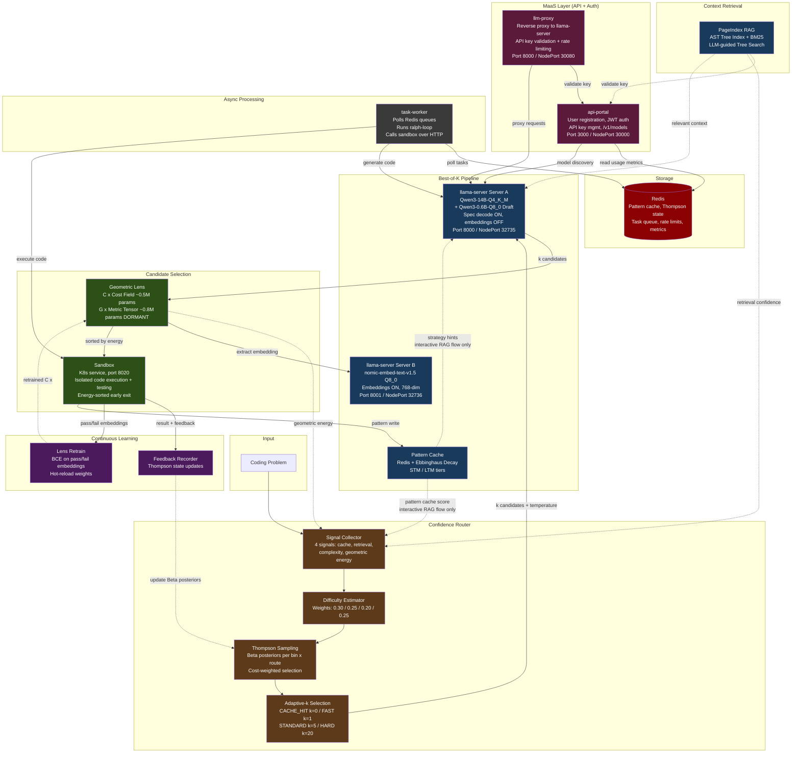
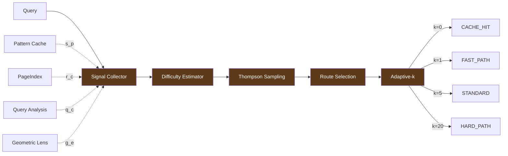
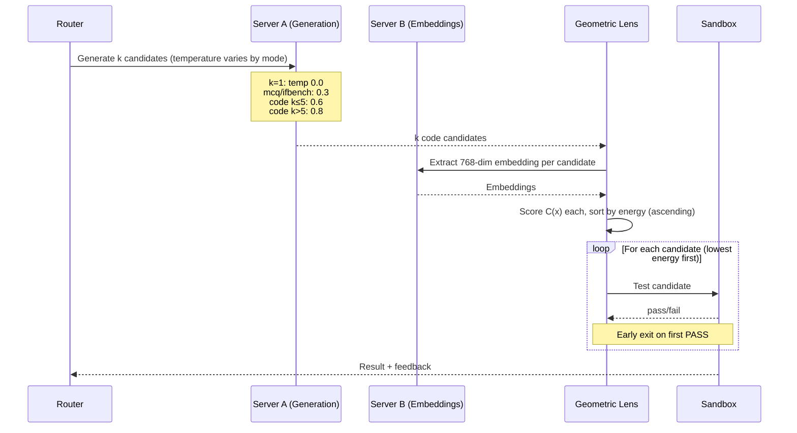

# ATLAS Architecture

Detailed architecture companion to the README. Describes the system as currently deployed (V2.5).

---

## 1. System Overview

ATLAS is a self-hosted benchmark infrastructure for evaluating LLM code generation. It runs a local Qwen3-14B model on consumer hardware (single 16GB GPU) under K3s, combining retrieval-augmented generation, energy-based verification, and adaptive routing to maximize pass rates within a fixed VRAM budget.

### System Diagram



### Color Legend

| Color | Meaning |
|-------|---------|
| Dark green | Evaluation (Lens + Sandbox) |
| Dark blue | Generation and retrieval (llama-server, PageIndex, Pattern Cache) |
| Dark brown | Routing (Signal Collector, Difficulty Estimator, Thompson, Adaptive-k) |
| Dark purple | Feedback and learning (Feedback Recorder, Lens Retrain) |
| Dark rose | MaaS layer (API Portal, LLM Proxy) |
| Dark grey | Async workers (Task Worker) |
| Dark red | Storage (Redis) |

### Service Summary

| Layer           | Service                | K8s Service Name       | Port                   | Technology              | Purpose                                                                 |
|-----------------|------------------------|------------------------|------------------------|-------------------------|-------------------------------------------------------------------------|
| **MaaS**        | api-portal             | api-portal             | 3000 (NodePort 30000)  | FastAPI                 | User registration/login (JWT), API key mgmt (sk-llm-*), /v1/models      |
|                 | llm-proxy              | llm-proxy              | 8000 (NodePort 30080)  | FastAPI                 | Reverse proxy to llama-server with API key validation + rate limiting    |
| **Core**        | rag-api                | rag-api                | 8001 (NodePort 31144)  | FastAPI                 | Orchestration: routing, RAG, cache, lens, key validation via api-portal  |
|                 | llama-server (Server A)| llama-service          | 8000 (NodePort 32735)  | llama.cpp + CUDA        | GPU inference (Qwen3-14B + 0.6B draft, spec decode ON, embeddings OFF)  |
|                 | llama-embed (Server B) | llama-embed-service    | 8001 (NodePort 32736)  | llama.cpp + CUDA        | Embedding sidecar (nomic-embed-text-v1.5, 768-dim, embeddings ON)       |
| **Execution**   | sandbox                | sandbox                | 8020 (NodePort 30820)  | K8s service             | Isolated code execution and testing (HTTP API)                           |
|                 | task-worker            | task-worker             | 8080 (ClusterIP)       | Python                  | Async task processor: polls Redis queues, runs ralph-loop, calls sandbox |
| **Storage**     | Redis                  | redis                  | 6379                   | Redis                   | Pattern cache, Thompson state, task queue, rate limits, usage metrics    |
| **Intelligence**| Confidence Router      | (in rag-api)           | --                     | Thompson Sampling       | 4-signal difficulty estimation, adaptive-k                               |
|                 | Geometric Lens         | (in rag-api)           | --                     | PyTorch (CPU)           | Energy-based candidate scoring, ~1.3M params                            |
|                 | Pattern Cache          | (in rag-api)           | --                     | Redis-backed            | Ebbinghaus-decay STM/LTM pattern memory                                  |
|                 | PageIndex              | (in rag-api)           | --                     | tree-sitter + BM25      | AST-aware code retrieval with LLM tree search                            |
| **Dashboard**   | atlas-dashboard        | atlas-dashboard        | 3001 (NodePort 30001)  | Web UI                  | Monitoring dashboard (queue stats, daily metrics, weekly trend)          |
| **Training**    | atlas-nightly-training | (CronJob, suspended)   | --                     | CronJob, suspended       | LoRA fine-tuning (V1 artifact, suspended -- V2 uses frozen model)        |

### K3s Pods

| Pod | Purpose |
|-----|---------|
| llama-server | GPU inference (Qwen3-14B) + embedding sidecar (nomic-embed-text-v1.5) |
| rag-api | Orchestration, routing, PageIndex, Geometric Lens |
| redis | Pattern Cache, Thompson Sampling state, AOF persistence |
| sandbox | Isolated code execution and test validation |
| api-portal | User authentication, API key management, JWT issuance |
| llm-proxy | Rate-limited OpenAI-compatible proxy in front of llama-server |
| task-worker | Async task execution with Ralph Loop retry logic |
| dashboard | Monitoring UI (queue stats, daily metrics, weekly trend) |
| atlas-nightly-training | CronJob for nightly LoRA fine-tuning (runs if ATLAS_ENABLE_TRAINING=true) |

### NodePorts

| Service | NodePort |
|---------|----------|
| llama-server | 32735 |
| llama-embed-service | 32736 |
| rag-api | 31144 |
| api-portal | 30000 |
| llm-proxy | 30080 |
| sandbox | 30820 |
| dashboard | 30001 |

---

## 2. Data Flows

### Routing Decision (interactive RAG flow)



### Best-of-K Pipeline



Note: In benchmark mode, best-of-k calls llama-server directly (`_call_llm`). Pattern Cache strategy hints and `pattern_cache_score` are only used in the interactive RAG flow, not the benchmark pipeline.

### MaaS Authentication

External users authenticate via API keys through `llm-proxy`, which validates against `api-portal`. Internal services (rag-api, task-worker) call llama-server directly, bypassing `llm-proxy` (no auth needed).

### Task Worker (production async flow)

User request via api-portal → task queued in Redis → task-worker polls and picks up task → (optional) retrieve RAG context from rag-api → generate code via llama-server (direct, bypasses llm-proxy auth) → execute + test via sandbox service → store result in Redis, publish completion.

### Continuous Learning

Sandbox results (pass/fail + code embeddings) feed into: Lens Retrain (BCE loss, epoch-based) → hot-reload C(x) weights into rag-api. Thompson Sampling feedback updates Beta posteriors. Pattern Cache extracts and stores successful patterns.

---

## 3. Components

### 3.1 llama-server (Inference Engine)

GPU-accelerated LLM inference via llama.cpp, serving OpenAI-compatible API endpoints.

**Models**:

| Model | Format | Size |
|-------|--------|------|
| Qwen3-14B-Q4_K_M | GGUF (4.87 BPW) | 8.38 GiB |
| Qwen3-0.6B-Q8_0 (draft) | GGUF | 610 MiB |

Speculative decoding is active with ~80% token acceptance rate. Throughput: ~100 tok/s.

Embeddings are served by a dedicated sidecar (nomic-embed-text-v1.5, port 8001) instead of the main model. The `--embeddings` flag was removed from Server A because it forces `n_batch=512`, breaking speculative decoding. See [V2_TO_V2_5_MIGRATION.md](V2_TO_V2_5_MIGRATION.md) for the migration rationale.

**Verified Flag List** (Server A -- generation):

```
--ctx-size 16384          # 2 parallel slots
--parallel 2
--cont-batching
--flash-attn
--no-mmap
--cache-type-k q4_0
--cache-type-v q4_0
--draft-max 16
--draft-min 1
--ngl 99
--mlock
```

**VRAM Budget**: ~12,720 / 16,311 MiB (78%). See Section 5 for breakdown.

**Throughput**: 109 tasks/hr (V2 benchmark aggregate across all datasets).

**Deployment Notes**:
- Strategy: Recreate (single GPU, cannot run 2 pods simultaneously).
- Entrypoint managed via ConfigMap `llama-entrypoint` to avoid full image rebuilds (llama.cpp compiles from source, pins all CPU/RAM during build).
- Model files mounted from the host path configured in `manifests/llama-deployment.yaml` (default: `/opt/atlas/models/`).
- First request after model load is slow (cold KV cache); warm up before benchmarking.
- Qwen3-14B thinking mode: at temperature=0, model uses `<think>` tags consuming 8000+ tokens. Must set max_tokens >= 16384 or use `/nothink`.

### 3.2 Geometric Lens (Energy-Based Verifier)

An energy-based model that scores code generation candidates, enabling the best-of-K selection pipeline to pick the most likely correct candidate before running expensive sandbox tests.

**Theoretical Foundation**: ARM-EBM duality (Blondel et al., 2025). The cost field C(x) maps embedding-space points to scalar energy values, where low energy correlates with correct solutions and high energy with incorrect ones.

**Architecture**:

C(x) Cost Field (~0.5M params at 768-dim input):
```
Linear(768 -> 512) + SiLU
Linear(512 -> 128) + SiLU
Linear(128 -> 1)   + Softplus
```

G(x) Metric Tensor (~0.8M params at 768-dim input, **dormant** -- see note below):
```
Linear(768 -> 512) + SiLU
Linear(512 -> 768) + Softplus
```

Input dimension adapts automatically on retrain (768 for nomic-embed-text-v1.5; was 5120 for Qwen3-14B in V2).

**Core Equation**:
```
delta_x = -alpha * G(x)^{-1} * grad_C(x)
```

The correction vector delta_x indicates the direction in embedding space that would reduce energy, providing a geometric interpretation of what the model "should have generated."

**Training**: Contrastive ranking loss on real benchmark pass/fail data. Self-supervised -- no human labels required beyond the sandbox's binary pass/fail signal.

**Performance** (V2 benchmark run, contextualized by V2.5 ablation):

| Metric | Value | Note |
|--------|-------|------|
| Validation AUC | 0.968 (Epoch 3) | C(x) learns real energy separation |
| PASS energy (mean) | 5.00 | |
| FAIL energy (mean) | 14.04 | |
| Energy separation | 9.04 | Doubled over 3 retraining epochs (5.3 → 11.3) |
| Selection vs random | +0.6pp (37.7% vs 37.1%) | **Not significant under nomic embeddings** (within 3.4pp seed variance); V2.5.1 investigating self-embedding restoration |
| Difficulty prediction | 58.5% vs 18.9% pass rate | Energy tiers correlate with task difficulty |
| Latency | ~75ms per evaluation | |

The V2.5 ablation study ([V2_5_ABLATION_STUDY.md](V2_5_ABLATION_STUDY.md)) found that while C(x) learns meaningful energy separation between passing and failing code, this did not translate into significant candidate selection improvement under 768-dim nomic embeddings. Energy-sorted selection was statistically indistinguishable from random ordering because most tasks are all-pass or all-fail across candidates (92% have full diversity). The energy signal's validated use is as a **difficulty predictor** for adaptive routing.

> **⚠️ V2.5.1 INVESTIGATION — EMBEDDING SOURCE HYPOTHESIS**
>
> The V2.5 ablation finding that C(x) energy scoring ≈ random for candidate selection may be an artifact of switching from Qwen3-14B self-embeddings (5120-dim) to nomic-embed-text-v1.5 (768-dim) in the V2→V2.5 migration, NOT a fundamental failure of the Geometric Lens architecture.
>
> Self-embeddings encode the model's internal confidence and reasoning state; external semantic embeddings encode only what the output text says. The Lens may have lost its discriminative signal when it lost access to the model's internal representation. This perfectly explains the observed results: energy predicts difficulty (semantically distinct problems) but not candidate quality (semantically near-identical solutions).
>
> **V2.5.1 will run a confirmation ablation** using original V2 self-embeddings to test this hypothesis. If confirmed, a solution restoring self-embeddings without breaking spec decode will be implemented before V3 proceeds. This is the highest-priority open question in the project.

**G(x) Status**: The metric tensor is functionally dormant. It is loaded but its correction output is never consumed by the benchmark. See the ablation study for V3 options (activate, remove, or defer).

**Weights**: `rag-api/geometric_lens/models/cost_field.pt`, `metric_tensor.pt`. Baked into the container image. PyTorch CPU only (torch 2.10.0+cpu).

**Embedding Source**: Currently uses dedicated nomic-embed-text-v1.5 sidecar (768-dim). The Lens MLP input layer adapts automatically on retrain to match the embedding source dimension. **V2.5.1 may change the embedding source** back to self-embeddings (possibly via draft model extraction at 1024-dim, hidden state capture at 5120-dim, or post-generation self-embedding), with corresponding MLP dimension changes. See [V2_5_ABLATION_STUDY.md](V2_5_ABLATION_STUDY.md) for details.

**Environment**: `GEOMETRIC_LENS_ENABLED` env var. Models loaded lazily on first use.

### 3.3 Confidence Router

Adaptive per-task routing that decides how many candidates (k) to generate based on estimated problem difficulty. Uses Thompson Sampling (Bayesian bandit) with Redis-backed Beta(alpha, beta) posteriors, updated with real outcomes.

**4 Input Signals**:

| Signal | Source | Range | Description |
|--------|--------|-------|-------------|
| pattern_cache_score (s_p) | Pattern Cache | 0.0--1.0 | Cache hit confidence |
| retrieval_confidence (r_c) | PageIndex | 0.0--1.0 | Retrieval quality score |
| query_complexity (q_c) | Query analysis | 0.0--1.0 | Estimated difficulty |
| geometric_energy (g_e) | Geometric Lens | 0.0--1.0 (normalized) | Cost field energy |

**Difficulty Fusion**:
```
D(x) = 0.30 * (1 - s_p) + 0.25 * (1 - r_c) + 0.20 * q_c + 0.25 * g_e
```

**Thompson Sampling**: Beta(alpha, beta) parameters maintained per (difficulty_bin, route) pair in Redis. On each task, the router samples from each route's Beta distribution and selects the route with the highest sampled value. Outcomes (pass/fail) update the winning route's parameters.

**Routes**:

| Route | k (candidates) | When Selected |
|-------|----------------|---------------|
| CACHE_HIT | 0 | High cache confidence, known pattern |
| FAST_PATH | 1 | Low difficulty, single attempt sufficient |
| STANDARD | 5 | Medium difficulty, moderate exploration |
| HARD_PATH | 20 | High difficulty, extensive exploration |

**Environment**: `ROUTING_ENABLED` env var. When disabled (Mode B), all tasks use STANDARD route (k=5).

**Location**: `rag-api/router/` -- signal_collector, difficulty_estimator, route_selector, feedback_recorder, fallback_chain.

### 3.4 Best-of-K Selection Pipeline

The selection pipeline generates k candidates in parallel, scores them with the Geometric Lens, and tests them in the sandbox in energy-sorted order with early exit on first pass.

**Generation**:
- ThreadPoolExecutor with max_workers=2.
- 100ms stagger between candidate submissions to avoid llama-server slot contention.
- cache_prompt=True for KV cache reuse across candidates sharing the same prefix.

**Seed Determinism**: Each candidate i uses seed = index * 42 + 1, ensuring reproducibility.

**Temperature Schedule**:

| Condition | Temperature |
|-----------|-------------|
| k <= 1 (single attempt) | 0.0 |
| MCQ or IFBench | 0.3 |
| k <= 5 (code tasks) | 0.6 |
| k > 5 (code tasks) | 0.8 |

**Selection Process**:
1. Generate k candidates via llama-server `/completion` (raw ChatML, not `/v1/chat/completions` -- chat endpoint is incompatible with speculative decoding).
2. Extract code from each response.
3. Score each candidate via `/internal/lens/score-text` (Geometric Lens energy).
4. Sort candidates by energy (ascending -- lowest energy first).
5. Run sandbox tests in sorted order.
6. Early exit: return the first candidate that passes all tests.

### 3.5 PageIndex RAG

Replaced V1's Qdrant vector database with AST-aware retrieval.

**Indexing Pipeline**:
1. **AST Parsing** (`indexer/ast_parser.py`): tree-sitter + tree-sitter-python parses source into syntax trees.
2. **Tree Building** (`indexer/tree_builder.py`): Hierarchical TreeIndex -- modules, classes, functions.
3. **BM25 Indexing** (`indexer/bm25_index.py`): Term-frequency index over node content.
4. **Summarization** (`indexer/summarizer.py`): LLM-generated summaries for tree nodes.
5. **Persistence** (`indexer/persistence.py`): JSON to `/data/projects/{project_id}/tree_index.json` + `bm25_index.json`.

**Retrieval Strategies**:

| Strategy | Module | Description |
|----------|--------|-------------|
| Tree Search | `retriever/tree_search.py` | LLM-guided traversal of AST tree |
| BM25 Search | `retriever/bm25_search.py` | Token-based keyword matching |
| Hybrid | `retriever/hybrid_router.py` | Combines tree + BM25, deduplicates |

**Caching**: Lazy in-memory cache in `rag.py` (`_pageindex_cache`), invalidated on project sync.

**Provides**: `retrieval_confidence` signal to the Confidence Router.

### 3.6 Pattern Cache (Redis)

Stores problem-to-strategy patterns for cache routing, implementing Ebbinghaus memory decay.

**Tiers**:

| Tier | TTL | Purpose |
|------|-----|---------|
| STM (Short-Term Memory) | 1 hour | Recent query-result pairs |
| LTM (Long-Term Memory) | 7 days | Frequently reinforced patterns |

Patterns accessed frequently are promoted from STM to LTM. Unused patterns decay naturally via TTL expiration.

Also serves as the backend for Thompson Sampling router state (Beta distribution parameters per route).

### 3.7 Sandbox

Isolated code execution environment providing ground-truth pass/fail signals. This is the objective verification layer -- the model cannot corrupt this signal.

**Execution Modes**:

| Mode | Field | Description |
|------|-------|-------------|
| function | test_code | Python test assertions run against generated function |
| stdio | test_inputs / test_outputs | Input piped to stdin, output compared to expected |
| mcq | N/A | Multiple-choice answer extraction and comparison |
| ifbench | N/A | Instruction-following constraint evaluation |

---

## 4. V2 Benchmark Results

Run ID: `v2_run_20260217_125310`
Hardware: RTX 5060 Ti 16GB VRAM
Throughput: 109 tasks/hr aggregate

All results from a single benchmark run. Not averaged across multiple runs; variance unknown.

### Benchmark Scores

| Benchmark | Tasks | pass@1 | Conditions |
|-----------|-------|--------|------------|
| LiveCodeBench v5 | 599 | 36--41% | k=3, Geometric Lens selection |
| GPQA Diamond | 198 | 47.0% | k=5, MCQ format |
| IFBench | 300 | excluded | k=5, instruction following (see note) |
| Custom | 100 | 53--55% | k=1, real-world tasks |
| SciCode | 341 | 14.7% sub-problems | k=1, scientific computing |

### Geometric Lens Verification

| Metric | Value |
|--------|-------|
| Validation AUC | 0.968 (Epoch 3) |
| First-pick accuracy | ~80% (151/188 lowest-energy candidate passed) |
| Avg sandbox calls | 1.30 per task (energy-sorted early exit) |
| PASS energy (mean) | 5.00 |
| FAIL energy (mean) | 14.04 |
| Energy separation | 9.04 |

### Dataset Notes

- **LiveCodeBench**: Source mirror bzantium/livecodebench (primary livecodebench/code_generation_lite returns 404). 599 tasks, stdio evaluation, AA prompt format.
- **GPQA Diamond**: Gated on HuggingFace; sourced from openaipublic.blob.core.windows.net CSV. 198 multiple-choice questions.
- **IFBench**: IFBench evaluation is incomplete -- evaluate_ifbench_loose() defaults to True for ~11/15 instruction categories. The 100% score in benchmark results reflects broken evaluation logic, not model capability. IFBench is excluded from headline results pending proper implementation.
- **Custom**: 100 tasks from benchmark/custom/tasks.json.
- **SciCode**: ~80 problems. Known parsing issue (list-in-join TypeError in _build_step_test_code). Stretch goal; execution environment lacks numpy.

---

## 5. VRAM Budget

Total available: 16,311 MiB (RTX 5060 Ti 16GB).

As of V2.5, measured via `nvidia-smi` with both servers running:

| Component | VRAM |
|-----------|------|
| Server A (Qwen3-14B + draft + KV cache) | ~12,420 MiB |
| Server B (nomic-embed-text-v1.5 Q8_0 sidecar) | ~300 MiB |
| **Total** | **~12,720 MiB (78%)** |

Headroom: ~3,590 MiB. The embed sidecar adds only ~300 MiB while enabling speculative decoding (~100 tok/s vs ~38 tok/s in V2).

See [V2_TO_V2_5_MIGRATION.md](V2_TO_V2_5_MIGRATION.md) for the full two-server migration details.

---

## 6. MaaS Layer (Optional)

ATLAS includes an optional Model-as-a-Service layer for external API access to the model. These services are not required for benchmarking or internal use.

### api-portal (NodePort 30000)

User-facing gateway providing authentication, API key management, and model discovery.

- **Auth**: JWT-based login/register + `sk-llm-` prefixed API keys
- **Key endpoints**: `/api/auth/register`, `/api/auth/login`, `/api/keys` (CRUD), `/api/validate-key` (internal)
- **Model discovery**: Proxies to llama-server `/v1/models` and `/props`
- **Database**: SQLite (`portal.db`) for users, keys, usage logs

### llm-proxy (NodePort 30080)

Rate-limited OpenAI-compatible proxy. All requests require a valid API key (validated against api-portal).

- **Key endpoints**: `/v1/chat/completions`, `/v1/models`, catch-all proxy to llama-server
- **Rate limiting**: Per-key sliding window (60s) via Redis
- **Streaming**: Full SSE support for streaming completions
- **Metrics**: Logged to Redis (`metrics:daily:{date}`)

### task-worker (ClusterIP)

Async task processor implementing the Ralph Loop (retry-until-success code generation). Polls Redis task queues (`tasks:p0`, `tasks:p1`, `tasks:p2`) and executes code generation with sandbox validation.

- **Ralph Loop**: Up to 5 attempts with escalating temperature (0.3→1.0), error feedback between attempts
- **Services used**: llama-server (direct, no auth), rag-api (optional context), sandbox (execution)
- **No HTTP API** — communicates only via Redis queues

### atlas-nightly-training (CronJob — Suspended)

LoRA fine-tuning cronjob. Currently suspended (`suspend: true`). V2 uses a frozen base model; the only model adaptation is Geometric Lens retraining during benchmark runs.

---

## 7. Removed in V2

The following V1 components were removed and replaced:

| V1 Component | V2 Replacement | Reason |
|-------------|----------------|--------|
| Qdrant vector database | PageIndex (AST tree + BM25) | Structural code understanding, lower resource usage |
| Dedicated embedding service | llama-server `--embeddings` (V2), then nomic-embed-text-v1.5 sidecar (V2.5) | V2 used self-embeddings (5120-dim); V2.5 uses dedicated embed model (768-dim) to enable spec decode. V2.5.1 investigating whether the embedding source switch degraded Lens discrimination — may restore self-embeddings via alternative extraction methods |
| Chunking pipeline (`rag-api/chunker.py`) | AST-based tree indexing | Chunk boundaries are semantic (functions, classes) rather than arbitrary token windows |

Removed manifests: `embedding-deployment.yaml`, `qdrant-deployment.yaml`.
Removed modules: `rag-api/chunker.py`, `rag-api/vector_store.py`.
