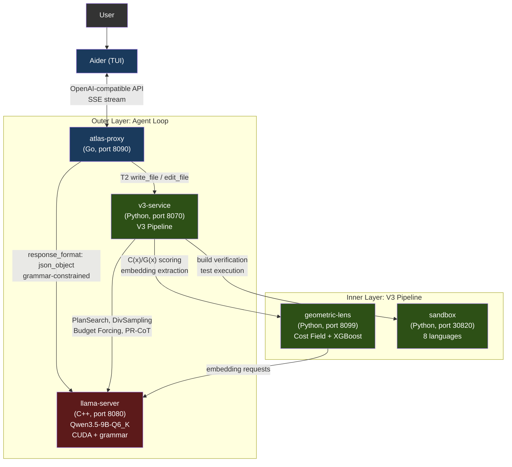
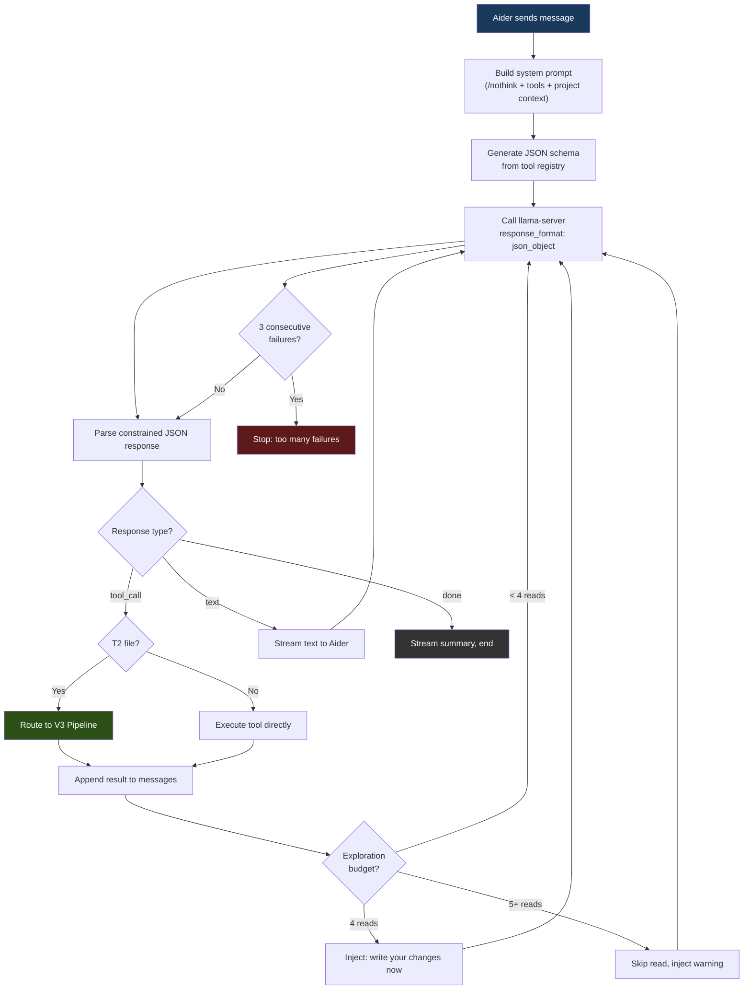
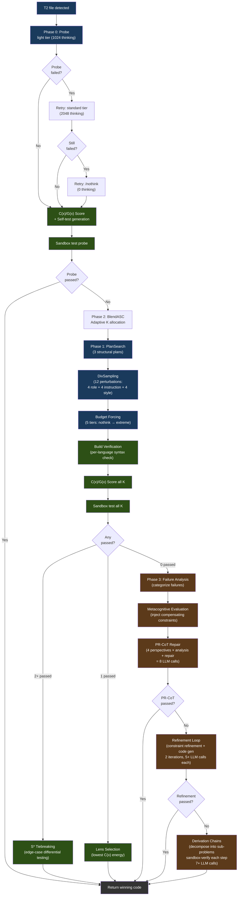
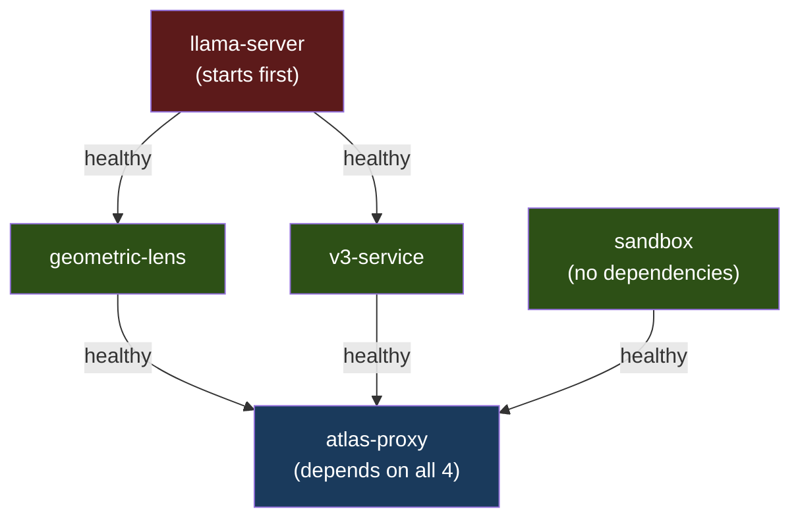

# ATLAS Architecture

System architecture for ATLAS V3.0.1. Two-layer design: an outer agent loop handles tool-call orchestration, and an inner V3 pipeline generates diverse code candidates with build verification and energy-based selection.

---

## 1. System Overview


```mermaid
graph TB
    User["User"] --> Aider["Aider (TUI)"]
    Aider <-->|"OpenAI-compatible API\nSSE stream"| Proxy["atlas-proxy\n(Go, port 8090)"]

    subgraph outer["Outer Layer: Agent Loop"]
        Proxy -->|"response_format: json_object\ngrammar-constrained"| LLM["llama-server\n(C++, port 8080)\nQwen3.5-9B-Q6_K\nCUDA + grammar"]
        Proxy -->|"T2 write_file / edit_file"| V3Service["v3-service\n(Python, port 8070)\nV3 Pipeline"]
    end

    subgraph inner["Inner Layer: V3 Pipeline"]
        V3Service -->|"PlanSearch, DivSampling\nBudget Forcing, PR-CoT"| LLM
        V3Service -->|"C(x)/G(x) scoring\nembedding extraction"| Lens["geometric-lens\n(Python, port 8099)\nCost Field + XGBoost"]
        V3Service -->|"build verification\ntest execution"| Sandbox["sandbox\n(Python, port 30820)\n8 languages"]
        Lens -->|"embedding requests"| LLM
    end

    style User fill:#333,color:#fff
    style Aider fill:#1a3a5c,color:#fff
    style Proxy fill:#1a3a5c,color:#fff
    style LLM fill:#5c1a1a,color:#fff
    style V3Service fill:#2d5016,color:#fff
    style Lens fill:#2d5016,color:#fff
    style Sandbox fill:#2d5016,color:#fff
```

Services run as containers via Docker Compose (recommended) or as local processes via the `atlas` launcher. Only llama-server uses the GPU. Everything else runs on CPU.

---

## 2. Services

| Service | Port | Language | Purpose |
|---------|------|----------|---------|
| **llama-server** | 8080 | C++ (llama.cpp) | LLM inference with CUDA, grammar-constrained JSON, self-embeddings |
| **atlas-proxy** | 8090 | Go | Agent loop, tool-call routing, tier classification, Aider format translation |
| **v3-service** | 8070 | Python | V3 pipeline HTTP wrapper (PlanSearch, DivSampling, PR-CoT, etc.) |
| **geometric-lens** | 8099 | Python (FastAPI) | C(x) energy scoring, G(x) XGBoost quality prediction, RAG/project indexing |
| **sandbox** | 30820 (host) / 8020 (container) | Python (FastAPI) | Isolated code execution, compilation, linting, test running |

---

## 3. Agent Loop (Outer Layer)

The proxy receives chat completion requests from Aider and runs an internal agent loop:


```mermaid
flowchart TD
    Start["Aider sends message"] --> Build["Build system prompt\n(/nothink + tools + project context)"]
    Build --> Schema["Generate JSON schema\nfrom tool registry"]
    Schema --> Call["Call llama-server\nresponse_format: json_object"]
    Call --> Parse["Parse constrained JSON response"]
    Parse --> Route{Response type?}

    Route -->|"tool_call"| Tier{"T2 file?"}
    Tier -->|"Yes"| V3["Route to V3 Pipeline"]
    Tier -->|"No"| Exec["Execute tool directly"]
    V3 --> Result["Append result to messages"]
    Exec --> Result
    Result --> Budget{"Exploration\nbudget?"}
    Budget -->|"< 4 reads"| Call
    Budget -->|"4 reads"| Warn["Inject: write your changes now"] --> Call
    Budget -->|"5+ reads"| Skip["Skip read, inject warning"] --> Call

    Route -->|"text"| Stream["Stream text to Aider"] --> Call
    Route -->|"done"| Done["Stream summary, end"]

    Call --> ErrCheck{"3 consecutive\nfailures?"}
    ErrCheck -->|"Yes"| Stop["Stop: too many failures"]
    ErrCheck -->|"No"| Parse

    style Start fill:#1a3a5c,color:#fff
    style Done fill:#333,color:#fff
    style Stop fill:#5c1a1a,color:#fff
    style V3 fill:#2d5016,color:#fff
```

### Grammar Enforcement

llama-server's `response_format: {"type": "json_object"}` forces every model output to be exactly one of three valid JSON shapes:

```json
{"type": "tool_call", "name": "<tool_name>", "args": {...}}
{"type": "text", "content": "<message>"}
{"type": "done", "summary": "<summary>"}
```

The JSON schema uses `oneOf` with `additionalProperties: false` and enumerates tool names from the registry. The model cannot produce invalid JSON — token generation is grammar-constrained at the llama-server level.

### Tools

8 tools available to the model:

| Tool | Purpose | Read-only |
|------|---------|-----------|
| `read_file` | Read file contents (with optional offset/limit) | Yes |
| `write_file` | Create new file or overwrite (routes to V3 for T2 files) | No |
| `edit_file` | Replace exact string in file (old_str/new_str) | No |
| `delete_file` | Delete file or empty directory (forces loop exit after) | No |
| `run_command` | Execute shell command (5 min timeout cap) | No |
| `search_files` | Regex search across files (max 200 matches, skips .git/node_modules) | Yes |
| `list_directory` | List directory contents with type and size | Yes |
| `plan_tasks` | Decompose work into parallel tasks with dependencies | No |

### Per-File Tier Classification

Each `write_file`/`edit_file` call is classified independently:

| Tier | Max Turns | Action |
|------|-----------|--------|
| T0 (Conversational) | 5 | Text response only |
| T1 (Simple) | 30 | Direct write — no V3 overhead |
| T2 (Feature) | 30 | V3 pipeline fires |
| T3 (Hard) | 60 | V3 pipeline fires |

**Always T1 (direct write):**
- Config files by name: package.json, tsconfig.json, Dockerfile, Makefile, pyproject.toml, requirements.txt, .gitignore, and ~30 more
- Data files by extension: .json, .yaml, .yml, .toml, .csv, .xml, .env
- Style files: .css, .scss, .less
- Documentation: .md, .txt, .rst
- Shell scripts: .sh, .bash
- Short files: under 50 lines (V3 overhead exceeds quality gain)

**T2 (V3 pipeline):** Files with 50+ lines AND 3+ logic indicators. Logic indicators include function definitions (`def`, `func`, `function`, `async`), control flow (`if`, `else`, `switch`, `for`, `while`, `try`), API patterns (`export default`, `app.get`, `router.`, `NextResponse`), state management (`useState`, `useEffect`, `dispatch`), and JSX patterns (`return (`, `className=`, `.map(`).

### Safety Limits

| Limit | Value | Purpose |
|-------|-------|---------|
| Conversation trim | Keep 12 messages max (system + first user + last 8) | Prevent context overflow |
| write_file for existing files | Reject if file > 100 lines | Forces edit_file for targeted changes |
| Truncation detection | JSON parse check on tool args | Catches truncated model output |
| Error loop breaker | 3 consecutive failures | Stops runaway failure cycles |
| Exploration budget warning | 4 consecutive read-only calls | Inject "write your changes now" |
| Exploration budget skip | 5+ consecutive read-only calls | Skip the read, return warning |
| Command stdout | 8,000 chars max | Prevent context flooding |
| Command stderr | 4,000 chars max | Prevent context flooding |
| Search results | 200 matches max | Prevent context flooding |
| File search | Skip files > 1 MB | Performance |

---

## 4. V3 Pipeline (Inner Layer)

Activates inside `write_file`/`edit_file` executors for T2+ files. The pipeline has four phases with early exits at every stage.


```mermaid
flowchart TD
    Entry["T2 file detected"] --> Probe["Phase 0: Probe\nlight tier (1024 thinking)"]
    Probe --> ProbeRetry{"Probe\nfailed?"}
    ProbeRetry -->|"Yes"| Standard["Retry: standard tier\n(2048 thinking)"]
    ProbeRetry -->|"No"| Score1

    Standard --> StdRetry{"Still\nfailed?"}
    StdRetry -->|"Yes"| NoThink["Retry: /nothink\n(0 thinking)"]
    StdRetry -->|"No"| Score1

    NoThink --> Score1["C(x)/G(x) Score\n+ Self-test generation"]
    Score1 --> SB1["Sandbox test probe"]
    SB1 --> Pass1{"Probe\npassed?"}
    Pass1 -->|"Yes"| Done["Return winning code"]

    Pass1 -->|"No"| Alloc["Phase 2: BlendASC\nAdaptive K allocation"]
    Alloc --> PS["Phase 1: PlanSearch\n(3 structural plans)"]
    PS --> DS["DivSampling\n(12 perturbations:\n4 role + 4 instruction + 4 style)"]
    DS --> BF["Budget Forcing\n(5 tiers: nothink → extreme)"]
    BF --> Build["Build Verification\n(per-language syntax check)"]
    Build --> Score2["C(x)/G(x) Score all K"]
    Score2 --> SB2["Sandbox test all K"]

    SB2 --> AnyPass{"Any\npassed?"}
    AnyPass -->|"2+ passed"| SStar["S* Tiebreaking\n(edge-case differential testing)"]
    AnyPass -->|"1 passed"| Select["Lens Selection\n(lowest C(x) energy)"]
    SStar --> Done
    Select --> Done

    AnyPass -->|"0 passed"| FA["Phase 3: Failure Analysis\n(categorize failures)"]
    FA --> Meta["Metacognitive Evaluation\n(inject compensating constraints)"]
    Meta --> PRCOT["PR-CoT Repair\n(4 perspectives × analysis + repair\n= 8 LLM calls)"]
    PRCOT --> PRPass{"PR-CoT\npassed?"}
    PRPass -->|"Yes"| Done

    PRPass -->|"No"| Refine["Refinement Loop\n(constraint refinement + code gen\n2 iterations, 5+ LLM calls each)"]
    Refine --> RefPass{"Refinement\npassed?"}
    RefPass -->|"Yes"| Done

    RefPass -->|"No"| Derive["Derivation Chains\n(decompose into sub-problems\nsandbox-verify each step\n7+ LLM calls)"]
    Derive --> Done

    style Entry fill:#1a3a5c,color:#fff
    style Done fill:#333,color:#fff
    style Probe fill:#1a3a5c,color:#fff
    style PS fill:#1a3a5c,color:#fff
    style DS fill:#1a3a5c,color:#fff
    style BF fill:#1a3a5c,color:#fff
    style SStar fill:#2d5016,color:#fff
    style Select fill:#2d5016,color:#fff
    style Score1 fill:#2d5016,color:#fff
    style Score2 fill:#2d5016,color:#fff
    style SB1 fill:#2d5016,color:#fff
    style SB2 fill:#2d5016,color:#fff
    style Build fill:#2d5016,color:#fff
    style PRCOT fill:#5c3a1a,color:#fff
    style Refine fill:#5c3a1a,color:#fff
    style Derive fill:#5c3a1a,color:#fff
    style FA fill:#5c3a1a,color:#fff
    style Meta fill:#5c3a1a,color:#fff
```

### Phase 0: Probe

Generates a single baseline candidate with progressive retry:
1. **Light tier** (1024 thinking tokens)
2. **Standard tier** (2048 thinking tokens) if light fails
3. **/nothink** (0 thinking tokens) as final fallback

The probe is scored with C(x)/G(x) and tested in the sandbox. If it passes, the pipeline exits immediately — no further candidates are generated.

### Phase 1: Constraint-Driven Generation

**PlanSearch** generates 3 structurally different implementation plans by extracting distinct constraint sets from the problem. Each plan approaches the problem differently (e.g., iterative vs recursive vs mathematical).

**DivSampling** applies perturbation diversity across 12 dimensions:
- 4 roles: competitive_programmer, systems_engineer, mathematician, pragmatist
- 4 instructions: step_by_step, edge_case_first, complexity_aware, constraint_driven
- 4 styles: functional, pythonic, optimize_iteratively, structured

**Budget Forcing** controls thinking token allocation per candidate:

| Tier | Thinking Tokens | Wait Injection |
|------|----------------|----------------|
| nothink | 0 | /nothink prompt |
| light | 1,024 | None |
| standard | 2,048 | If thinking ends < 512 tokens |
| hard | 4,096 | If thinking ends < 1,024 tokens |
| extreme | 8,192 | If thinking ends < 2,048 tokens |

Wait injection appends "Wait, let me reconsider.\n" to force the model to think longer when it stops too early. Tier selection is driven by C(x) energy: lower energy (easier problems) get lower tiers.

### Phase 2: Verification and Selection

**Build Verification** runs per-language syntax checks:
- Python: `python -m py_compile`
- TypeScript: `npx tsc --noEmit`
- JavaScript: `node --check`
- Go: `go build .`
- Rust: `cargo check`
- C/C++: `gcc/g++ -fsyntax-only`
- Shell: `bash -n`

Framework-specific overrides exist for Next.js, React, Flask, Django, and Express.

**C(x)/G(x) Scoring** evaluates each candidate via Geometric Lens (single embedding extraction per candidate).

**S* Tiebreaking** activates when 2+ candidates pass sandbox testing. It generates edge-case inputs where candidates produce different outputs, runs both in the sandbox, and picks the majority winner. This resolves ties that energy scoring alone cannot.

**Lens Selection** is the fallback: sort by C(x) energy (lower = better), pick the winner.

### Phase 3: Repair (if 0/K pass)

Three repair strategies run sequentially. Each exits early if the repaired code passes.

**Failure Analysis** categorizes why each candidate failed (wrong_algorithm, implementation_bug, edge_case_miss, time_limit, format_error, partial_correct) and extracts violated constraints.

**Metacognitive Evaluation** models Qwen3.5's known failure patterns per problem category and injects compensating constraints into repair prompts.

**PR-CoT Repair** (Progressive Repair with Chain-of-Thought):
- 4 analysis perspectives: logical_consistency, information_completeness, biases, alternative_solutions
- Each perspective generates an analysis + repair attempt
- ~8 LLM calls per attempt, up to 3 rounds

**Refinement Loop** orchestrates iterative repair:
- Failure Analysis → Constraint Refinement → Code Generation → Sandbox Test → Learn
- 2 iterations max, 120 second time budget
- ~5+ LLM calls per iteration
- Constraint refinement uses cosine distance filtering (>= 0.15) to prevent hypothesis repetition

**Derivation Chains** decompose the problem into up to 5 sub-problems:
- Each sub-problem is solved and sandbox-verified independently
- Solutions are composed into a final candidate
- ~7+ LLM calls total (1 decomposition + 5 per-step + 1 composition)

---

## 5. Geometric Lens

Neural scoring system that evaluates code quality without executing it. Runs entirely on CPU.

### C(x) Cost Field

| Property | Value |
|----------|-------|
| Architecture | 4096 → 512 → 128 → 1 MLP |
| Activations | SiLU (hidden), Softplus (output, ensures positive energy) |
| Parameters | 2,163,457 (~8.7 MB) |
| Input | 4096-dim self-embeddings from llama-server |
| Output | Scalar energy (lower = more likely correct) |
| Training | Contrastive ranking loss on 597 LCB embeddings (504 PASS, 93 FAIL) |
| Performance | Val AUC 0.9467, separation ratio 2.04x |
| Normalization | Sigmoid: `1 / (1 + exp(-(energy - 19.0) / 2.0))` → [0, 1] |

### G(x) Quality Prediction

| Property | Value |
|----------|-------|
| Architecture | PCA (4096 → 128 dims) + XGBoost classifier |
| Training data | 13,398 embeddings (4,835 PASS, 8,563 FAIL) |
| Output | PASS probability [0, 1] |
| PCA variance explained | 80.8% |

**Verdict thresholds:**
- `gx_score >= 0.7` → "likely_correct"
- `gx_score >= 0.3` → "uncertain"
- `gx_score < 0.3` → "likely_incorrect"

> **Note:** Model weights (.pt, .pkl files) are not committed to the repository — they are built during training and baked into the container image or mounted at runtime. When model files are absent, the service degrades gracefully: C(x) returns neutral energy, G(x) returns `gx_score: 0.5` and `verdict: "unavailable"`. Training data and weights are available on [HuggingFace](https://huggingface.co/datasets/itigges22/ATLAS).

### Combined Scoring Flow

1. Extract a single 4096-dim embedding from llama-server (one call, shared by both models)
2. C(x): forward through MLP → raw energy → sigmoid normalization
3. G(x): PCA projection → XGBoost → PASS probability
4. Combine into verdict

---

## 6. VRAM Budget

Running on RTX 5060 Ti 16GB with Docker Compose defaults (32K context):

| Component | VRAM |
|-----------|------|
| Qwen3.5-9B-Q6_K model weights | ~6.9 GB |
| KV cache (32K context) | ~1.3 GB |
| **Total llama-server** | **~8.2 GB** |
| Geometric Lens | 0 (CPU-only, ~12 MB RAM for models, ~128 MB for PyTorch runtime) |
| v3-service | 0 (CPU-only) |
| sandbox | 0 (CPU-only) |
| atlas-proxy | 0 (Go binary, ~30 MB RAM) |
| **Free VRAM** | **~7.8 GB** |

All computation outside of llama-server runs on CPU. The GPU is used exclusively for LLM inference and embedding extraction.

---

## 7. Deployment

### Docker Compose (Recommended)

`docker-compose.yml` defines all 5 services with health checks, dependency ordering, and GPU passthrough:


```mermaid
graph TD
    LLM["llama-server\n(starts first)"] -->|"healthy"| GL["geometric-lens"]
    LLM -->|"healthy"| V3["v3-service"]
    GL -->|"healthy"| AP["atlas-proxy\n(depends on all 4)"]
    V3 -->|"healthy"| AP
    SB["sandbox\n(no dependencies)"] -->|"healthy"| AP

    style LLM fill:#5c1a1a,color:#fff
    style GL fill:#2d5016,color:#fff
    style V3 fill:#2d5016,color:#fff
    style SB fill:#2d5016,color:#fff
    style AP fill:#1a3a5c,color:#fff
```

`llama-server` and `sandbox` start independently (no dependencies). `geometric-lens` and `v3-service` wait for `llama-server` to be healthy. `atlas-proxy` waits for all four services. First run builds container images (several minutes); subsequent starts are fast.

### Bare Metal

The `atlas` CLI (`pip install -e .`) talks directly to services on their default ports. The bash launcher script (`~/.local/bin/atlas`) can start all services as local processes and launch Aider, or detect a running Docker Compose stack and connect to it.

### K3s

Manifests in `k8s/templates/` are processed by `scripts/generate-manifests.sh` from `atlas.conf`. Services deploy as pods in the `atlas` namespace with NodePort exposure. K3s deployment uses the entrypoint scripts in `inference/` which support extended context (160K), KV cache quantization (q8_0/q4_0), flash attention, and mlock.

---

## 8. Data Flow

### T1: Simple File (Config, CSS, Markdown, Short Files)

```
User prompt → Aider → atlas-proxy → llama-server (json_object) →
  model emits write_file → direct write to disk → Aider applies
```

One LLM call. No V3 overhead.

### T2: Feature File (50+ Lines with Logic)

```
User prompt → Aider → atlas-proxy → llama-server (json_object) →
  model emits write_file → tier = T2 →
    v3-service: Probe → [early exit if passes] →
      PlanSearch → DivSampling → Budget Forcing →
      Build Verify → C(x)/G(x) Score → Sandbox Test →
      [S* tiebreak or Lens select if any pass] →
      [Phase 3 repair if 0/K pass] →
    winning code returned → atlas-proxy writes to disk → Aider applies
```

Minimum 3 llama-server calls (1 probe generation + 1 self-test generation + 1 embedding extraction). Maximum 30+ if Phase 3 repair engages all strategies.

### Edit Existing Code

```
User prompt → Aider → atlas-proxy → llama-server (json_object) →
  model emits edit_file(old_str, new_str) → proxy applies replacement →
  Aider applies
```

Existing files over 100 lines are rejected for `write_file` — the model must use `edit_file` with targeted changes.

### Delete

```
User prompt → atlas-proxy → model emits delete_file →
  proxy deletes from disk → forces agent loop exit → Aider sees file gone
```
