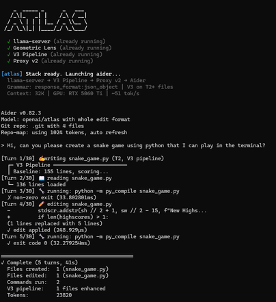
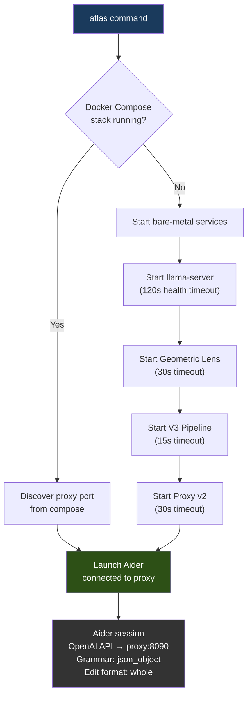
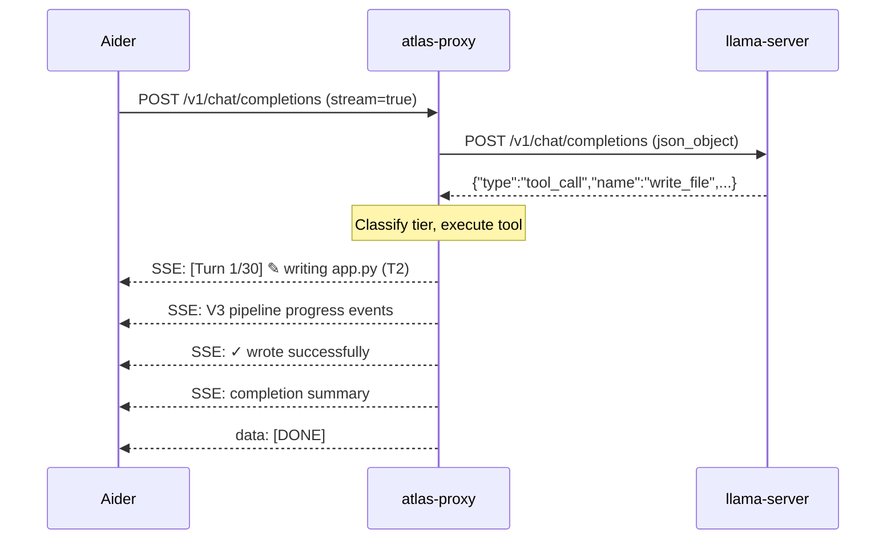

# ATLAS CLI Guide

The ATLAS CLI launches all required services, connects to the local LLM, and drops you into an interactive coding session powered by the V3 pipeline.

<p align="center">
  
</p>

---

## Launching

```bash
cd /path/to/your/project
atlas
```

The `atlas` command automatically detects the deployment mode:

- **Docker Compose**: If a running Docker Compose stack is detected, ATLAS connects to the containerized services
- **Bare metal**: If no Docker stack is found, ATLAS starts llama-server, Geometric Lens, V3 Pipeline, and Proxy v2 as local processes

Both paths end the same way: Aider launches connected to the ATLAS proxy, with grammar-constrained tool calls and V3 pipeline integration.

### Usage Modes

```bash
atlas                          # Interactive session
atlas somefile.py              # Add file to chat on launch
atlas --message "fix the bug"  # Non-interactive (runs and exits)
echo "solve this" | atlas      # Pipe mode (stdin as problem)
```

Any arguments after `atlas` are passed through to Aider.

### Startup Flow



### Startup Banner

```
    _  _____ _      _   ___
   /_\|_   _| |    /_\ / __|
  / _ \ | | | |__ / _ \\__ \
 /_/ \_\|_| |____/_/ \_\___/

  ✓ llama-server (port 8080)
  ✓ Geometric Lens (port 8099)
  ✓ V3 Pipeline (port 8070)
  ✓ Proxy v2 (port 8090)

[atlas] Stack ready. Launching aider...
  llama-server → V3 Pipeline → Proxy v2 → Aider
  Grammar: response_format:json_object | V3 on T2+ files
  Context: 32K | GPU: RTX 5060 Ti | ~51 tok/s
```

Each service is health-checked via `GET /health` before proceeding:

| Service | Port | Health Timeout |
|---------|------|---------------|
| llama-server | 8080 | 120s (model loading is slow) |
| Geometric Lens | 8099 | 30s |
| V3 Pipeline | 8070 | 15s |
| Proxy v2 | 8090 | 30s |

If a service is already running, ATLAS skips it and shows "(already running)". Logs for each service are written to `logs/` in the ATLAS directory.

---

## Streaming Output

Every tool call, V3 pipeline stage, and build verification is streamed in real-time:

```
[Turn 1/30] 📋 planning subtasks...
[Turn 2/30] ✎ writing package.json (T1, direct)
  ✓ wrote successfully (1.2ms)
[Turn 3/30] ✎ writing app.py (T2, V3 pipeline)
  ┌─ V3 Pipeline ─────────────────────────────
  │ Baseline: 134 lines, scoring...
  │ [probe] Generating probe candidate...
  │ [probe_scored] C(x)=0.72
  │ [plansearch] Generating 3 plans...
  │ [sandbox_test] Testing candidates...
  └──── V3 complete: phase1, 3 candidates
  ✓ wrote successfully
[Turn 4/30] 🔧 running: python -m py_compile app.py
  ✓ exit code 0 (0.3s)
[Turn 5/30] 📖 reading requirements.txt
  └─ 12 lines loaded

═══════════════════════════════════════════
✓ Complete (5 turns, 47s)
  Files created:  3 (package.json, app.py, requirements.txt)
  Commands run:   1
  V3 pipeline:    1 file enhanced
  Tokens:         8432
═══════════════════════════════════════════
```

### How Streaming Works

The proxy wraps each status update in OpenAI-compatible SSE chunks:



All status lines are injected as `delta.content` in standard OpenAI SSE chunks, so any OpenAI-compatible client can display them.

### Status Icons

| Icon | Tool | Example |
|------|------|---------|
| ✎ | `write_file` | `[Turn 2/30] ✎ writing app.py (T1, direct)` |
| ✏️ | `edit_file` | `[Turn 3/30] ✏️ editing auth.py` |
| 🔧 | `run_command` | `[Turn 4/30] 🔧 running: npm test` |
| 📖 | `read_file` | `[Turn 5/30] 📖 reading config.json` |
| 🔍 | `search_files` | `[Turn 6/30] 🔍 searching "handleAuth"` |
| 📁 | `list_directory` | `[Turn 7/30] 📁 listing src/` |
| 📋 | `plan_tasks` | `[Turn 1/30] 📋 planning subtasks...` |

### Result Indicators

| Symbol | Meaning | Example |
|--------|---------|---------|
| ✓ | Success | `✓ wrote successfully (1.2ms)` |
| ✗ | Failure | `✗ failed: SyntaxError on line 12 (0.4s)` |
| └─ | Read/search result | `└─ 42 lines loaded` |

### Edit Diff Preview

When the model uses `edit_file`, the proxy shows what changed:

```
[Turn 3/30] ✏️ editing auth.py
  - def authenticate(user, password):
  + def authenticate(user: str, password: str) -> bool:
  (1 lines replaced with 1 lines)
  ✓ edit applied (0.8ms)
```

### Completion Summary

After the agent finishes, a summary box shows:
- **Files created/edited/deleted** with names (max 5 shown, then "+N more")
- **Commands run** count
- **V3 pipeline** count (only shown if V3 was used)
- **Tokens** total consumed

---

## Workflow Examples

### Creating a new project

```
> Create a Flask REST API with user authentication, SQLite database,
  and input validation using Pydantic

[Turn 1/30] 📋 planning subtasks...
[Turn 2/30] ✎ writing requirements.txt (T1, direct)
  ✓ wrote successfully
[Turn 3/30] ✎ writing app.py (T2, V3 pipeline)
  ┌─ V3 Pipeline ─────────────────────────────
  │ [probe] C(x)=0.68, testing...
  │ [probe_sandbox] ✓ probe passed
  └──── V3 complete: phase0 (probe pass)
  ✓ wrote successfully
[Turn 4/30] ✎ writing models.py (T1, direct)
  ✓ wrote successfully
[Turn 5/30] 🔧 running: python -c "import app; print('ok')"
  ✓ exit code 0 (0.5s)

═══════════════════════════════════════════
✓ Complete (5 turns, 23s)
  Files created:  3 (requirements.txt, app.py, models.py)
  Commands run:   1
  V3 pipeline:    1 file enhanced
═══════════════════════════════════════════
```

Notice `app.py` (complex logic) went through V3, while `requirements.txt` and `models.py` (simple/short) were written directly as T1.

### Fixing a bug in existing code

```
> The login endpoint returns 500 when the email field is missing.
  Fix the input validation.

[Turn 1/30] 📖 reading app.py
  └─ 187 lines loaded
[Turn 2/30] 📖 reading models.py
  └─ 42 lines loaded
[Turn 3/30] ✏️ editing app.py
  - data = request.json
  + data = request.json or {}
  + if not data.get("email"):
  +     return jsonify({"error": "email required"}), 400
  (1 lines replaced with 3 lines)
  ✓ edit applied
[Turn 4/30] 🔧 running: python -m pytest tests/ -q
  ✓ exit code 0 (1.2s)

═══════════════════════════════════════════
✓ Complete (4 turns, 8s)
  Files edited:   1 (app.py)
  Commands run:   1
═══════════════════════════════════════════
```

The model reads files first, uses `edit_file` for surgical changes (not full rewrites), and verifies the fix by running tests.

---

## Aider Commands

All standard Aider commands work through ATLAS:

| Command | Description |
|---------|-------------|
| `/add <file>` | Add a file to the chat context |
| `/drop <file>` | Remove a file from context |
| `/clear` | Clear chat history |
| `/tokens` | Show token usage |
| `/undo` | Undo last change |
| `/run <command>` | Run a shell command |
| `/help` | Show all commands |

---

## Python REPL (Alternative)

ATLAS also includes a standalone Python REPL that talks directly to services without Aider:

```bash
pip install -e .
atlas  # Falls back to Python REPL if no Docker stack and no bare-metal launcher
```

### REPL Commands

| Command | Description |
|---------|-------------|
| `/solve <file>` | Solve a coding problem from a file |
| `/bench [--tasks N] [--dataset NAME] [--strategy TYPE]` | Run benchmarks |
| `/status` | Check service health |
| `/help` | Show available commands |
| `/quit`, `/exit`, `/q` | Exit |

Plain text input (no `/` prefix) is treated as a coding problem and solved directly.

### REPL Health Checks

On startup, the REPL checks:
- **llama-server** at `ATLAS_INFERENCE_URL` (default: localhost:8080) — required, exits if unavailable
- **Geometric Lens** at `ATLAS_RAG_URL` (default: localhost:8099) — optional, warns "Lens unavailable — verification disabled"
- **Sandbox** at `ATLAS_SANDBOX_URL` (default: localhost:30820) — optional, warns "Sandbox unavailable — code testing disabled"

### Solve Pipeline

When you type a problem or use `/solve`:
1. Generate code from llama-server (streaming if interactive, batch if piped)
2. Extract code (handles `<think>` blocks, markdown fences, raw code)
3. Score via Geometric Lens (C(x)/G(x) energy + verdict)
4. Test via sandbox (if test cases available)
5. Display results with token count and elapsed time

Generation parameters: `max_tokens=8192`, `temperature=0.6`, `top_k=20`, `top_p=0.95`, `stop=["<|im_end|>"]`

---

## What ATLAS Does Well

- **Single-file creation**: Python scripts, Rust CLIs, Go servers, C programs, shell scripts — first-shot, compiles and runs
- **Multi-file project scaffolding**: Next.js, Flask, Express — correct dependency order, config files included
- **Bug fixes**: Reads existing files, identifies issues, applies targeted edits via `edit_file`
- **Feature additions**: Reads project context, adds features using surgical `old_str`/`new_str` changes
- **Code analysis**: Reads entire codebases and explains implementation details
- **V3-enhanced quality**: Files with complex logic (T2) get diverse candidates, build verification, and energy-based selection — producing measurably better code

## What ATLAS Is Not Good At (Yet)

- **Very large existing codebases** (50+ files): The 32K context window limits how much project context the model can process at once
- **Visual output verification**: CSS styling, layout issues, and design quality cannot be verified by the sandbox
- **Real-time interactive applications**: The model cannot run a browser or test interactive UIs
- **Adding features to existing projects**: ~67% reliability (L6 test) — the 9B model sometimes over-explores instead of writing code

## Tips for Best Results

1. **Be specific**: "Create a Flask API with /users GET and POST endpoints, SQLite backend, input validation with Pydantic" works better than "Create a web app"
2. **Provide file context**: When modifying existing code, `/add` files to the Aider chat so ATLAS can read them
3. **Complex tasks take longer**: V3 pipeline fires on feature files (50+ lines with logic), adding 2-5 minutes but producing better code
4. **Watch the terminal**: Streaming shows every tool call, V3 step, and build verification in real-time
5. **Use edit_file hints**: For large existing files, ask for specific changes rather than full rewrites — the proxy rejects `write_file` for existing files over 100 lines

---

## Troubleshooting

### llama-server fails to start (120s timeout)

**Symptom:** `✗ llama-server failed to start (120s timeout)`

**Common causes:**
- **GPU not detected**: Check `nvidia-smi` — driver must be installed and GPU visible
- **Model file missing**: Check that the GGUF model exists at the expected path (`ATLAS_MODEL_PATH` or `./models/Qwen3.5-9B-Q6_K.gguf`)
- **Insufficient VRAM**: The 9B Q6_K model needs ~8.2 GB VRAM. Run `nvidia-smi` to check available memory. Close other GPU processes.
- **Port conflict**: Another process may be using port 8080. Check with `lsof -i :8080`

**Debug:** Check `logs/llama-server.log` for the actual error.

### Geometric Lens reports "unavailable"

**Symptom:** `! Lens unavailable — verification disabled`

This is non-fatal. ATLAS still works but skips C(x)/G(x) scoring and Lens-based candidate selection. The V3 pipeline falls back to sandbox-only verification.

**Common causes:**
- Lens service failed to connect to llama-server (check `logs/geometric-lens.log`)
- Model weight files missing from the models directory (service degrades gracefully)

### Sandbox reports "unavailable"

**Symptom:** `! Sandbox unavailable — code testing disabled`

Non-fatal but significantly impacts quality. Without sandbox, V3 cannot verify candidates by executing them.

**Common causes:**
- Docker/Podman not installed (sandbox runs in a container)
- Port 30820 already in use

### Aider shows "Model not found" or similar

**Check that both config files exist in the ATLAS root:**
- `.aider.model.settings.yml` — model configuration
- `.aider.model.metadata.json` — token limits and cost

These are included in the repo. If they're missing, the launcher's `--model-settings-file` and `--model-metadata-file` flags will fail.

### Agent loop stops with "too many failures"

The proxy's error loop breaker triggers after 3 consecutive tool failures. This usually means:
- The model is generating truncated output (file too large for one `write_file`)
- The file doesn't exist where the model expects it

**Fix:** Try rephrasing your request to be more specific. For large files, ask for targeted edits rather than full rewrites.

### V3 pipeline takes too long (5+ minutes)

V3 fires on T2 files (50+ lines with logic). If Phase 3 repair engages, it can take several minutes. This is normal for complex code generation.

**If it's consistently slow:**
- Check GPU utilization with `nvidia-smi` — should be near 100% during generation
- Ensure no other services are competing for GPU VRAM

---

## Environment Variables

All ports and URLs are configurable:

### Service URLs

| Variable | Default | Used By | Purpose |
|----------|---------|---------|---------|
| `ATLAS_INFERENCE_URL` | `http://localhost:8080` | proxy, v3-service, Python CLI | llama-server endpoint |
| `ATLAS_RAG_URL` | `http://localhost:8099` | Python CLI | Geometric Lens endpoint |
| `ATLAS_LENS_URL` | `http://localhost:8099` | proxy, v3-service | Geometric Lens endpoint |
| `ATLAS_SANDBOX_URL` | `http://localhost:30820` | proxy, v3-service, Python CLI | Sandbox endpoint |
| `ATLAS_V3_URL` | `http://localhost:8070` | proxy | V3 Pipeline endpoint |

### Service Configuration

| Variable | Default | Purpose |
|----------|---------|---------|
| `ATLAS_MODEL_NAME` | `Qwen3.5-9B-Q6_K` | Model identifier for API responses |
| `ATLAS_MODEL_FILE` | `Qwen3.5-9B-Q6_K.gguf` | GGUF filename in models directory |
| `ATLAS_MODELS_DIR` | `./models` | Host path to model weights |
| `ATLAS_CTX_SIZE` | `32768` | Context window size (tokens) |
| `ATLAS_AGENT_LOOP` | `1` | Enable agent loop in proxy (`1` = on) |
| `ATLAS_PROXY_PORT` | `8090` | Proxy listening port |
| `ATLAS_V3_PORT` | `8070` | V3 service listening port |
| `ATLAS_LLAMA_PORT` | `8080` | llama-server listening port |
| `ATLAS_LENS_PORT` | `8099` | Geometric Lens listening port |
| `ATLAS_SANDBOX_PORT` | `30820` | Sandbox host port |
| `GEOMETRIC_LENS_ENABLED` | `true` | Enable/disable Lens scoring |

### Bare Metal Only

| Variable | Default | Purpose |
|----------|---------|---------|
| `ATLAS_LLAMA_BIN` | `~/llama-cpp-mtp/build/bin/llama-server` | Path to llama-server binary |
| `ATLAS_MODEL_PATH` | `~/models/Qwen3.5-9B-Q6_K.gguf` | Full path to model file |

---

## Configuration Files

### `.aider.model.settings.yml`

Controls how Aider interacts with the ATLAS proxy:

```yaml
- name: openai/atlas
  edit_format: whole           # Aider sends full file content (not diffs)
  weak_model_name: openai/atlas # Use same model for all tasks
  use_repo_map: true           # Send repo structure to model
  send_undo_reply: true        # Notify model when user undoes changes
  examples_as_sys_msg: true    # Include examples in system prompt
  extra_params:
    max_tokens: 32768          # Match llama-server context window
    temperature: 0.3           # Low temp for deterministic output
  cache_control: false         # No Anthropic-style caching
  caches_by_default: false
  streaming: true              # Enable SSE streaming
  reminder: sys                # Put reminders in system prompt
```

### `.aider.model.metadata.json`

Tells Aider the model's token limits and cost (local = free):

```json
{
  "openai/atlas": {
    "max_tokens": 32768,         // Max output tokens
    "max_input_tokens": 32768,   // Max input context
    "max_output_tokens": 32768,  // Max generation length
    "input_cost_per_token": 0,   // Free (local inference)
    "output_cost_per_token": 0,
    "litellm_provider": "openai",// OpenAI-compatible API
    "mode": "chat"               // Chat completion mode
  }
}
```

Both files are included in the repo and referenced by the launcher via `--model-settings-file` and `--model-metadata-file`.
