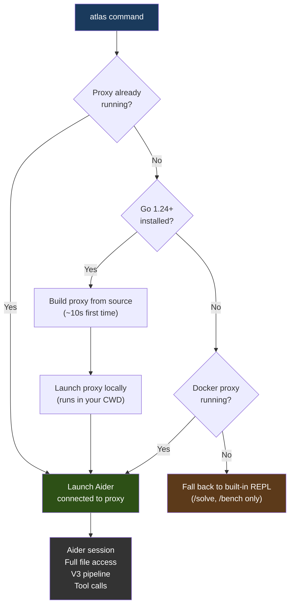
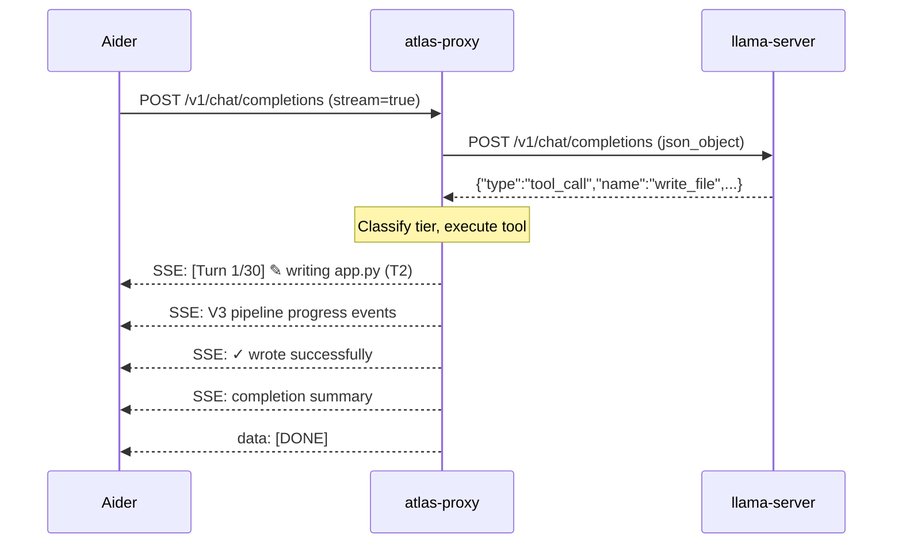

# ATLAS CLI Guide

The ATLAS CLI launches all required services, connects to the local LLM, and drops you into an interactive coding session powered by the V3 pipeline.

<p align="center">
  
</p>

---

## Launching

```bash
cd /path/to/your/project
atlas
```

The `atlas` command automatically detects what's available and launches the best configuration:

1. **Proxy already running** (any method) → connects Aider immediately
2. **Go installed** (1.24+) → builds and launches the proxy locally as a background process, then connects Aider. The proxy runs in your current directory with full file access.
3. **Docker Compose proxy only** (no Go) → connects to the containerized proxy. File access is limited to the directory set in `ATLAS_PROJECT_DIR` (defaults to the ATLAS repo root).
4. **Nothing available** → falls back to the built-in REPL (`/solve`, `/bench` only, no file operations)

> **For the best experience, install Go 1.24+.** The local proxy runs in whatever directory you're in when you type `atlas`, so it can always see your project files. The Docker Compose proxy can only see the directory that was mounted when the containers started. See [Proxy File Access](#proxy-file-access) below.

### Usage Modes

```bash
atlas                          # Interactive session
atlas somefile.py              # Add file to chat on launch
atlas --message "fix the bug"  # Non-interactive (runs and exits)
echo "solve this" | atlas      # Pipe mode (stdin as problem)
```

Any arguments after `atlas` are passed through to Aider.

### Startup Flow



### Startup Banner

```
    _  _____ _      _   ___
   /_\|_   _| |    /_\ / __|
  / _ \ | | | |__ / _ \\__ \
 /_/ \_\|_| |____/_/ \_\___/

  ✓ llama-server (port 8080)
  ✓ Geometric Lens (port 8099)
  ✓ V3 Pipeline (port 8070)
  ✓ Proxy v2 (port 8090)

[atlas] Stack ready. Launching aider...
  llama-server → V3 Pipeline → Proxy v2 → Aider
  Grammar: response_format:json_object | V3 on T2+ files
  Context: 32K | GPU: RTX 5060 Ti | ~51 tok/s
```

Each service is health-checked via `GET /health` before proceeding:

| Service | Port | Health Timeout |
|---------|------|---------------|
| llama-server | 8080 | 120s (model loading is slow) |
| Geometric Lens | 8099 | 30s |
| V3 Pipeline | 8070 | 15s |
| Proxy v2 | 8090 | 30s |

If a service is already running, ATLAS skips it and shows "(already running)". Logs for each service are written to `logs/` in the ATLAS directory.

---

## Streaming Output

Every tool call, V3 pipeline stage, and build verification is streamed in real-time:

```
[Turn 1/30] 📋 planning subtasks...
[Turn 2/30] ✎ writing package.json (T1, direct)
  ✓ wrote successfully (1.2ms)
[Turn 3/30] ✎ writing app.py (T2, V3 pipeline)
  ┌─ V3 Pipeline ─────────────────────────────
  │ Baseline: 134 lines, scoring...
  │ [probe] Generating probe candidate...
  │ [probe_scored] C(x)=0.72
  │ [plansearch] Generating 3 plans...
  │ [sandbox_test] Testing candidates...
  └──── V3 complete: phase1, 3 candidates
  ✓ wrote successfully
[Turn 4/30] 🔧 running: python -m py_compile app.py
  ✓ exit code 0 (0.3s)
[Turn 5/30] 📖 reading requirements.txt
  └─ 12 lines loaded

═══════════════════════════════════════════
✓ Complete (5 turns, 47s)
  Files created:  3 (package.json, app.py, requirements.txt)
  Commands run:   1
  V3 pipeline:    1 file enhanced
  Tokens:         8432
═══════════════════════════════════════════
```

### How Streaming Works

The proxy wraps each status update in OpenAI-compatible SSE chunks:



All status lines are injected as `delta.content` in standard OpenAI SSE chunks, so any OpenAI-compatible client can display them.

### Status Icons

| Icon | Tool | Example |
|------|------|---------|
| ✎ | `write_file` | `[Turn 2/30] ✎ writing app.py (T1, direct)` |
| ✏️ | `edit_file` | `[Turn 3/30] ✏️ editing auth.py` |
| 🔧 | `run_command` | `[Turn 4/30] 🔧 running: npm test` |
| 📖 | `read_file` | `[Turn 5/30] 📖 reading config.json` |
| 🔍 | `search_files` | `[Turn 6/30] 🔍 searching "handleAuth"` |
| 📁 | `list_directory` | `[Turn 7/30] 📁 listing src/` |
| 📋 | `plan_tasks` | `[Turn 1/30] 📋 planning subtasks...` |

### Result Indicators

| Symbol | Meaning | Example |
|--------|---------|---------|
| ✓ | Success | `✓ wrote successfully (1.2ms)` |
| ✗ | Failure | `✗ failed: SyntaxError on line 12 (0.4s)` |
| └─ | Read/search result | `└─ 42 lines loaded` |

### Edit Diff Preview

When the model uses `edit_file`, the proxy shows what changed:

```
[Turn 3/30] ✏️ editing auth.py
  - def authenticate(user, password):
  + def authenticate(user: str, password: str) -> bool:
  (1 lines replaced with 1 lines)
  ✓ edit applied (0.8ms)
```

### Completion Summary

After the agent finishes, a summary box shows:
- **Files created/edited/deleted** with names (max 5 shown, then "+N more")
- **Commands run** count
- **V3 pipeline** count (only shown if V3 was used)
- **Tokens** total consumed

---

## Workflow Examples

### Creating a new project

```
> Create a Flask REST API with user authentication, SQLite database,
  and input validation using Pydantic

[Turn 1/30] 📋 planning subtasks...
[Turn 2/30] ✎ writing requirements.txt (T1, direct)
  ✓ wrote successfully
[Turn 3/30] ✎ writing app.py (T2, V3 pipeline)
  ┌─ V3 Pipeline ─────────────────────────────
  │ [probe] C(x)=0.68, testing...
  │ [probe_sandbox] ✓ probe passed
  └──── V3 complete: phase0 (probe pass)
  ✓ wrote successfully
[Turn 4/30] ✎ writing models.py (T1, direct)
  ✓ wrote successfully
[Turn 5/30] 🔧 running: python -c "import app; print('ok')"
  ✓ exit code 0 (0.5s)

═══════════════════════════════════════════
✓ Complete (5 turns, 23s)
  Files created:  3 (requirements.txt, app.py, models.py)
  Commands run:   1
  V3 pipeline:    1 file enhanced
═══════════════════════════════════════════
```

Notice `app.py` (complex logic) went through V3, while `requirements.txt` and `models.py` (simple/short) were written directly as T1.

### Fixing a bug in existing code

```
> The login endpoint returns 500 when the email field is missing.
  Fix the input validation.

[Turn 1/30] 📖 reading app.py
  └─ 187 lines loaded
[Turn 2/30] 📖 reading models.py
  └─ 42 lines loaded
[Turn 3/30] ✏️ editing app.py
  - data = request.json
  + data = request.json or {}
  + if not data.get("email"):
  +     return jsonify({"error": "email required"}), 400
  (1 lines replaced with 3 lines)
  ✓ edit applied
[Turn 4/30] 🔧 running: python -m pytest tests/ -q
  ✓ exit code 0 (1.2s)

═══════════════════════════════════════════
✓ Complete (4 turns, 8s)
  Files edited:   1 (app.py)
  Commands run:   1
═══════════════════════════════════════════
```

The model reads files first, uses `edit_file` for surgical changes (not full rewrites), and verifies the fix by running tests.

---

## Aider Commands

All standard Aider commands work through ATLAS:

| Command | Description |
|---------|-------------|
| `/add <file>` | Add a file to the chat context |
| `/drop <file>` | Remove a file from context |
| `/clear` | Clear chat history |
| `/tokens` | Show token usage |
| `/undo` | Undo last change |
| `/run <command>` | Run a shell command |
| `/help` | Show all commands |

---

## Proxy File Access

The proxy executes all file operations (`read_file`, `write_file`, `edit_file`, `run_command`, etc.) on the filesystem where it's running. How it accesses your project files depends on how it's launched:

### Local Proxy (Go installed) — Recommended

When Go 1.24+ is installed, `atlas` builds and launches the proxy as a local process. It runs in your **current working directory**, so it can read and write any file you can. This works from any directory:

```bash
cd ~/projects/my-app
atlas    # proxy sees ~/projects/my-app/
cd ~/projects/other-app
atlas    # proxy sees ~/projects/other-app/
```

**Install Go:** [https://go.dev/dl/](https://go.dev/dl/) — the proxy builds automatically on first run (~10 seconds).

### Docker Compose Proxy (No Go) — Limited

Without Go, the proxy runs inside a Docker container. It can only see files in the directory that was mounted when the containers started. By default, this is the ATLAS repo root (wherever you ran `docker compose up`).

To use ATLAS in a different project directory, set `ATLAS_PROJECT_DIR` in your `.env` before starting:

```bash
# In your .env file:
ATLAS_PROJECT_DIR=/home/username/projects/my-app

# Then restart the proxy to pick up the new mount:
docker compose up -d atlas-proxy
```

**Limitation:** You must update `ATLAS_PROJECT_DIR` and restart the proxy each time you switch projects. This is why Go is recommended — the local proxy has no such limitation.

### Which Mode Am I Using?

| Sign | Mode |
|------|------|
| `atlas` prints "Starting local proxy..." | Local (Go) — full CWD access |
| `atlas` connects immediately without printing proxy startup | Pre-existing proxy (local or Docker) |
| Proxy lists files from wrong directory or `/tmp` | Docker proxy without correct mount — install Go or set `ATLAS_PROJECT_DIR` |

---

## Python REPL (Alternative)

ATLAS also includes a standalone Python REPL that talks directly to services without Aider:

```bash
pip install -e .
atlas  # Falls back to Python REPL if no Docker stack and no bare-metal launcher
```

### REPL Commands

| Command | Description |
|---------|-------------|
| `/solve <file>` | Solve a coding problem from a file |
| `/bench [--tasks N] [--dataset NAME] [--strategy TYPE]` | Run benchmarks |
| `/status` | Check service health |
| `/help` | Show available commands |
| `/quit`, `/exit`, `/q` | Exit |

Plain text input (no `/` prefix) is treated as a coding problem and solved directly.

### REPL Health Checks

On startup, the REPL checks:
- **llama-server** at `ATLAS_INFERENCE_URL` (default: localhost:8080) — required, exits if unavailable
- **Geometric Lens** at `ATLAS_RAG_URL` (default: localhost:8099) — optional, warns "Lens unavailable — verification disabled"
- **Sandbox** at `ATLAS_SANDBOX_URL` (default: localhost:30820) — optional, warns "Sandbox unavailable — code testing disabled"

### Solve Pipeline

When you type a problem or use `/solve`:
1. Generate code from llama-server (streaming if interactive, batch if piped)
2. Extract code (handles `<think>` blocks, markdown fences, raw code)
3. Score via Geometric Lens (C(x)/G(x) energy + verdict)
4. Test via sandbox (if test cases available)
5. Display results with token count and elapsed time

Generation parameters: `max_tokens=8192`, `temperature=0.6`, `top_k=20`, `top_p=0.95`, `stop=["<|im_end|>"]`

---

<a id="diagnostic-commands"></a>
## Diagnostic Commands

ATLAS ships with standalone subcommands for first-run setup, install diagnostics, hardware classification, and the model registry. All are invoked as `atlas <subcommand>` after `pip install -e .`.

<a id="atlas-init"></a>
### `atlas init` — first-run install wizard (PC-054)

`atlas init` is the recommended entry point on a fresh checkout. It composes `atlas tier` (hardware probe) + `atlas model recommend` (registry) + `atlas model install` (download + SHA verify) + `.env` and `secrets/api-keys.json` generation into a single five-step run, so users never have to hand-edit config to get the stack up.

```bash
atlas init                                 # interactive: prompts at the model-confirmation step
atlas init --yes                           # non-interactive: accept all defaults (CI / scripted bootstrap)
atlas init --yes --skip-download           # write config but bring-your-own gguf
atlas init --reconfigure                   # back up existing .env → .env.bak, regenerate
atlas init --dry-run                       # print proposed writes, touch nothing
atlas init --json                          # machine-readable summary on stdout
atlas init --models-dir /data/atlas/models # override default <atlas_root>/models
atlas init --image-tag v1.0.0              # pin a specific GHCR tag instead of "latest"
atlas init --ghcr-owner myfork             # use your own published images
```

**Interactive vs. non-interactive.** The wizard prompts when stdin is a TTY *and* `--yes` wasn't passed. With `--yes`, or when stdin is piped (CI, `<<<` heredoc, `curl | sh` bootstrap), all prompts are skipped and defaults applied — answering "y" to model confirmation. Never hangs waiting on a prompt that won't come. Decline a prompt with `n` and the wizard exits 1 cleanly without writing anything.

**Five steps, in order.** Each delegates to existing primitives — there's no separate code path to keep in sync:

1. **Probe hardware** — `tier.classify(probe())` reports tier (cpu/small/medium/large/xlarge) and surfaces GPU/RAM/disk.
2. **Select model** — `model_registry.for_tier(tier)`, but if the tier default has `lens_status != "supported"`, fall back to the only Lens-supported model in the registry (`Qwen3.5-9B-Q6_K` today). The wizard never recommends a model where G(x) would silently no-op.
3. **Download** — delegates to `atlas model install <name> --models-dir <dir>`. Inherits all of PC-056.1/.2's gates: SHA256 enforcement, `.part` resume, concurrent-install lock, oversized-`.part` guard, HF_TOKEN handling.
4. **Write `.env`** — every key the compose stack reads at boot: `ATLAS_MODEL_FILE` / `ATLAS_MODEL_NAME` (from registry), `ATLAS_CTX_SIZE` / `PARALLEL_SLOTS` / `KV_CACHE_TYPE_K|V` (from TierProfile), `ATLAS_MODELS_DIR`, `ATLAS_GHCR_OWNER`, `ATLAS_IMAGE_TAG`, plus default port mappings. Header comment records tier + model + lens_status for at-a-glance review.
5. **Generate `secrets/api-keys.json`** — fresh `sk-atlas-<token_urlsafe(32)>` key labeled `{"user": "local"}`. Parent dir 0700, file 0600 (set atomically via `O_CREAT` mode). The key is printed once — capture it for your client's `Authorization: Bearer` header.

**Safety gates:**

| Gate | Behavior |
|---|---|
| No ATLAS checkout | If no `docker-compose.yml` is in CWD or any parent, refuses up-front. Wizard never silently dumps `.env` and `secrets/` into a directory that isn't an ATLAS clone. |
| CPU-only host | If `tier.classify` returns `cpu` (no NVIDIA GPU), refuses with the ROCm/Metal roadmap pointer. Better to refuse here than write a `.env` that fails at `docker compose up -d`. |
| Already-configured | Refuses if `.env` exists and `--reconfigure` not passed. Pre-existing `.env` is **never** modified by accident. |
| `--reconfigure` backup | Atomically copies `.env` → `.env.bak` (and `api-keys.json` → `api-keys.json.bak` if present) before writing. Recovery is `mv .env.bak .env`. |
| Loose `secrets/` perms | If `secrets/` exists with permissions looser than 0700, refuses unless `--yes` is passed (security guardrail — the user might have intentionally chmod'd for a multi-user setup). |
| Lens fallback | If tier default is `no-artifacts`, surfaces the supported fallback. Wizard never silently picks a model where G(x) would no-op. |
| Model-step delegation | Install reuses `atlas model install` — wizard inherits SHA verify, lock, oversized-part guard for free. |

**`--yes` non-interactive contract.** Defaults are the safe bootstrap path: model = `atlas model recommend`'s fallback (the only `supported` model today), tier knobs = TierProfile defaults, image tag = `latest`, models_dir = `<atlas_root>/models`, single new `sk-atlas-…` key labeled "local". Refuses if `.env` exists, requiring the composable `atlas init --reconfigure --yes`.

**`--json` shape (stable for the bootstrap script):**

```json
{
  "atlas_root": "/path/to/ATLAS",
  "tier": "medium",
  "model": "Qwen3.5-9B-Q6_K",
  "models_dir": "/path/to/ATLAS/models",
  "env_path": "/path/to/ATLAS/.env",
  "env_backup": null,
  "api_keys_path": "/path/to/ATLAS/secrets/api-keys.json",
  "api_keys_backup": null,
  "api_key": "sk-atlas-…",
  "image_tag": "latest",
  "ghcr_owner": "itigges22",
  "dry_run": false
}
```

**Out of scope** (ticket-tracked, not in PC-054): Bubbletea TUI replacement of the prompt loop (Phase 1), custom `presets/` schema beyond TierProfile, multi-user `api-keys.json`, K3s installer wizard variant, `ATLAS_PROJECT_DIR` rebind workflow.

<a id="atlas-doctor"></a>
### `atlas doctor` — install health check

`atlas doctor` runs **21 checks** across the host (Docker / Compose / NVIDIA stack), the running services (compose ps, image skew, health endpoints, model file presence, Lens weights), and the runtime contract (kernel `vm.overcommit_memory`, host-vs-tier match + constraints, end-to-end llama-server smoke). Use it as the **first step** for any "ATLAS isn't working" question — it replaces the 8-line manual `curl` ritual that used to lead the troubleshooting guide.

```bash
atlas doctor              # full check (~5–10 s)
atlas doctor --quick      # skip the e2e smoke (~2 s)
atlas doctor --json       # machine output, for bootstrap / CI
atlas doctor -v           # verbose: full detail per check
atlas doctor --no-color   # disable ANSI color in human output
```

**Flags**

| Flag | Behavior |
|---|---|
| `--quick` | Skip the e2e llama-server smoke test (~10 s saved). |
| `--json` | Emit machine output. Used by `atlas-bootstrap.sh` post-install to surface warnings inline. |
| `-v` / `--verbose` | Show full detail (commands, output snippets, remediation hints) for each check, not just status + headline. |
| `--no-color` | Disable ANSI color (auto-disabled when stdout is non-TTY or `--json`). |

**Exit codes**

- `0` — all checks pass, or only warnings (warnings are actionable, not fatal).
- `1` — at least one check failed (compose stack down, OOM-bound config, smoke test fails, etc.).

**The 21 checks** (in run order)

1. `docker` — daemon installed and reachable
2. `compose` — Docker Compose v2 plugin available
3. `nvidia` — `nvidia-smi` works + container runtime can see GPU
4. `overcommit` — kernel `vm.overcommit_memory` set sanely for llama-server allocator
5. `model_file` — `ATLAS_MODEL_FILE` exists on disk in `models/` (size sanity-check)
6. `lens_weights` — Geometric Lens model files present
7. `containers` — all 5 atlas-* containers in `compose ps` output
8. `health_endpoints` — proxy / lens / sandbox / llama health endpoints reachable
9. `image_skew` — all 5 atlas-* images on the same tag (mixed tags can break inter-service contracts)
10. `e2e_smoke` — direct `POST /completion` to llama-server returns text (skipped under `--quick`)
11–19. service-specific subcheck rows (containers, ports, log heads, env-var presence, etc.)
20. `tier_match` — does the configured `ATLAS_MODEL_FILE` match the recommended model for this hardware tier? Warns on overshoot (small box running large-tier model — OOM risk); passes silently on undershoot (just leaves perf on the table).
21. `tier_constraints` — does this host meet the recommended tier's CPU / RAM / disk minimums? Multi-axis check (PC-055.1) — pure VRAM check isn't enough since ATLAS is heavy on host RAM (5 containers + V3 PR-CoT) and disk (model + images + working space).

Doctor's tier checks consult the same classification engine as `atlas tier` (below). Disk checks against the directory containing `docker-compose.yml`, so users who installed to `/opt/atlas` or `/data/atlas` get the right partition measured.

<a id="atlas-tier"></a>
### `atlas tier` — hardware classification

`atlas tier` probes the host (GPU VRAM via `nvidia-smi`, system RAM via `/proc/meminfo`, CPU cores via `os.cpu_count()`, free disk via `shutil.disk_usage`), classifies it into one of five tiers (`cpu` / `small` / `medium` / `large` / `xlarge`), and prints the recommended ATLAS runtime settings for that tier (model, context length, parallel slots, KV-cache quantization). Use it before editing `.env` for the first time, or whenever you swap GPUs.

```bash
atlas tier              # classify this host + show recommendations
atlas tier list         # show all 5 tier definitions
atlas tier --json       # machine output (consumed by PC-054 wizard, PC-056 registry)
atlas tier --raw        # just the probe (no classification)
atlas tier --install-dir /data/atlas   # measure disk free against an alternate path
```

**Tier breakpoints** (VRAM)

| Tier | VRAM band | Example GPUs |
|---|---|---|
| `cpu` | none | (CPU-only is documented but not supported in v1) |
| `small` | 8–12 GB | RTX 3060 8GB, RTX 4060 8GB |
| `medium` | 12–20 GB | RTX 4060 Ti 16GB, RTX 5060 Ti 16GB, 4070 Ti Super 16GB |
| `large` | 20–32 GB | RTX 3090 / 4090 / 5090 24GB |
| `xlarge` | 32 GB+ | RTX 5090 32GB, A6000 48GB, A100, H100 |

**Multi-axis constraints (PC-055.1).** Each tier carries minimums for system RAM, CPU cores, and free disk in addition to VRAM, because a 16 GB GPU paired with 8 GB host RAM is a real OOM risk during V3 + sandbox compiles. The tier card prints a constraint table comparing the host against the recommended tier's minimums; the JSON output exposes `constraints[]` and an `overall` field (`pass` / `warn` / `fail`) so consumers don't have to re-implement the rules.

**Multi-GPU.** `atlas tier` reports the **largest** GPU's VRAM as the budget. ATLAS runs llama-server on the biggest GPU; to override, set `CUDA_VISIBLE_DEVICES=N` before invoking so `nvidia-smi` only sees the chosen GPU.

**Exit codes**

- `0` — classified successfully (warnings stay exit 0 — they're actionable, not fatal).
- `1` — at least one constraint failed (cpu tier, or RAM/disk shortage past 15% threshold). `atlas-bootstrap.sh` gates on this.

<a id="atlas-model"></a>
### `atlas model` — registry: list / install / recommend / remove

`atlas model` is the install-side counterpart to `atlas tier`. The tier command answers *"what hardware do I have and what should I run?"*; the model command answers *"is that model actually downloadable, is it on disk, will G(x) verification work on it?"*. The central concept is **`lens_status`** — every registry entry is one of:

| Lens status | Meaning |
|---|---|
| `supported` | Trained metric tensor + embeddings shipped in the repo, validated end-to-end against this exact (model, quant) combination. G(x) verification works. |
| `no-artifacts` | Model exists but no Lens artifacts are trained for it (no metric tensor at all). ATLAS will run llama-server on it but G(x) silently no-ops (`gx_score: 0.5, verdict: "unavailable"`) on every generation — half of what makes ATLAS *ATLAS* will be missing. |
| `unverified` | Has Lens artifacts that should structurally apply (e.g., a different quant of the same model family — embedding space is structurally similar) but the exact (model, quant) combination hasn't been validated. PC-056.1 marks the 9B Q4_K_M and Q8_0 variants as `unverified` — they share the Q6_K's metric tensor. |

Today **only `Qwen3.5-9B-Q6_K` is `supported` (validated)**, with `Qwen3.5-9B-Q4_K_M` and `Qwen3.5-9B-Q8_0` as `unverified` quant variants that share its Lens artifacts. The 7B / 14B / 32B entries are listed honestly as `no-artifacts` so the registry tells the truth about what works. Bringing more models to `supported` is the work of [PC-058 (`atlas lens build`)](https://github.com/itigges22/ATLAS/issues/100); see ISSUES.md for the model-agnostic roadmap.

```bash
atlas model list                                   # show all known models
atlas model list --tier medium                     # filter to a tier
atlas model list --installed                       # only models on disk
atlas model list --lens-supported                  # only Lens-supported models
atlas model list --json                            # machine output
atlas model recommend                              # best model for THIS host
atlas model install Qwen3.5-9B-Q6_K                # download + SHA verify into ATLAS_MODELS_DIR
atlas model install Qwen3.5-9B-Q6_K --dry-run      # print URL/target/SHA, no network
atlas model install Qwen3.5-9B-Q6_K --no-resume    # ignore .part, restart from byte 0
atlas model install Qwen3.5-14B-Q5_K_M --no-lens   # acknowledge installing a no-artifacts model
HF_TOKEN=hf_xxx atlas model install Qwen3.5-14B-Q5_K_M --no-lens   # unlock gated upstream
atlas model verify                                 # re-hash all installed models vs registry
atlas model verify Qwen3.5-9B-Q6_K                 # verify just one
atlas model remove Qwen3.5-9B-Q6_K --yes           # delete from disk
```

**HuggingFace authentication (PC-056.1).** Set the `HF_TOKEN` env var to a HuggingFace access token (get one at https://huggingface.co/settings/tokens) to unlock gated upstreams. The 7B / 14B / 32B unsloth repos all return HTTP 401 anonymously; with a valid token, the install path will authenticate and proceed. `HUGGING_FACE_HUB_TOKEN` is honored as an alternative spelling for compatibility with the HF Python SDK. `atlas model list` shows `(requires HF_TOKEN)` when the env var is missing and `gated, HF_TOKEN present` when it's set.

**Path resolution.** All four subcommands share a `--models-dir` flag and resolve in this order: `--models-dir` flag > `ATLAS_MODELS_DIR` env var > `./models/` relative to `atlas_root` (the directory containing `docker-compose.yml`).

#### `atlas model list`

Prints the registry as a table with install state + Lens status per row. The `--installed` filter only shows models present in `ATLAS_MODELS_DIR` (file > 100 MB sanity threshold). The `--lens-supported` filter is the right starting point if you don't yet know which model to use:

```bash
atlas model list --lens-supported   # → just shows Qwen3.5-9B-Q6_K today
```

| Flag | Behavior |
|---|---|
| `--tier` | Filter to one of `cpu` / `small` / `medium` / `large` / `xlarge`. |
| `--installed` | Show only models whose gguf file is present in `ATLAS_MODELS_DIR`. |
| `--lens-supported` | Show only models with `lens_status == "supported"`. |
| `--models-dir` | Override `ATLAS_MODELS_DIR`. |
| `--json` | Emit machine output: `{"models_dir": "...", "models": [{...}, ...]}`. |
| `--no-color` | Disable ANSI color. |

#### `atlas model recommend`

Composes `atlas tier` (host classification) with the registry (what's actually installable + Lens-supported) and prints the best fit:

- If your tier's default model is `supported` → prints "Ready to install: `atlas model install …`" and exits 0.
- If your tier's default is `no-artifacts` → surfaces the **fallback** (the only `supported` model today, regardless of tier) so users on small/large/xlarge hosts get a working recommendation instead of nothing.
- JSON output includes both `recommendation` (tier-default) and `fallback` (Lens-supported alternative) keys for the wizard / scripts to consume.

#### `atlas model install <name>`

Streams the model from the registry's `download_url` via stdlib `urllib` (no third-party deps), writes to `ATLAS_MODELS_DIR/<file>.part`, then atomically renames into place on success. Shows a progress bar with rate + ETA. Partial files are deleted on interrupt or download failure (no resume support in v1; PC-056.1 follow-up).

**Safety gates** (in order):

1. **Unknown name** → exit 1 with "Unknown model" message.
2. **No-artifacts gate** → If `lens_status != "supported"` and `--no-lens` not passed → refuse with explanation. The user must explicitly acknowledge that G(x) will silently no-op.
3. **Gated upstream** → If `download_url is None` (e.g., 7B/14B/32B unsloth repos return HTTP 401) → refuse. There's nothing to download.
4. **Disk space** → If free disk in `ATLAS_MODELS_DIR` < 1.2× model size → refuse with the shortfall reported.
5. **Existing file** → If target already exists → refuse without `--yes`.

| Flag | Behavior |
|---|---|
| `--dry-run` | Print URL / target path / size / SHA256, no network or disk writes. Used by tests and by users sanity-checking before committing. |
| `--no-lens` | Acknowledge installing a model with no Lens artifacts. Required for any non-`supported` install. |
| `--yes` | Overwrite an existing file without prompt. |
| `--no-resume` | Ignore any existing `.part` file and restart from byte 0 (default: resume from `.part` if present, hashing existing bytes into the SHA digest first). |
| `--models-dir` | Override `ATLAS_MODELS_DIR`. |
| `--no-color` | Disable ANSI color. |

**SHA verification (PC-056.1).** The 9B variants' registry entries carry the HuggingFace `x-linked-etag` (content-addressed storage SHA256). The install path now **enforces the hash**: `hashlib.sha256.update()` runs alongside the chunk write loop, and the final hexdigest is compared to the registry value. Mismatch deletes the `.part` file and exits 1 with a message that distinguishes "download corruption" (likely transient — re-install) from "registry SHA stale" (upstream re-uploaded — wait for an ATLAS release). When the registry has no expected SHA (gated entries we couldn't anonymously HEAD), download proceeds and prints a warning that integrity wasn't verified end-to-end.

**Download resume (PC-056.1).** The default behavior is to resume from any existing `<target>.part` file using `Range: bytes=N-`. Hash continuation works correctly: the existing `.part` bytes get folded into the SHA digest before the new chunks land. If the server returns 200 OK to a Range request (some endpoints ignore it), the install path detects that and restarts from byte 0 cleanly. Pass `--no-resume` to force a fresh download. Network failures and `Ctrl+C` keep the `.part` for the next attempt; SHA mismatches and "file too small" errors delete it.

**Concurrent install protection (PC-056.2).** Two `atlas model install` invocations against the same target file would otherwise both write to `<file>.part` and corrupt each other's bytes. The install path now writes a `<file>.part.lock` containing the writer's PID via `O_CREAT|O_EXCL`. On collision, the lock holder's PID is checked with `os.kill(pid, 0)` — dead PIDs (or unparseable lock contents from a crash mid-write) are reclaimed automatically; live PIDs cause the second install to refuse with a clear "PID N is already downloading" message. The lock is released in a `finally` block so a crashed install never permanently wedges the slot. Manual recovery if needed: `rm <file>.part.lock`.

**Oversized `.part` guard (PC-056.2).** Resume trusts the existing `.part` size and asks for `Range: bytes=N-` from there. If a `.part` somehow exceeds the registry's expected model size (renamed model, mismatched mirror left behind, manual fiddling), the install path now refuses with a clear message and a `rm <path>` / `--no-resume` recovery hint *before* sending the Range request — rather than spending bandwidth and failing SHA at the end. A 5% slack handles legitimate quant-size variation; anything past that triggers the refusal.

**Verify subcommand (`atlas model verify`).** Recomputes the SHA of installed file(s) and compares to the registry. Without a model name, verifies every installed model. Useful after suspected disk corruption, after pulling a new ATLAS release (registry SHAs may have changed), or as a periodic integrity check. Status per model: `OK` (matches), `MISMATCH` (corrupted or stale registry — exit 1), `[?]` (no expected SHA in registry, can't verify), `[skip]` (not installed). JSON output includes per-model results + an `any_mismatch` summary flag for scripting.

#### `atlas model remove <name>`

Deletes the model file from `ATLAS_MODELS_DIR`. Refuses without `--yes`. Idempotent — removing a model that isn't installed exits 0 with no action.

---

## What ATLAS Does Well

- **Single-file creation**: Python scripts, Rust CLIs, Go servers, C programs, shell scripts — first-shot, compiles and runs
- **Multi-file project scaffolding**: Next.js, Flask, Express — correct dependency order, config files included
- **Bug fixes**: Reads existing files, identifies issues, applies targeted edits via `edit_file`
- **Feature additions**: Reads project context, adds features using surgical `old_str`/`new_str` changes
- **Code analysis**: Reads entire codebases and explains implementation details
- **V3-enhanced quality**: Files with complex logic (T2) get diverse candidates, build verification, and energy-based selection — producing measurably better code

## What ATLAS Is Not Good At (Yet)

- **Very large existing codebases** (50+ files): The 32K context window limits how much project context the model can process at once
- **Visual output verification**: CSS styling, layout issues, and design quality cannot be verified by the sandbox
- **Real-time interactive applications**: The model cannot run a browser or test interactive UIs
- **Adding features to existing projects**: ~67% reliability (L6 test) — the 9B model sometimes over-explores instead of writing code

## Tips for Best Results

1. **Be specific**: "Create a Flask API with /users GET and POST endpoints, SQLite backend, input validation with Pydantic" works better than "Create a web app"
2. **Provide file context**: When modifying existing code, `/add` files to the Aider chat so ATLAS can read them
3. **Complex tasks take longer**: V3 pipeline fires on feature files (50+ lines with logic), adding 2-5 minutes but producing better code
4. **Watch the terminal**: Streaming shows every tool call, V3 step, and build verification in real-time
5. **Use edit_file hints**: For large existing files, ask for specific changes rather than full rewrites — the proxy rejects `write_file` for existing files over 100 lines

---

## Troubleshooting

### llama-server fails to start (120s timeout)

**Symptom:** `✗ llama-server failed to start (120s timeout)`

**Common causes:**
- **GPU not detected**: Check `nvidia-smi` — driver must be installed and GPU visible
- **Model file missing**: Check that the GGUF model exists at the expected path (`ATLAS_MODEL_PATH` or `./models/Qwen3.5-9B-Q6_K.gguf`)
- **Insufficient VRAM**: The 9B Q6_K model needs ~8.2 GB VRAM. Run `nvidia-smi` to check available memory. Close other GPU processes.
- **Port conflict**: Another process may be using port 8080. Check with `lsof -i :8080`

**Debug:** Check `logs/llama-server.log` for the actual error.

### Geometric Lens reports "unavailable"

**Symptom:** `! Lens unavailable — verification disabled`

This is non-fatal. ATLAS still works but skips C(x)/G(x) scoring and Lens-based candidate selection. The V3 pipeline falls back to sandbox-only verification.

**Common causes:**
- Lens service failed to connect to llama-server (check `logs/geometric-lens.log`)
- Model weight files missing from the models directory (service degrades gracefully)

### Sandbox reports "unavailable"

**Symptom:** `! Sandbox unavailable — code testing disabled`

Non-fatal but significantly impacts quality. Without sandbox, V3 cannot verify candidates by executing them.

**Common causes:**
- Docker/Podman not installed (sandbox runs in a container)
- Port 30820 already in use

### Aider shows "Model not found" or similar

**Check that both config files exist in the ATLAS root:**
- `.aider.model.settings.yml` — model configuration
- `.aider.model.metadata.json` — token limits and cost

These are included in the repo. If they're missing, the launcher's `--model-settings-file` and `--model-metadata-file` flags will fail.

### Agent loop stops with "too many failures"

The proxy's error loop breaker triggers after 3 consecutive tool failures. This usually means:
- The model is generating truncated output (file too large for one `write_file`)
- The file doesn't exist where the model expects it

**Fix:** Try rephrasing your request to be more specific. For large files, ask for targeted edits rather than full rewrites.

### V3 pipeline takes too long (5+ minutes)

V3 fires on T2 files (50+ lines with logic). If Phase 3 repair engages, it can take several minutes. This is normal for complex code generation.

**If it's consistently slow:**
- Check GPU utilization with `nvidia-smi` — should be near 100% during generation
- Ensure no other services are competing for GPU VRAM

---

## Environment Variables

All ports and URLs are configurable:

### Service URLs

| Variable | Default | Used By | Purpose |
|----------|---------|---------|---------|
| `ATLAS_INFERENCE_URL` | `http://localhost:8080` | proxy, v3-service, Python CLI | llama-server endpoint |
| `ATLAS_RAG_URL` | `http://localhost:8099` | Python CLI | Geometric Lens endpoint |
| `ATLAS_LENS_URL` | `http://localhost:8099` | proxy, v3-service | Geometric Lens endpoint |
| `ATLAS_SANDBOX_URL` | `http://localhost:30820` | proxy, v3-service, Python CLI | Sandbox endpoint |
| `ATLAS_V3_URL` | `http://localhost:8070` | proxy | V3 Pipeline endpoint |

### Service Configuration

| Variable | Default | Purpose |
|----------|---------|---------|
| `ATLAS_MODEL_NAME` | `Qwen3.5-9B-Q6_K` | Model identifier for API responses |
| `ATLAS_MODEL_FILE` | `Qwen3.5-9B-Q6_K.gguf` | GGUF filename in models directory |
| `ATLAS_MODELS_DIR` | `./models` | Host path to model weights |
| `ATLAS_CTX_SIZE` | `32768` | Context window size (tokens) |
| `ATLAS_AGENT_LOOP` | `1` | Enable agent loop in proxy (`1` = on) |
| `ATLAS_PROXY_PORT` | `8090` | Proxy listening port |
| `ATLAS_V3_PORT` | `8070` | V3 service listening port |
| `ATLAS_LLAMA_PORT` | `8080` | llama-server listening port |
| `ATLAS_LENS_PORT` | `8099` | Geometric Lens listening port |
| `ATLAS_SANDBOX_PORT` | `30820` | Sandbox host port |
| `GEOMETRIC_LENS_ENABLED` | `true` | Enable/disable Lens scoring |

### Bare Metal Only

| Variable | Default | Purpose |
|----------|---------|---------|
| `ATLAS_LLAMA_BIN` | `~/llama-cpp-mtp/build/bin/llama-server` | Path to llama-server binary |
| `ATLAS_MODEL_PATH` | `~/models/Qwen3.5-9B-Q6_K.gguf` | Full path to model file |

---

## Configuration Files

### `.aider.model.settings.yml`

Controls how Aider interacts with the ATLAS proxy:

```yaml
- name: openai/atlas
  edit_format: whole           # Aider sends full file content (not diffs)
  weak_model_name: openai/atlas # Use same model for all tasks
  use_repo_map: true           # Send repo structure to model
  send_undo_reply: true        # Notify model when user undoes changes
  examples_as_sys_msg: true    # Include examples in system prompt
  extra_params:
    max_tokens: 32768          # Match llama-server context window
    temperature: 0.3           # Low temp for deterministic output
  cache_control: false         # No Anthropic-style caching
  caches_by_default: false
  streaming: true              # Enable SSE streaming
  reminder: sys                # Put reminders in system prompt
```

### `.aider.model.metadata.json`

Tells Aider the model's token limits and cost (local = free):

```json
{
  "openai/atlas": {
    "max_tokens": 32768,         // Max output tokens
    "max_input_tokens": 32768,   // Max input context
    "max_output_tokens": 32768,  // Max generation length
    "input_cost_per_token": 0,   // Free (local inference)
    "output_cost_per_token": 0,
    "litellm_provider": "openai",// OpenAI-compatible API
    "mode": "chat"               // Chat completion mode
  }
}
```

Both files are included in the repo and referenced by the launcher via `--model-settings-file` and `--model-metadata-file`.
