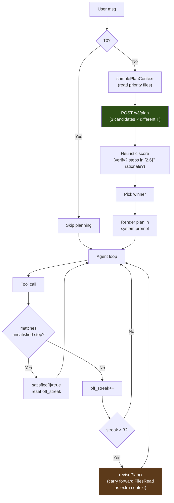

# Plan Mode

Plan mode is a pre-flight planning step that runs once per agent turn before the model starts calling tools. The planner samples 3 candidate plans from the LLM at different temperatures, scores each heuristically, and picks the best one. The winning plan goes into the system prompt and seeds an adherence gate that auto-revises when the model thrashes off-plan.

Designed to address two failure modes:

1. **Discovery thrashing.** Without a plan, the model's first 2–4 tool calls are often `read_file → list_directory → search_files → read_file → ...` — exploring instead of acting. With a plan, the system prompt tells it explicitly: read this, edit that, verify with curl.
2. **No-evidence "done"**. The plan's `verify_step` is treated as the proof-of-fix. The verification gate (PC-179) refuses `done` until that step has run successfully.

## End-to-end flow

## Components

### v3-service: `/v3/plan` (Python)

Defined in `v3-service/main.py`. The handler:

1. Renders `PLAN_PROMPT_TEMPLATE` with the user message + working dir + truncated project files.
2. Calls the LLM 3 times with seed offsets and temperatures `[0.3, 0.5, 0.7]`. `chat_template_kwargs: {enable_thinking: false}` — Qwen3.5 routes its `<think>` block into `delta.reasoning_content` when thinking is on, which the chat-completions consumer doesn't see, so we'd burn a 2048-token budget on reasoning and emit zero JSON. The flag disables thinking at the chat-template layer; the prompt's `/nothink` directive alone is unreliable.
3. Parses each raw response with a markdown-fence-tolerant + brace-depth-aware extractor (`_parse_plan_json`).
4. Scores each parsed plan with `_score_plan`:
   - **+0.3** for having a `verify_step`
   - **+0.2** for `len(steps) ∈ [2, 6]`
   - **+0.2** if the verify step's action references a known verification command (`pytest`, `python`, `curl`, `go test`, etc.)
   - **+0.1 per step** that targets a file the user named (capped at +0.2)
   - **+0.1** for a non-empty `rationale`
5. Picks the highest-scoring plan; tie-break favours fewer steps (less waffle).
6. If all candidates fail to parse, returns a one-step fallback (`{action: "investigate the request and act"}`) so the agent loop never blocks on planner failure.

API contract documented in [API.md § POST /v3/plan](API.md#post-v3plan).

### proxy: bridge, hook, gate (Go)

| File | Role |
|---|---|
| `proxy/v3_bridge.go` | `callV3PlanStreaming(v3URL, req, onProgress)` — opens the SSE stream, forwards progress events to the callback, returns the final `Plan` from the `event: result` frame. Mirrors `callV3GenerateStreaming` for V3-pipeline runs. |
| `proxy/types.go` | `V3PlanRequest`, `Plan`, `PlanStep` types. `AgentContext` gains `Plan`, `PlanStepsSatisfied[]`, `PlanOffStreak`, `PlanRevisions`. |
| `proxy/agent.go` | `samplePlanContext()` walks priority files (app.py, templates/index.html, package.json, …) for the planner. `shouldGeneratePlan()` gates on tier + message length. `generatePlan()` runs the bridge, drops per-token noise, emits `plan_loaded` with the full step list. |
| `proxy/plan_adherence.go` | `matchPlanStep()` (loose tool-name + path-suffix match), `recordPlanAdherence()` (per-tool-call accounting), `revisePlan()` (regenerate with `FilesRead` carried forward as extra context). |

The system prompt rendering happens in `buildSystemPrompt`. Plan steps are listed with glyphs (☐ pending, ✓ satisfied, ⚐ verify-step) and the verify step is called out as the "evidence-of-fix" step that the verification gate guards against `done`.

### tui: rendering (Go)

`tui/plan.go` defines `planView` (state on the model) plus three `applyPlan*` handlers wired into `tui/model.go`'s chat dispatcher:

| Event | Handler | UI effect |
|---|---|---|
| `plan_loaded` | `applyPlanLoaded` | Replaces `m.plan` with the new plan; appends a multi-line chat row showing all steps with status glyphs. Revisions overwrite `m.plan` and reset Satisfied flags. |
| `plan_adherence` (matched) | `applyPlanAdherence` | Flips the matched step's `Satisfied` flag; appends a one-liner `✓ s2 satisfied · edit_file (1/3)`. |
| `plan_adherence` (unmatched) | `applyPlanAdherence` | **Silent** — off-plan calls only update internal state. Without this filter, every off-plan call would spawn a chat row, drowning out actual progress. |
| `plan_revise` | `applyPlanRevise` | Sets `Revising=true` on the current plan; appends `Plan revising (rev 1): <reason>`. Next `plan_loaded` (with `revision>0`) replaces it. |
| `v3_plan` | `formatV3StageEvent` | Renders the planner's own progress (`candidate 1/3 score=0.80`, `plan 1 won`) under a `plan` chat-row meta tag. |

## Tunables

Defined in `proxy/plan_adherence.go`:

| Constant | Default | Rationale |
|---|---|---|
| `planAutoReviseThreshold` | 3 | Off-plan tool calls before auto-revise fires. Tight enough to catch a wrong plan within ~30s; loose enough that one or two exploratory off-plan calls don't trigger thrashing. |
| `planMaxRevisions` | 2 | Cap on auto-revisions per loop. Past this, the loop runs plan-free for the remainder. Prevents pathological off-plan inputs from looping `/v3/plan` forever. |

`v3-service/main.py` constants:

| Constant | Default | Rationale |
|---|---|---|
| `n_candidates` | 3 | Diverse sampling at temps `[0.3, 0.5, 0.7]`. More candidates → more wall time (~5s/candidate). |
| `max_tokens` (per candidate) | 2048 | Empirically covers a 6-step plan with rationale. 1024 truncated mid-JSON in early testing. |

## When plan mode is skipped

Two predicates in `shouldGeneratePlan`:

1. **`ctx.Tier == Tier0Conversational`** — trivial chat ("hi", "thanks") never plans.
2. **`len(message) < 12`** — short acks ("yes do it", "looks good") that depend on the prior turn's plan don't plan again.

Outside those, every turn plans. Failures (`/v3/plan` 5xx, network error, all candidates unparseable beyond the fallback) degrade silently — the loop runs without `ctx.Plan`, identical to pre-PC-185 behaviour.

## Cost

Wall time: **~15s** for a 3-candidate sweep on a warm GPU (~5s per candidate). Token cost: `3 × 2048 max_tokens` budget ≈ 1500 actual tokens per candidate × 3 = ~4500 tokens.

Both are paid up front before the agent's first tool call. The investment is recovered the moment the model skips a useless discovery round (each tool call is its own ~5–10s LLM round-trip plus tool execution).

## Testing

| Layer | File | What's covered |
|---|---|---|
| v3-service plan endpoint | smoke-tested via `curl /v3/plan` (no unit tests yet — JSON parser tolerance is exercised by the 3-candidate sampler in production) | parser handles fences, prose preamble, brace-depth nesting; scorer ranks plans correctly |
| proxy bridge | `proxy/v3_bridge_test.go` | SSE parse, missing-result error, stage routing |
| proxy hook | `proxy/plan_hook_test.go` | priority-file pickup, truncation thresholds, fallback walk, tier/length gating |
| proxy adherence | `proxy/plan_adherence_test.go` | match logic (tool name + path suffix), failed-call exclusion, revision cap, system-prompt rendering |
| TUI rendering | `tui/plan_test.go` | `planView` state transitions, plan_loaded replacement on revise, off-plan silence |
