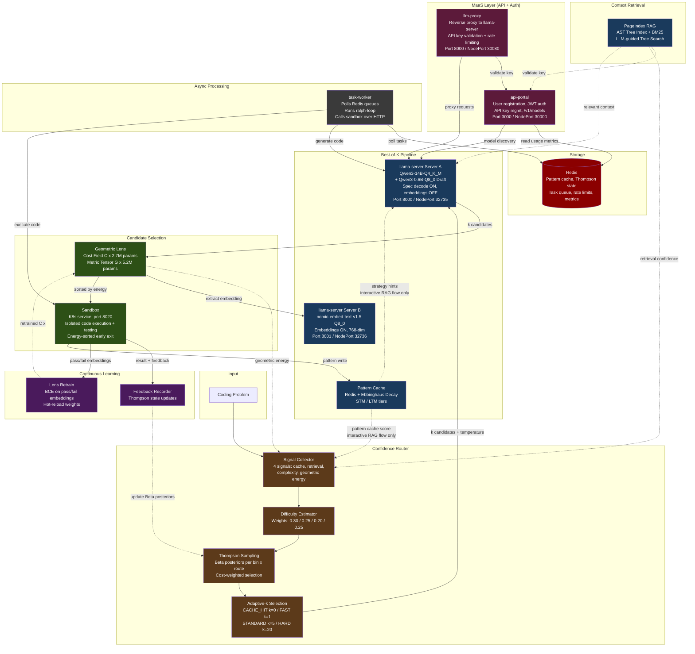

# ATLAS V2 Architecture Diagram

<div align="center">



</div>

## Service Summary

| Layer           | Service                | K8s Service Name       | Port                   | Technology              | Purpose                                                                 |
|-----------------|------------------------|------------------------|------------------------|-------------------------|-------------------------------------------------------------------------|
| **MaaS**        | api-portal             | api-portal             | 3000 (NodePort 30000)  | FastAPI                 | User registration/login (JWT), API key mgmt (sk-llm-*), /v1/models      |
|                 | llm-proxy              | llm-proxy              | 8000 (NodePort 30080)  | FastAPI                 | Reverse proxy to llama-server with API key validation + rate limiting    |
| **Core**        | rag-api                | rag-api                | 8001 (NodePort 31144)  | FastAPI                 | Orchestration: routing, RAG, cache, lens, key validation via api-portal  |
|                 | llama-server (Server A)| llama-service          | 8000 (NodePort 32735)  | llama.cpp + CUDA        | GPU inference (Qwen3-14B + 0.6B draft, spec decode ON, embeddings OFF)  |
|                 | llama-embed (Server B) | llama-embed-service    | 8001 (NodePort 32736)  | llama.cpp + CUDA        | Embedding sidecar (nomic-embed-text-v1.5, 768-dim, embeddings ON)       |
| **Execution**   | sandbox                | sandbox                | 8020 (NodePort 30820)  | K8s service             | Isolated code execution and testing (HTTP API)                           |
|                 | task-worker            | task-worker             | 8080 (ClusterIP)       | Python                  | Async task processor: polls Redis queues, runs ralph-loop, calls sandbox |
| **Storage**     | Redis                  | redis                  | 6379                   | Redis                   | Pattern cache, Thompson state, task queue, rate limits, usage metrics    |
| **Intelligence**| Confidence Router      | (in rag-api)           | --                     | Thompson Sampling       | 4-signal difficulty estimation, adaptive-k                               |
|                 | Geometric Lens         | (in rag-api)           | --                     | PyTorch (CPU)           | Energy-based candidate scoring, 7.9M params                             |
|                 | Pattern Cache          | (in rag-api)           | --                     | Redis-backed            | Ebbinghaus-decay STM/LTM pattern memory                                  |
|                 | PageIndex              | (in rag-api)           | --                     | tree-sitter + BM25      | AST-aware code retrieval with LLM tree search                            |
| **Dashboard**   | atlas-dashboard        | atlas-dashboard        | 3001 (NodePort 30001)  | Web UI                  | Monitoring dashboard (queue stats, daily metrics, weekly trend)          |
| **Training**    | atlas-nightly-training | (CronJob, suspended)   | --                     | CronJob, suspended       | LoRA fine-tuning (V1 artifact, suspended — V2 uses frozen model)         |

## Data Flows

### Routing Decision (interactive RAG flow)
```
Query
 -> Signal Collector (pattern_cache_score, retrieval_confidence, query_complexity, geometric_energy)
 -> Difficulty Estimator (weighted sum -> D(x) in [0,1])
 -> Thompson Sampling (Beta posteriors, cost-weighted efficiency)
 -> Route Selection (CACHE_HIT / FAST_PATH / STANDARD / HARD_PATH)
 -> Adaptive-k (k=0 / k=1 / k=5 / k=20)
```

### Best-of-K Generation
```
Task + k value
 -> llama-server Server A (k candidates, temperature varies by mode:
      k=1: 0.0, mcq/ifbench: 0.3, code k<=5: 0.6, code k>5: 0.8)
 -> Geometric Lens (extract 768-dim embedding via Server B /embedding,
      score each candidate through C(x), sort by energy)
 -> Sandbox (try in energy order, early exit on first PASS)
 -> Result + feedback
```
Note: In benchmark mode, best-of-k calls llama-server directly (_call_llm).
Pattern Cache strategy hints and pattern_cache_score are only used in the
interactive RAG flow, not the benchmark pipeline.

### Task Worker (production async flow)
```
User request via api-portal
 -> Task queued in Redis
 -> task-worker polls Redis, picks up task
 -> (optional) Retrieve RAG context from rag-api
 -> Generate code via llama-server (direct, bypasses llm-proxy auth)
 -> Execute + test via sandbox service (HTTP POST to sandbox:8020)
 -> Store result in Redis, publish completion
 -> Store result in Redis, publish completion
```

### MaaS Authentication
```
External user
 -> llm-proxy (Bearer sk-llm-* key in Authorization header)
 -> llm-proxy validates key with api-portal /api/validate-key
 -> Rate limit check via Redis sliding window
 -> Proxy request to llama-server

Internal services (rag-api, task-worker)
 -> Call llama-server directly (bypass llm-proxy, no auth needed)
```

### Continuous Learning
```
Sandbox results (pass/fail + code embeddings)
 -> Lens Retrain (BCE loss, epoch-based)
 -> Hot-reload C(x) weights into rag-api
 -> Thompson Sampling feedback (update Beta posteriors)
 -> Pattern Cache write (extract + store successful patterns)
```

## Color Legend

| Color | Meaning |
|-------|---------|
| Dark green | Evaluation (Lens + Sandbox) |
| Dark blue | Generation and retrieval (llama-server, PageIndex, Pattern Cache) |
| Dark brown | Routing (Signal Collector, Difficulty Estimator, Thompson, Adaptive-k) |
| Dark purple | Feedback and learning (Feedback Recorder, Lens Retrain) |
| Dark rose | MaaS layer (API Portal, LLM Proxy) |
| Dark grey | Async workers (Task Worker) |
| Dark red | Storage (Redis) |
