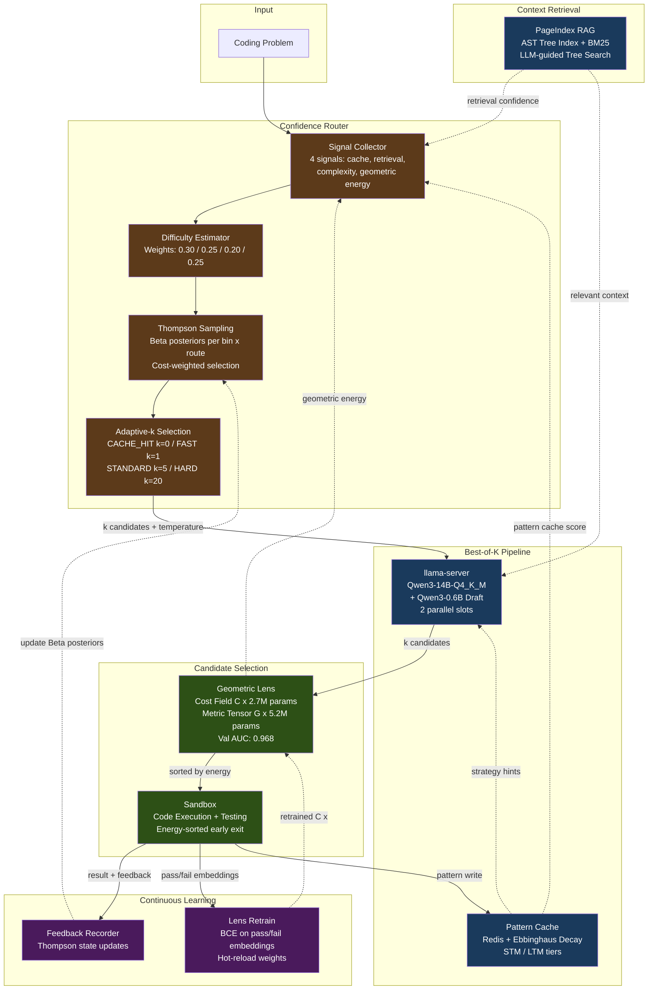

# ATLAS V2 Architecture Diagram

<div align="center">



</div>

## Service Summary

| Layer | Service | Port | Technology | Purpose |
|-------|---------|------|------------|---------|
| **Core** | rag-api | 8001 (NodePort 31144) | FastAPI | Orchestration: routing, RAG, cache, lens |
| | llama-server | 8000 (NodePort 32735) | llama.cpp + CUDA | GPU inference (Qwen3-14B-Q4_K_M + 0.6B draft) |
| **Storage** | Redis | 6379 | Redis | Pattern cache, Thompson state, task queue |
| **Intelligence** | Confidence Router | (in rag-api) | Thompson Sampling | 4-signal difficulty estimation, adaptive-k |
| | Geometric Lens | (in rag-api) | PyTorch (CPU) | Energy-based candidate scoring, 7.9M params |
| | Pattern Cache | (in rag-api) | Redis-backed | Ebbinghaus-decay STM/LTM pattern memory |
| | PageIndex | (in rag-api) | tree-sitter + BM25 | AST-aware code retrieval with LLM tree search |
| **Execution** | Sandbox | (in benchmark) | subprocess | Isolated code execution and testing |

## Data Flows

### Routing Decision
```
Query
 -> Signal Collector (pattern_cache_score, retrieval_confidence, query_complexity, geometric_energy)
 -> Difficulty Estimator (weighted sum -> D(x) in [0,1])
 -> Thompson Sampling (Beta posteriors, cost-weighted efficiency)
 -> Route Selection (CACHE_HIT / FAST_PATH / STANDARD / HARD_PATH)
 -> Adaptive-k (k=0 / k=1 / k=5 / k=20)
```

### Best-of-K Generation
```
Task + k value
 -> llama-server (k candidates at temperature 0.6-0.8, pipelined via ThreadPool)
 -> Geometric Lens (score each candidate, sort by energy)
 -> Sandbox (try in energy order, early exit on first PASS)
 -> Result + feedback
```

### Continuous Learning
```
Sandbox results (pass/fail + code embeddings)
 -> Lens Retrain (BCE loss, epoch-based)
 -> Hot-reload C(x) weights into rag-api
 -> Thompson Sampling feedback (update Beta posteriors)
 -> Pattern Cache write (extract + store successful patterns)
```

## Color Legend

| Color | Meaning |
|-------|---------|
| Dark green | Evaluation (Lens + Sandbox) |
| Dark blue | Generation and retrieval (llama-server, PageIndex, Pattern Cache) |
| Dark brown | Routing (Signal Collector, Difficulty Estimator, Thompson, Adaptive-k) |
| Dark purple | Feedback and learning (Feedback Recorder, Lens Retrain) |
