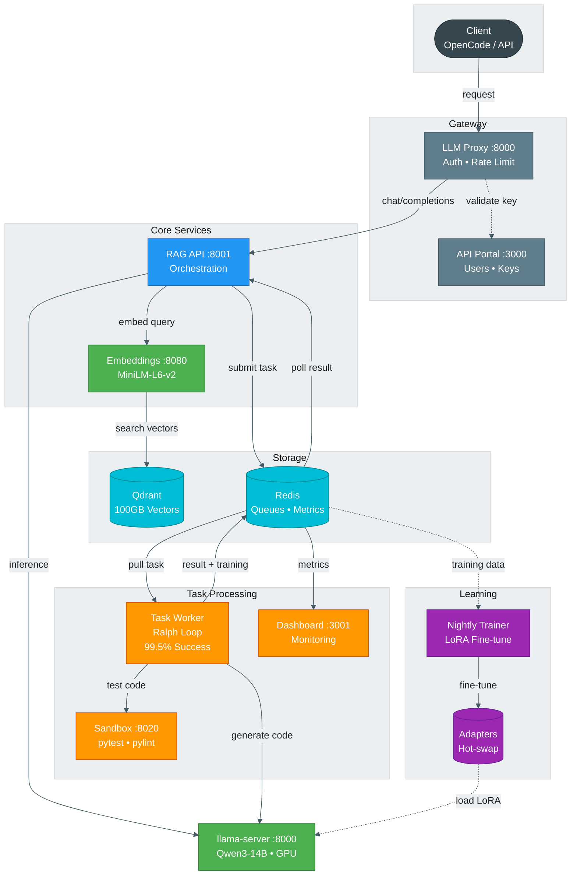

# ATLAS Architecture Diagram

<div align="center">



</div>

## Service Summary

| Layer | Service | Port | Technology | Purpose |
|-------|---------|------|------------|---------|
| **Gateway** | LLM Proxy | 8000 | FastAPI | Auth, rate limiting, routing |
| | API Portal | 3000 | FastAPI + SQLite | User/key management, usage tracking |
| **Core** | RAG API | 8001 | FastAPI | Project sync, chunking, orchestration |
| | llama-server | 8000 | llama.cpp + CUDA | GPU inference (Qwen3-14B) |
| | Embeddings | 8080 | sentence-transformers | Text → 384-dim vectors |
| **Storage** | Qdrant | 6333/6334 | Qdrant | Vector DB, HNSW indexing |
| | Redis | 6379 | Redis | Task queues, metrics, cache |
| **Processing** | Task Worker | — | Python | Ralph Loop execution |
| | Sandbox | 8020 | FastAPI | Isolated pytest/pylint |
| | Dashboard | 3001 | FastAPI + Jinja2 | Real-time monitoring |
| **Learning** | Trainer | — | PyTorch + PEFT | Nightly LoRA fine-tuning |

## Data Flows

### Chat Completion
```
Client → LLM Proxy → RAG API → Embeddings → Qdrant
                         ↓
                    llama-server → Response
```

### Task Processing (Ralph Loop)
```
Client → RAG API → Redis Queue
                       ↓
               Task Worker ⟷ Sandbox
                   ↓
              llama-server
                   ↓
              Success → Training Data
```

### Continuous Learning
```
Redis (completions) → Trainer → LoRA Adapter → llama-server
                                    ↑
                            Hot-swap via symlink
```

## Color Legend

| Color | Meaning |
|-------|---------|
| 🟢 Green | GPU-accelerated services |
| 🔵 Blue | Persistent storage |
| 🟠 Orange | Task processing |
| 🟣 Purple | Learning pipeline |
