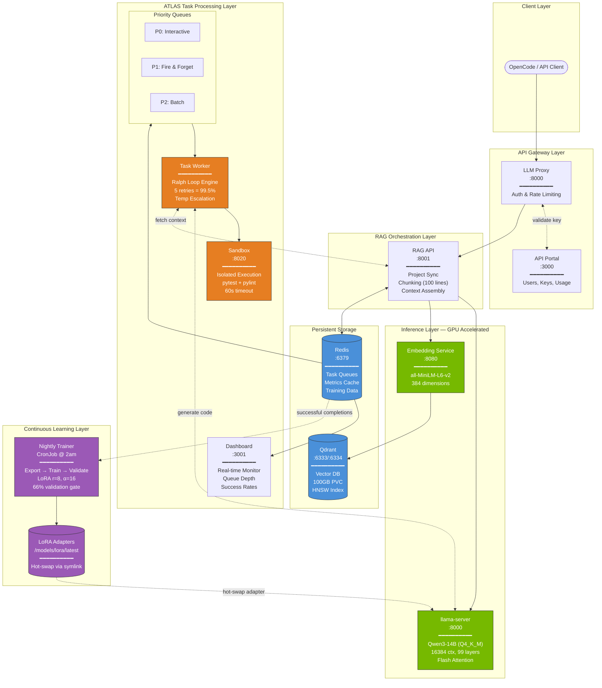

# ATLAS Architecture Diagram

This document contains the full architecture diagram for ATLAS in Mermaid format.

## Component Summary

| Layer | Components | Purpose |
|-------|------------|---------|
| **Client** | OpenCode, API Clients | External interface |
| **Gateway** | LLM Proxy, API Portal | Auth, rate limiting, user management |
| **Inference** | llama-server, Embedding Service | GPU inference, vectorization |
| **Orchestration** | RAG API | Context retrieval, request routing |
| **Storage** | Qdrant, Redis | Vectors, queues, metrics |
| **Processing** | Task Worker, Sandbox, Dashboard | Ralph Loop, isolated execution, monitoring |
| **Learning** | Trainer, LoRA Adapters | Continuous improvement |

## Port Reference

| Service | Port | Protocol |
|---------|------|----------|
| LLM Proxy | 8000 | HTTP |
| API Portal | 3000 | HTTP |
| llama-server | 8000 | HTTP |
| Embedding Service | 8080 | HTTP |
| RAG API | 8001 | HTTP |
| Qdrant | 6333/6334 | HTTP/gRPC |
| Redis | 6379 | Redis |
| Sandbox | 8020 | HTTP |
| Dashboard | 3001 | HTTP |
