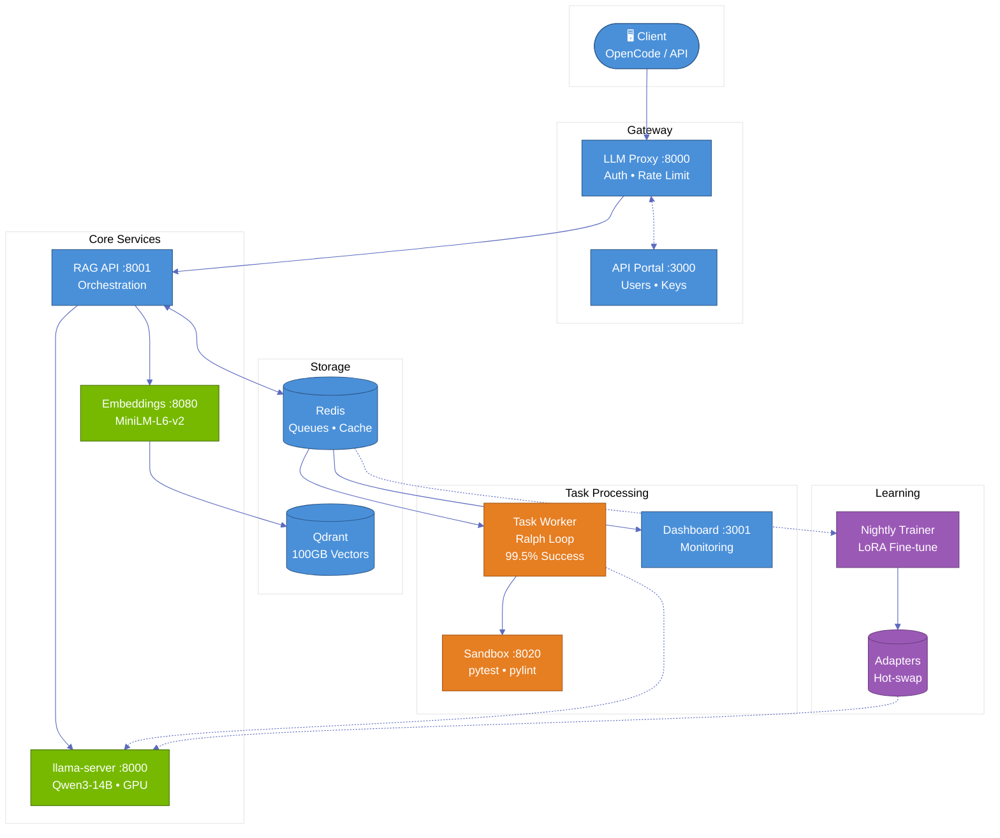

# ATLAS Architecture Diagram

<div align="center">


```mermaid
%%{init: {'theme': 'base', 'themeVariables': { 'primaryColor': '#4A90D9', 'primaryTextColor': '#fff', 'primaryBorderColor': '#2E5A8B', 'lineColor': '#5C6BC0', 'secondaryColor': '#E8EAF6', 'tertiaryColor': '#fff'}}}%%
flowchart TB
    subgraph external[" "]
        client(["🖥️ Client<br/>OpenCode / API"])
    end
    subgraph gateway["Gateway"]
        proxy["LLM Proxy :8000<br/>Auth • Rate Limit"]
        portal["API Portal :3000<br/>Users • Keys"]
    end
    subgraph core["Core Services"]
        rag["RAG API :8001<br/>Orchestration"]
        llama["llama-server :8000<br/>Qwen3-14B • GPU"]
        embed["Embeddings :8080<br/>MiniLM-L6-v2"]
    end
    subgraph data["Storage"]
        qdrant[("Qdrant<br/>100GB Vectors")]
        redis[("Redis<br/>Queues • Cache")]
    end
    subgraph atlas["Task Processing"]
        worker["Task Worker<br/>Ralph Loop<br/>99.5% Success"]
        sandbox["Sandbox :8020<br/>pytest • pylint"]
        dash["Dashboard :3001<br/>Monitoring"]
    end
    subgraph learn["Learning"]
        trainer["Nightly Trainer<br/>LoRA Fine-tune"]
        lora[("Adapters<br/>Hot-swap")]
    end
    client --> proxy
    proxy <-.-> portal
    proxy --> rag
    rag --> llama
    rag --> embed
    embed --> qdrant
    rag <--> redis
    redis --> worker
    worker --> sandbox
    worker -.-> llama
    redis --> dash
    redis -.-> trainer
    trainer --> lora
    lora -.-> llama
    classDef gpu fill:#76B900,stroke:#4a7200,color:#fff
    classDef storage fill:#4A90D9,stroke:#2E5A8B,color:#fff
    classDef process fill:#E67E22,stroke:#a85a16,color:#fff
    classDef learn fill:#9B59B6,stroke:#6c3d80,color:#fff
    class llama,embed gpu
    class qdrant,redis storage
    class worker,sandbox process
    class trainer,lora learn
```

</div>

## Service Summary

| Layer | Service | Port | Technology | Purpose |
|-------|---------|------|------------|---------|
| **Gateway** | LLM Proxy | 8000 | FastAPI | Auth, rate limiting, routing |
| | API Portal | 3000 | FastAPI + SQLite | User/key management, usage tracking |
| **Core** | RAG API | 8001 | FastAPI | Project sync, chunking, orchestration |
| | llama-server | 8000 | llama.cpp + CUDA | GPU inference (Qwen3-14B) |
| | Embeddings | 8080 | sentence-transformers | Text → 384-dim vectors |
| **Storage** | Qdrant | 6333/6334 | Qdrant | Vector DB, HNSW indexing |
| | Redis | 6379 | Redis | Task queues, metrics, cache |
| **Processing** | Task Worker | — | Python | Ralph Loop execution |
| | Sandbox | 8020 | FastAPI | Isolated pytest/pylint |
| | Dashboard | 3001 | FastAPI + Jinja2 | Real-time monitoring |
| **Learning** | Trainer | — | PyTorch + PEFT | Nightly LoRA fine-tuning |

## Data Flows

### Chat Completion
```
Client → LLM Proxy → RAG API → Embeddings → Qdrant
                         ↓
                    llama-server → Response
```

### Task Processing (Ralph Loop)
```
Client → RAG API → Redis Queue
                       ↓
               Task Worker ⟷ Sandbox
                   ↓
              llama-server
                   ↓
              Success → Training Data
```

### Continuous Learning
```
Redis (completions) → Trainer → LoRA Adapter → llama-server
                                    ↑
                            Hot-swap via symlink
```

## Color Legend

| Color | Meaning |
|-------|---------|
| 🟢 Green | GPU-accelerated services |
| 🔵 Blue | Persistent storage |
| 🟠 Orange | Task processing |
| 🟣 Purple | Learning pipeline |
