> **[English](../../ARCHITECTURE.md)** | **[简体中文](../zh-CN/ARCHITECTURE.md)** | **日本語** | **[한국어](../ko/ARCHITECTURE.md)**

# ATLAS アーキテクチャ

ATLAS V3.1.0 のシステムアーキテクチャ。二層構成: 外側のエージェントループがツールコールのオーケストレーションを担い、内側の V3 パイプラインがビルド検証とエネルギーベースの選択を通じて多様なコード候補を生成します。

---

## 1. システム概要

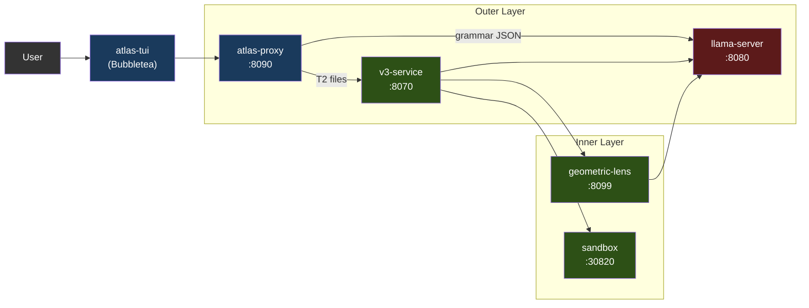

各サービスは Docker Compose 経由（推奨）でコンテナとして、または `atlas` ランチャー経由でローカルプロセスとして動作します。GPU を使うのは llama-server だけです。それ以外はすべて CPU 上で動きます。

チャットフロントエンドは **atlas-tui**（Bubbletea, PC-062）です。ネイティブ Go 製のターミナル UI で、`/v1/agent`（ターンごとのチャット SSE）と `/events`（パイプラインペイン向けのグローバルな型付きエンベロープフィード）を消費します。`atlas`（対話モードのデフォルト）または `atlas tui`（明示指定）で起動します。パイプラインペインは V3 ステージをライブ表示し、チャットペインはアシスタントの Markdown を glamour でレンダリングします。スラッシュコマンド `/add /diff /commit /run` などがローカルファイルのコンテキストとシェルアウトを処理します。モードを意識した入力（チャット / `!bash` / `/slash`）にヒントドロップダウンが付きます。

プロキシ上の `/v1/chat/completions` は llama-server への透過パススルーです。SDK 互換性のために残してありますが、エージェントループは実行しません。ツールコール + V3 パイプラインを使いたいサードパーティクライアントは `/v1/agent` を直接対象にすべきです。この契約は [API.md](API.md) に記載されています。PC-063 では、完全に動作するレシピと OpenAPI 仕様の作成を追跡しています。

### 1.1 対応アクセラレータ

llama-server は GPU を使用する唯一のサービスです。それ以外のすべての ATLAS サービスは CPU 上で動作します（プロキシは Go、v3-service / geometric-lens / sandbox は Python）。これによりマルチバックエンドの対応面が小さく保たれます — 新しいアクセラレータを追加するには、新しい Dockerfile + エントリーポイントの環境変数分岐が必要なだけで、パイプラインへの変更は不要です。

| バックエンド | ステータス (V3.1.x) | イメージ / ビルドパス | Compose オーバーライド | 検証済みカード |
|---|---|---|---|---|
| **CUDA** (NVIDIA) | V3.1.0 以降提供中 | `inference/Dockerfile.v31` → `atlas-llama` | (デフォルト) | RTX 5060 Ti 16GB（標準構成）、RTX 30xx/40xx/50xx |
| **ROCm / HIP** (AMD) | V3.1.1 提供中 | `inference/Dockerfile.rocm` → `atlas-llama-rocm` | `docker-compose.rocm.yml` | RX 7900 XTX（コミュニティによるスモークテスト、GH #26） |
| **Metal** (Apple Silicon) | 提供中 ([#32](https://github.com/itigges22/ATLAS/issues/32)) | ハイブリッド: ネイティブ llama-server (Metal) + 残りは Docker（macOS は GPU をコンテナにパススルーできないため） | `docker-compose.macos.yml` | M シリーズ; 16 GB 以下では Q4_K_M、24 GB 以上のユニファイドメモリでは Q6_K |
| **SYCL** (Intel Arc) | ロードマップ | 未定 | 未定 | Arc A770 16 GB（ターゲット） |

**バックエンドの選択は実行時ではなくインストール時に行われます。** `atlas init` は `tier.detect_gpu()`（`atlas/cli/commands/tier.py` を参照）を実行し、検出されたすべてのベンダーの中から VRAM が最大の GPU を選び（`ATLAS_GPU_VENDOR` / `ATLAS_GPU_INDEX` でオーバーライド可能）、`.env` に `ATLAS_BACKEND={cuda|rocm|metal|sycl}` を書き込みます。各バックエンドにはそれぞれ事前ビルド済みのイメージがあります。ユーザーがすべてのバックエンドのライブラリを同梱した肥大化したイメージを実行することはありません。ウィザードは、起動しない `.env` を書き込む代わりに、未対応バックエンドのホストでは拒否します。

**持ち込みモデルの対応面 (V3.1.1)。** `atlas lens check` は、稼働中の llama-server に対する安価な事前チェックで、ロード済みモデルが Lens 互換かどうかを報告します（PC-057）。`atlas lens build --samples <path>` は `geometric-lens/geometric_lens/training.py` をラップし、モデルのネイティブ埋め込み次元で新しい `cost_field.pt` アーティファクトをトレーニングします（PC-058）。この2つを組み合わせることで、ユーザーは Lens コードをフォークすることなくデフォルト以外の GGUF を差し込めます — C(x) コンストラクタは任意の `input_dim` を受け付けるため、モデルごとに変わるのはトレーニング済み重みだけです。ユーザー向けのフローは [CLI.md § atlas lens](CLI.md#atlas-lens-pc-057--pc-058) を参照してください。PC-059（レジストリへの書き戻し）と PC-060（HF 仲介配布）は、このループを閉じる V3.1.2 以降のフォローアップです。

**ベンダー非依存な要素**（すべてのバックエンドで動作）: 文法制約付き JSON、セルフ埋め込み（`/embedding`）、レイヤーごとの隠れ状態（PC-202 パッチ）、ASA 制御ベクトル（バックエンドを問わず llama.cpp の `control_vector_load` でロードされる）、KV キャッシュ量子化、外側のエージェントループ全体、V3 パイプライン、Geometric Lens、サンドボックス。

**バックエンドごとに異なる要素:**
- **Flash attention。** CUDA + ROCm: 完全サポート。Metal: 限定的（llama.cpp の Metal バックエンドは一部のヘッドサイズで flash-attn をサポート。未対応の場合はデフォルトでオフ）。SYCL: 未定。
- **ピン留めホストメモリ。** `GGML_CUDA_NO_PINNED` は CUDA + ROCm に適用されます（HIP は GGML 互換レイヤーで CUDA のパスをミラーします）。Metal/SYCL はピン留めを使いません。
- **マルチ GPU + テンソル並列。** V1 はすべてのバックエンドでシングル GPU のみをサポートします。マルチ GPU は GH #34 で、特定のベンダーに紐づいてはいません。
- **Apple ユニファイドメモリ。** macOS は GPU とシステムメモリを共有します。「VRAM」の計算は実際には「合計 16 GB から OS + アプリを引いたもの」です。§7 を参照してください。

K3s デプロイパス（`scripts/install.sh`、`templates/` 内のマニフェスト）は V3.1.1 時点では CUDA 専用です — ROCm の K8s レシピは V3.1.2 の予定です（`/dev/kfd` + `/dev/dri` の hostPath マウントと `render`/`video` グループ所属が必要で、これは `docker-compose.rocm.yml` のクラスターレベル相当です）。

---

## 2. サービス

| サービス | ポート | 言語 | 役割 |
|---------|------|----------|---------|
| **llama-server** | 8080 | C++ (llama.cpp) | LLM 推論（CUDA / ROCm / Metal / Vulkan; SYCL はロードマップ — §1.1 を参照）、文法制約付き JSON、セルフ埋め込み、レイヤーごとの残差隠れ状態（PC-202） |
| **atlas-proxy** | 8090 | Go | エージェントループ、ツールコールルーティング、ティア分類、`/v1/agent` SSE、`/events` 型付き SSE、`/cancel`。`/v1/chat/completions` は llama-server へそのままパススルー。 |
| **atlas-tui** | (クライアント) | Go | Bubbletea TUI; `/events` と `/v1/agent` の SSE ストリームを消費。PC-062。 |
| **v3-service** | 8070 | Python | V3 パイプラインの HTTP ラッパー（PlanSearch、DivSampling、PR-CoT など） |
| **geometric-lens** | 8099 | Python (FastAPI) | C(x) エネルギースコアリング、G(x) XGBoost 品質予測、RAG/プロジェクトインデキシング |
| **sandbox** | 30820 (ホスト) / 8020 (コンテナ) | Python (FastAPI) | 分離されたコード実行、コンパイル、リント、テスト実行 |
| **redis** | 6379 (内部) | C (Redis 7) | パターンキャッシュ、共起グラフ、タスクキュー、ルーター状態; geometric-lens のバッキングストア |

---

## 3. atlas-proxy（外側のレイヤー）

プロキシはチャットフロントエンドのエントリーポイントです。`/v1/agent`（型付きイベントストリーム — TUI が使うもの）でユーザーメッセージを受け取り、llama-server を呼び出し、ツールコールをパースし、それらを実行し、イベントをストリームバックする内部エージェントループを実行します。レガシーな `/v1/chat/completions` エンドポイントは llama-server への透過パススルーです。イベントタイプの完全なカタログは [API.md](API.md) を参照してください。

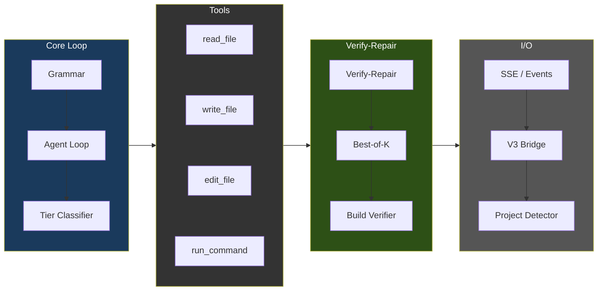

### エージェントループのフロー

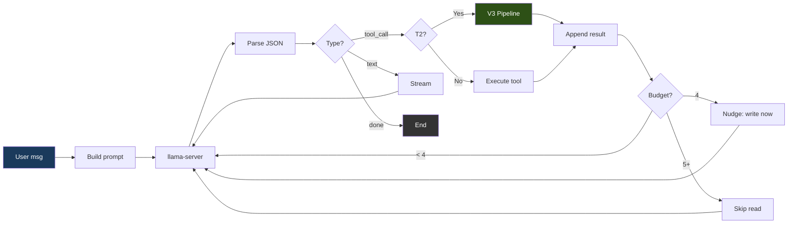

### 文法強制

llama-server の `response_format: {"type": "json_object"}` は、すべてのモデル出力を3つの有効な JSON 形状のいずれか1つに強制します:

```json
{"type": "tool_call", "name": "<tool_name>", "args": {...}}
{"type": "text", "content": "<message>"}
{"type": "done", "summary": "<summary>"}
```

JSON スキーマは `oneOf` と `additionalProperties: false` を用い、ツール名をレジストリから列挙します。モデルが不正な JSON を生成することはできません — トークン生成は llama-server レベルで文法制約されています。

### ツール

`proxy/tools.go` に登録された15個のツール:

| ツール | 役割 | 読み取り専用 |
|------|---------|-----------|
| `read_file` | ファイル内容を読む（任意の offset/limit 付き） | はい |
| `outline_file` | ファイルのトップレベルの関数/クラスを行範囲付きで一覧表示し、本体は含めない（`.py` は tree-sitter、それ以外はベストエフォートのスキャン）。外科的読み取りのエントリーポイント: まずアウトラインし、次に offset/limit 付きで `read_file` する | はい |
| `write_file` | 新規ファイルを作成（既存の5行超ファイルでは拒否 — 安全制限を参照） | いいえ |
| `edit_file` | ≤10 行の変更向けの外科的なインライン文字列置換（old_str/new_str） | いいえ |
| `ast_edit` | tree-sitter セレクタ（`function:NAME`、`class:NAME`、`<tag>`）による関数/クラス/HTML 要素全体の書き換え; ノード全体の差し替えでは edit_file より優先して必須。GH #39、v1 では .py/.html/.htm のみ | いいえ |
| `delete_file` | ファイルまたは空ディレクトリを削除（実行後にループ終了を強制） | いいえ |
| `move_file` | ワークスペース内でファイルを移動またはリネーム（例: `index.html` → `templates/`）。純粋な移動 — V3/外科的編集のゲートをバイパスし、既存の宛先の上書きは拒否。シェルの `mv`/`cp` が拒否されるため「ファイルを再編成する」ための正規のパス | いいえ |
| `find_file` | ファイル**名** / パスによる正規表現検索（安価な存在確認 + 位置特定）。ファイル内容を grep する `search_files` とは区別される。PC-028 | はい |
| `search_files` | ファイル内容にまたがる正規表現検索（最大200件、.git/node_modules をスキップ） | はい |
| `list_directory` | ディレクトリ内容を種別とサイズ付きで一覧表示 | はい |
| `run_command` | サンドボックスコンテナ経由でシェルコマンドを実行（PC-188）; 5分のタイムアウト上限 | いいえ |
| `run_background` | PC-196 — サンドボックス内で長時間実行プロセス（例: `python app.py`）を開始; `job_id` を即座に返す | いいえ |
| `tail_background` | PC-196 — バックグラウンドジョブの新しい stdout/stderr を `job_id` で取得 | はい |
| `stop_background` | PC-196 — バックグラウンドジョブを `job_id` で SIGTERM/SIGKILL | いいえ |
| `plan_tasks` | 作業を依存関係付きの並列タスクに分解 | いいえ |

### ツール選択バイアスの緩和策（2026年5月 BiasBusters の総合）

Qwen3.5-9B には、ast_edit が正しい場合でも `ast_edit` より `edit_file` を優先する文書化されたバイアスがあります（BiasBusters arxiv 2510.00307 — 近接するツール名の埋め込みが競合する; 名前よりも説明文の方が重要）。プロキシでは4つの防御策を組み合わせます:

1. **説明文の書き換え**（`proxy/tools.go`）。edit_file の説明はファイル全体/関数全体での使用を警告し、ast_edit の説明は >10 行 / ノード全体の差し替えには必須と述べ、write_file の説明は新規ファイル専用と述べる。
2. **条件付き GBNF 文法**（`proxy/grammar.go`、`proxy/agent.go:stepExclusions`）。既存の5行超 .py/.html/.htm ファイルに対する write_file が拒否されると、次の LLM 呼び出しはツール名のプロダクションから edit_file と write_file を禁止する GBNF 文法で制約される。モデルは物理的にそれらを発行できない。この制限は1回の判断後に失効する。
3. **ステップごとのツールリストフィルタ**（同じトリガー）。一時的な `[system note]` のユーザーメッセージが注入され、このステップでは ast_edit が唯一の構造的編集ツールであることをモデルに思い出させる。
4. **ASA ステアリングベクトル**（`geometric-lens/asa_calibration/`）。活性化ステアリングが残差ストリームの分布を上流でシフトさせ、いかなる拒否が発火する前の初回の判断でも ast_edit が優先される。ファイルが存在すれば `inference/entrypoint-v3.1.sh` が `/models/ast_edit_steering.gguf` から自動ロードする — オペレーターが `geometric-lens/asa_calibration/README.md` のワークフローでベクトルをビルドし配置すれば、以降は常時オン。パス/スケール/レイヤー範囲は `ATLAS_CONTROL_VECTOR*` 環境変数でオーバーライドする。

   **モデル別の結合（PC-061, V3.1.2）。** 各 ASA ベクトルは特定モデルの残差ストリーム幾何に対してトレーニングされる。同梱の `ast_edit_steering.gguf` は Qwen3.5-9B（4096 次元、36 レイヤー）向けにキャリブレーションされている — 別のモデルに差し替えると、ベクトルはよくて no-op、悪ければ能動的な誤ステアリングになる。`atlas asa check` は設定済みベクトルをロード済みモデルの埋め込み次元と照合し、GGUF メタデータからレイヤー数 + `model_hint` をパースし、`compat` / `needs-build` / `incompatible` を報告する。`atlas asa build` はキャリブレーションワークフローを1回の CLI 呼び出しにまとめ、（PC-202 の隠れ状態クライアントを持つ）lens コンテナ内で実行する。`atlas asa publish` はトレーニング済みアーティファクトを HF に送り、レジストリ PR を生成する — PC-057/058/059 で追加された `atlas lens` ファミリーと並行している。[CLI.md § atlas asa](CLI.md#atlas-asa-pc-061) を参照。

4つの緩和策はすべて組み合わさる: ASA は上流で提案分布をバイアスし（項目4）、文法は拒否後のハードな禁止であり（項目2）、システムノートはモデルの作業パレットを集中させ続け（項目3）、説明文はプロンプト自体に常時適用可能なステアリングシグナルを提供する（項目1）。

### ファイルごとのティア分類

各 `write_file`/`edit_file` の呼び出しは独立して分類されます:

| ティア | 最大ターン数 | アクション |
|------|-----------|--------|
| T0（会話的） | 5 | テキスト応答のみ |
| T1（単純） | 0（上限なし） | 直接書き込み — V3 オーバーヘッドなし |
| T2（機能） | 0（上限なし） | V3 パイプライン発火 |
| T3（難しい） | 0（上限なし） | V3 パイプライン発火 |

2026年5月のハードニングスイープにより `absoluteMaxTurns` の上限が撤去され、ティアごとの T1/T2/T3 の上限がゼロ（「上限なし」）に引き下げられました。これは、ループ内の8つの検出器スタックが、いつ打ち切るかを決めるようになったためです: lens リグレッション（`agent_lens_intervention`）、推論の繰り返し（`agent_reasoning_intervention`）、ツールコールの繰り返し（`agent_repeat_intervention`）、パス対応のエラーブレーカー、アクションなしの done ゲート、claim-check ゲート、プラン遵守の閾値、空応答のフォールバック。オペレーターは依然として、単発の「アプリ全体を直す」プロンプト向けに `ATLAS_MAX_TURNS=<n>` でオーバーライドできます — `proxy/types.go::envOverrideMaxTurns` を参照。

分類器は `proxy/tools.go`（`classifyFileTier`）に、ロジックパターンマッチャーは同じファイル（`hasLogicIndicators`）にあります。

**常に T1（直接書き込み）:**
- 名前による設定ファイル（コード中で計29個）: `package.json`、`tsconfig.json`、`next.config.{js,ts,mjs}`、`tailwind.config.{ts,js}`、`postcss.config.{js,mjs}`、`vite.config.{ts,js}`、`.eslintrc.json`、`.prettierrc`、`jest.config.{ts,js}`、`cargo.toml`、`go.mod`、`go.sum`、`makefile`、`cmakelists.txt`、`pyproject.toml`、`setup.py`、`setup.cfg`、`requirements.txt`、`pipfile`、`.editorconfig`、`.gitignore`、`dockerfile`、`docker-compose.{yml,yaml}`
- 拡張子によるデータファイル: `.json`、`.yaml`、`.yml`、`.toml`、`.csv`、`.xml`、`.env`
- スタイルファイル: `.css`、`.scss`、`.less`
- ドキュメント: `.md`、`.txt`、`.rst`
- シェルスクリプト: `.sh`、`.bash`
- 自明なほど小さいファイル: **10 行未満**（そのサイズでは V3 が意味のある多様化を行う対象がない — 以前の50行の下限は保守的すぎた; 7つのルートを持つ33行の flask `app.py` こそ V3 が助けるべきケース）
- ロジック指標のない未知の拡張子

**T2（V3 パイプライン）** — ファイルが10行以上であり、かつ以下のいずれかを満たす場合に該当:
- `hasLogicIndicators(content)` が true を返す — 以下のパターンファミリーにまたがる**2件以上の一致**として定義される（小さいがルーティングを持つファイルが漏れていたため3から引き下げ）:
  - **関数/メソッド定義:** `def `、`func `、`function `、`fn `、`async `
  - **制御フロー:** `if `、`else `、`switch `、`match `、`for `、`while `
  - **エラー処理:** `try `、`catch `、`except `、`throw `、`raise `
  - **Flask / FastAPI / Django ルーティング:** `@app.route`、`@app.get`、`@app.post`、`@app.put`、`@app.delete`、`@blueprint`、`render_template`、`url_for`、`request.method`、`flask.`、`from flask`
  - **Express / Node API:** `export default`、`export async`、`module.exports`、`app.get`、`app.post`、`app.put`、`app.delete`、`router.`、`handler`、`NextResponse`、`Response(`、`Request`
  - **React の state/data:** `useState`、`useEffect`、`useRef`、`useCallback`、`setState`、`dispatch`、`reducer`
  - **バリデーション:** `validate`、`schema`、`parse`、`zod.`
  - **データベース:** `query(`、`insert(`、`.select(`、`.update(`
  - **JSX / React コンポーネントパターン:** `return (`、`return <`、`className=`、`onClick`、`onChange`、`onSubmit`、`.map(`、`.filter(`、`.reduce(`
  - **インポート:** `import {`
- または、ファイルが認識されたソースコード / マークアップの拡張子を持ち、ロジック指標が発火しなかった場合 — T2 で疑わしきは罰せずの扱いを受ける（12行のコンポーネントの骨組みのような、最小だが本物のファイルをカバーする）。拡張子: `.py`、`.go`、`.rs`、`.ts`、`.tsx`、`.js`、`.jsx`、`.c`、`.cpp`、`.cc`、`.h`、`.hpp`、`.java`、`.kt`、`.swift`、`.rb`、`.php`、`.vue`、`.svelte`、`.html`、`.htm`

**T3（難しい）** — 現状、分類器が単独で T3 を発行することはない; サイクロマティック複雑度のリファイナー（GH #39 のポイント2の `/internal/cyclomatic_complexity` 経由の `refineTierWithCC`）は、McCabe CC が実際の分岐密度を示すときに T2 → T3 へ*エスカレート*できる。決してダウングレードはしない。

### プランモード（ターンごとの事前準備）

プランモードは、最初のツールコール**より前**にエージェントの各ターンで1回実行されるプランニングステップです。プランナーは LLM から異なる温度で3つの候補プランをサンプリングし、それぞれをヒューリスティックにスコア化し、最良のものを選びます。勝ったプランはシステムプロンプトに入り、モデルがプランから逸脱して空回りすると自動修正する遵守ゲートのシードになります。

2つの失敗モードに対処するよう設計されています:

1. **探索の空回り。** プランがないと、最初の2〜4個のツールコールは `read_file → list_directory → search_files → read_file → …` になりがちで、行動する代わりに探索してしまう。プランがあれば、システムプロンプトがモデルに明示的に伝える: これを読め、あれを編集しろ、curl で検証しろ。
2. **証拠のない `done`。** プランの `verify_step` は修正の証明である。検証ゲート（PC-179）は、そのステップが成功裏に実行されるまで `done` を拒否する。

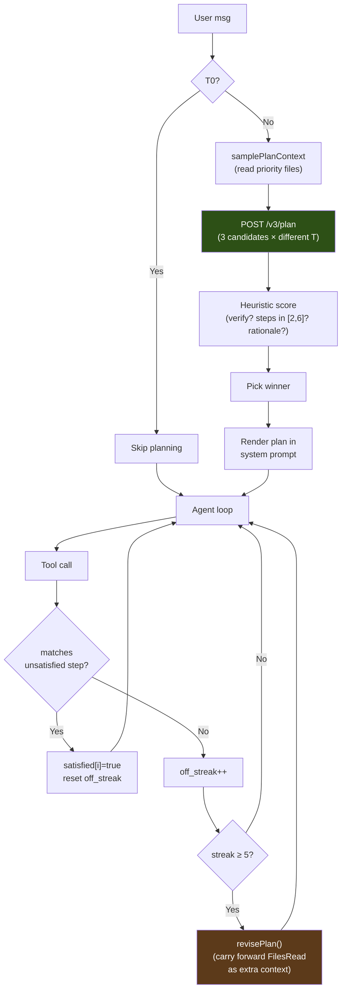

**v3-service `/v3/plan`（Python）。** `v3-service/main.py` は `PLAN_PROMPT_TEMPLATE` をユーザーメッセージ + 作業ディレクトリ + 切り詰めた優先ファイルでレンダリングし、シードオフセットと温度 `[0.3, 0.5, 0.7]` で LLM を3回呼び出します。デフォルトモードは llama-server に `chat_template_kwargs: {enable_thinking: false}` を送ります。Qwen3.5 は thinking がオンのとき `<think>` ブロックを `delta.reasoning_content`（chat-completions の消費者には見えない）にルーティングするため、2048 トークンの予算が完全に推論に費やされ、JSON が一切出力されなくなるからです。プロンプト内の `/nothink` ディレクティブ単独では信頼できません。`ATLAS_PLAN_THINKING=1` を設定すると両方が切り替わります: thinking が有効になり、プランナー予算が 8192 トークンに引き上げられます（PC-206 — 高速なハードウェアでのみ有用; 厳しい GPU ではプランナーのレイテンシが候補あたり約5〜30秒から4分超になる）。各生の応答は、Markdown フェンス耐性 + 波括弧の深さ対応のエクストラクタ（`_parse_plan_json`）でパースされ、`_score_plan` でスコア化されます:

- `verify_step` を持つことに対して **+0.3**
- `len(steps) ∈ [2, 6]` に対して **+0.2**
- 検証ステップが既知の検証コマンド（`pytest`、`python`、`curl`、`go test`、…）を参照する場合 **+0.2**
- ユーザーが名指ししたファイルを対象とする**ステップごとに +0.1**（+0.2 で打ち切り）
- 空でない `rationale` に対して **+0.1**

最高スコアが勝ち、同点ならステップ数が少ない方が勝つ（冗長さが少ない）。3つの候補すべてがパースに失敗した場合、ハンドラは1ステップのフォールバック（`{action: "investigate the request and act"}`）を返すため、エージェントループがプランナーの失敗でブロックすることはありません。API 契約: [API.md § POST /v3/plan](API.md#post-v3plan)。

**プロキシのコンポーネント（Go）。**

| ファイル | 役割 |
|---|---|
| `proxy/v3_bridge.go` | `callV3PlanStreaming(v3URL, req, onProgress)` — SSE ストリームを開き、進捗イベントをコールバックに転送し、`event: result` フレームから最終的な `Plan` を返す |
| `proxy/types.go` | `V3PlanRequest`、`Plan`、`PlanStep` の型。`AgentContext` に `Plan`、`PlanStepsSatisfied[]`、`PlanOffStreak`、`PlanRevisions` が追加される |
| `proxy/agent.go` | `samplePlanContext()` がプランナー向けに優先ファイル（`app.py`、`templates/index.html`、`package.json`、…）を走査する。`shouldGeneratePlan()` がティア + メッセージ長でゲートする。`generatePlan()` がブリッジを実行し、完全なステップリスト付きで `plan_loaded` を発行する |
| `proxy/plan_adherence.go` | `matchPlanStep()`（緩いツール名 + パス接尾辞のマッチ）、`recordPlanAdherence()`（ツールコールごとの計上）、`revisePlan()`（`FilesRead` を追加コンテキストとして引き継いで再生成） |

システムプロンプトのレンダリングは `buildSystemPrompt` 内で `## Plan` 見出しの下で行われます。各ステップは `i. [marker] **action** target — why` で、通常ステップは `marker = " "`、検証ステップは `marker = "✓"` です。検証ステップは、検証ゲートが `done` に対して守る「修正の証拠」ステップとしてフラグが立ちます。（TUI のチャット行レンダリングは `tui/plan.go` でより豊かなグリフ — ☐ 未充足、✓ 充足、⚐ 検証ステップ — を使いますが、それらはクライアントに存在し、モデルが見るシステムプロンプトにはありません。）

**調整可能な値。**

| 定数 | ソース | デフォルト | 根拠 |
|---|---|---|---|
| `planAutoReviseThreshold` | `proxy/plan_adherence.go` | `5` | 自動修正が発火するまでのプラン逸脱ツールコール数 |
| `planMaxRevisions` | `proxy/plan_adherence.go` | `2` | ループあたりの自動修正の上限。これを超えると `revisePlan` は no-op になる — 最後に成功したプランがアクティブのまま遵守の計上は続くが、それ以上の再プランニングは発火しない。 |
| `n_candidates` | `v3-service/main.py` | `3` | 温度 `[0.3, 0.5, 0.7]` での多様なサンプリング; 候補が増えるほど実時間が増える（候補あたり約5秒） |
| 候補あたりの `max_tokens` | `v3-service/main.py` | `2048` | 根拠付き6ステップのプランをカバーする; 1024 では初期テストで JSON が途中で切れた |

**スキップ条件**（`shouldGeneratePlan`）:

1. `ctx.Tier == Tier0Conversational` — 些細なチャット（「hi」「thanks」）は決してプランしない。
2. `len(message) < 12` — 前のターンのプランに依存する短い了承（「yes do it」「looks good」）は再びプランしない。

これら以外では、すべてのターンでプランします。失敗（`/v3/plan` 5xx、ネットワークエラー、フォールバックを超えてすべての候補がパース不能）は静かにデグレードします — ループは `ctx.Plan` なしで実行され、プランモード導入前の挙動と同一になります。

**コスト。** 温まった GPU での3候補スイープの実時間は約15秒（候補あたり約5秒）。トークンコストは ≈ 1500 トークン/候補 × 3 = 約4500 の実トークン（予算 6144）。どちらもエージェントの最初のツールコール前に前払いされます。モデルが無駄な探索ラウンドをスキップした瞬間に取り戻せます。なぜなら、節約された各ツールコールはそれ自体が約5〜10秒の LLM ラウンドトリップ + ツール実行だからです。

### 安全制限

| 制限 | 値 | 目的 |
|-------|------|---------|
| 会話のトリム | スロットに合わせたスライディングウィンドウ: system + 最新のユーザー指示 + **アクティブなファイルの内容** + `スロットあたりのコンテキスト − ATLAS_MAX_TOKENS − 2048` に収まるだけの末尾メッセージを保持（下限: 8 を保持; 任意のハードな上限は `ATLAS_AGENT_HISTORY_BUDGET` 経由）。最新のユーザーメッセージと最新のファイル内容読み取りの両方をピン留めすることが重要 — ファイルのピン留めがないと、長いループで編集中のファイルが落ち、弱いモデルが盲目的に編集し、もう見えないシンボル/行を幻覚する | 編集中のファイルをモデルから奪うことなくコンテキストのオーバーフローを防ぐ |
| 冗長読み取りのショートサーキット | 未変更ファイルのファイル全体 `read_file` は、**内容がまだライブの会話に存在する場合に限り**（そのファイルの最長行で探る）コンパクトな「すでにコンテキストにある」ポインタを返す; トリムされていた場合は、モデルが盲目的に編集しないよう完全なファイルが再提供される（`ATLAS_DEDUP_READS=0` で無効化）。ページ読み取りと変更済みファイルは常に実内容を提供する | 失った内容を持っているとモデルに嘘をつくことなく、未変更ファイルを毎ターン再エンコードするのを避ける |
| トレースバックの局所化 → 指向的編集（#39 / オプション3） | run_command が Python トレースバックを表面化させたとき、プロキシはプロジェクト内の最も深いフレーム（file:line:function）を抽出し、問題の行を引用し、指向的なステア（「ここの `function:X` を直せ; 他を編集したりハードコードしたりするな」）を注入する。モデルがその後も未変更のコードを再実行する場合、実行ツールは**次の判断の文法から禁止される**（`tracebackExclusion`）ため、編集が強制される | 弱いモデルが失敗する局所化（間違った関数を幻覚する）を、得意とする指向的編集に変換する — スタックフレームこそが局所化であり、LLM の推論は不要 |
| モジュール欠落のインストールステア | 実行が「No module named X」で失敗したとき（サンドボックスはアプリのライブラリを同梱しない）、プロキシはモデルにまず `pip install X` を — マニフェストがあれば `pip install -r requirements.txt` を（`missingModuleSteer`）— 行うよう伝え、同一の失敗コマンドを再実行する代わりにする。tracebackSteer は ModuleNotFoundError を意図的に無視する（コードのバグではない）; これが欠けていた肯定的なガイダンスを供給する | 未インストール依存のループを打破する（`flask run` ×3 の後 `run_background flask run` ×3 → タスク完了前に繰り返しブレーカーがセッションを停止したのを観測） |
| ファイル欠落の大文字小文字不一致ステア | 失敗した run_command が、実際のワークスペースファイルと大文字小文字だけが異なるファイルを名指して「No such file or directory」を表面化させたとき（例: ファイルが `requirements.txt` なのに `pip install -r Requirements.txt` を実行）、プロキシは正しいファイルを名指し、正確な名前で再実行するようモデルに伝える（`missingFileSteer`）。大文字小文字違いが実際に存在するときのみ発火する — 本当に存在しないファイルにアンカーを捏造することはない | 大文字小文字のタイプミスのループを実行禁止なしで打破する（繰り返しブレーカーが発火する前に間違った名前の同一再実行を5回観測）。ここではモデルが*再実行すべき*だから — ただし正しい名前で |
| V3 インタラクティブの実時間上限 | エージェントパスからの単一の V3 パイプライン呼び出しは `ATLAS_V3_TIMEOUT`（デフォルト 180秒）で上限を設けられる; タイムアウト時、プロキシはブロックする代わりにモデル自身の構文ゲートされた内容にフォールバックする | フェーズ3修復のロングテールな停滞（103行の書き込みで約11分を観測）を抑え、インタラクティブセッションの応答性を保つ; `0` でオフラインベンチ向けに無効化 |
| 読み取り/アウトライン時の呼び出しグラフフッター（#39） | `ATLAS_CALL_GRAPH` がオンのとき、`outline_file` と `.py` のファイル全体 `read_file` は各シンボルのファイル内呼び出しエッジ（`calls:` / `called by:`）に加えてステア（「間違った戻り値はそれが呼ぶ関数から来ているかもしれない — エッジをたどれ」）を添付する。その1ファイルにスコープされるので、ターゲットを見逃すリポジトリ全体スキャンは行わない | 局所化の判断地点で構造を表面化させる — モデルが何を編集するか選ぶ直前に検査するアーティファクト |
| ast_edit のシンボルグラウンディング | 0 ノードに一致するセレクタに対して、エラーは素っ気ない「存在を確認しろ」の代わりにファイルの実際のシンボルを列挙する（「`get_inventory_count` は無い; このファイルは `item_subtotal`、`total_value`、… を定義している」） | 幻覚したシンボルの再試行を、モデルが選べる実在の名前にグラウンディングする |
| セッション開始時の KV スロット消去 | スロット0だけでなく、すべての `--parallel` スロットが消去される（`/slots/N?action=erase`） — llama-server は接頭辞マッチ/LRU でリクエストごとにスロットを選ぶため、新しいセッションが任意のスロットに着地し得る | セッション間の分離（PC-045）: 以前のセッションの KV 接頭辞が新しいセッションに漏れない |
| ast_edit の暴走コンテンツガード | `content` > 8 KB かつ ファイル全体サイズの > 4倍 のとき拒否; 拒否テキストは「置換ノードのみを発行せよ」とステアする | 推論リーク blob（観測: 3行関数の「置換」として69 KB の思考連鎖）がディスクや V3 に到達する前に捕捉する |
| no-op 編集ガード | ast_edit + edit_file は、編集後ファイルが編集前ファイルとバイト単位で同一のとき失敗する; 拒否テキストはバグがまだ存在すると述べる | 弱いモデルが既存の壊れたコードを「修正」として再発行する; それに成功と報告すると修正が着地したと信じ込ませ、先へ進んでしまう |
| 空コンテンツガード | ast_edit（プロキシ + v3-service）は、空/空白の `content` をノードの上にスプライスする代わりに拒否する | `content` の省略はサイレントに選択された関数/クラスを削除してしまう — ライブで観測（`__main__` がまだ両関数を呼んでいるのに Qwen が calc.py の両関数を削除した）; 構文ゲート（ファイルはまだパースされる）と no-op ガード（内容は変わった）を通過するため、他に捕捉するものがない |
| Python 構文ゲート | ast_edit（v3-service 内、スプライス後）と edit_file（プロキシ → `/internal/pycheck`、ベストエフォート/フェイルオープン）は、もはやパースされない `.py` ファイルの書き込みを拒否する; 拒否は SyntaxError の行とメッセージを伴う | Tree-sitter はエラー耐性がある: ゴミの引用置換（`item["id""]`、`&quot;`）が「成功裏に」スプライスされ、以前は実行可能だったファイルに SyntaxError を出荷してしまう — 1回のテストバッチで2度観測 |
| edit_file の最近接行アンカー | old_str がミスしたとき、エラーは識別子の重複が最も多いファイル行（共有トークン2個以上かつプローブの半分以上）をその行番号付きで引用し、「ファイルから実在の行をコピーせよ — 記憶から書くな」を添える | ファイルの記憶から編集するモデル（観測: old_str `item = items[id + 1]` 対 実際の `return jsonify(items[item_id + 1])`）は、さもなければ外科的編集を諦め、同じ誤った記憶からノード全体を書き直す |
| ターンごとの推論予算 | 内容が出力されないまま約6144 推論トークン（`ATLAS_REASONING_BUDGET`、0 で無効）の後にストリームを打ち切る; 回復は推論から埋め込まれた tool_call を抽出するか再プロンプトする | 推論のスパイラル（観測: 24行ファイルについて14分 / 約17K トークン熟考し、ツールコールなしで終了）を抑える |
| 既存ファイルへの write_file | ファイルが5行超なら拒否（PC-159 でハードニング）; .py/.html/.htm では拒否テキスト + ステップごとの文法ゲートが `ast_edit` へステアする | 対象を絞った変更に ast_edit（ノード全体）または edit_file（外科的）を強制する |
| /workspace 幻覚ディレクトリゲート | run_command + run_background は、`/workspace` がプロジェクトルートでないときにそれを参照するコマンドを拒否する | Qwen3.5 の `/workspace` を汎用サンドボックスパスとみなす学習データの事前傾向を捕捉する; 拒否は実際の workingDir を名指すので、モデルは1ラウンドトリップで自己修正できる |
| ast_edit の `<html>` doctype ストリップ | セレクタが `<html>` のとき `content` の先頭の `<!DOCTYPE>` を検出し、書き込み前にストリップする | ディスク上での doctype 重複を防ぐ — `<html>` セレクタは先行する doctype ではなく `<html>` 要素のみを置換する |
| 疑わしい縮小ガード | ast_edit + edit_file は `oldSize >= 100B` かつ `newSize < 64B` のとき拒否する（`proxy/guardrails.go:271-281::validateNotSuspiciouslyShrunk`）。閾値の履歴: v1 newSize<32B（5月9日 — 32B のスタブをすり抜けさせた）、v2 newSize<128B（正当な80B のワンライナーリファクタを誤拒否）、v3 newSize<64B（現行）。 | 2026年5月9日の破壊的スタブバグを捕捉する — モデルが json_object 文法のプレッシャー下で `<html>` 全体の書き換えに `<!DOCTYPE html>\n` のみを発行し、ast_edit が「成功」し、ファイルが破壊された |
| ast_edit / edit_file の V3 ルーティング | 編集適用後、ファイルが T2 以上 かつ 結果が真に複雑（`cc >= 8`、または複雑度を測定できないとき `>= 80` 行）なとき、編集後の完全なファイルに対して V3（lens スコア + サンドボックス + 修復）を実行する | PC-042 を反映する; 複雑度ゲートが数分かかる PlanSearch を些細なファイルから遠ざける — 9行スクリプトも400行モジュールと同じく T2 に分類されるため、それに V3 を実行すると改善できない外科的編集を再現するのに数分を費やす |
| 切り詰め検出 | ツール引数の JSON パースチェック | 切り詰められたモデル出力を捕捉 |
| エラーループブレーカー | 3連続失敗 | 暴走する失敗サイクルを停止 |
| 探索予算の警告 | 4連続の読み取り専用呼び出し | 「今すぐ変更を書け」を注入 |
| 探索予算のスキップ | 5回以上連続の読み取り専用呼び出し | 読み取りをスキップし、警告を返す |
| コマンド stdout | 最大8,000文字 | コンテキストの氾濫を防ぐ |
| コマンド stderr | 最大4,000文字 | コンテキストの氾濫を防ぐ |
| 検索結果 | 最大200件 | コンテキストの氾濫を防ぐ |
| ファイル検索 | 1 MB 超のファイルをスキップ | パフォーマンス |

---

## 4. V3 パイプライン（内側のレイヤー）

T2 以上のファイルに対する `write_file`/`edit_file` のエグゼキュータ内で起動します。パイプラインには4つのフェーズがあり、各段階で早期離脱できます。

### パイプラインのフロー

```mermaid
flowchart LR
    Entry["T2 detected"] --> Probe["Probe"] --> Score1["C(x)/G(x)"] --> SB1["Sandbox"]
    SB1 --> Pass1{"Pass?"}
    Pass1 -->|"Yes"| Done["Done"]

    Pass1 -->|"No"| PS["PlanSearch"] --> DS["DivSampling"] --> BF["BudgetForcing"] --> Build["Build Check"] --> Score2["Score K"] --> SB2["Test K"]

    SB2 --> AnyPass{"Passed?"}
    AnyPass -->|"2+"| SStar["S* Tiebreak"] --> Done
    AnyPass -->|"1"| Select["Lens Select"] --> Done

    AnyPass -->|"0"| FA["Failure Analysis"] --> PRCOT["PR-CoT"]
    PRCOT --> PRPass{"Pass?"}
    PRPass -->|"Yes"| Done
    PRPass -->|"No"| Refine["Refinement"]
    Refine --> RefPass{"Pass?"}
    RefPass -->|"Yes"| Done
    RefPass -->|"No"| Derive["Derivation"] --> Done

    style Entry fill:#1a3a5c,color:#fff
    style Done fill:#333,color:#fff
    style Probe fill:#1a3a5c,color:#fff
    style PS fill:#1a3a5c,color:#fff
    style DS fill:#1a3a5c,color:#fff
    style BF fill:#1a3a5c,color:#fff
    style SStar fill:#2d5016,color:#fff
    style Select fill:#2d5016,color:#fff
    style Score1 fill:#2d5016,color:#fff
    style Score2 fill:#2d5016,color:#fff
    style SB1 fill:#2d5016,color:#fff
    style SB2 fill:#2d5016,color:#fff
    style Build fill:#2d5016,color:#fff
    style PRCOT fill:#5c3a1a,color:#fff
    style Refine fill:#5c3a1a,color:#fff
    style Derive fill:#5c3a1a,color:#fff
    style FA fill:#5c3a1a,color:#fff
```

凡例: 青 = 生成、緑 = 検証/選択、茶 = 修復。

### フェーズの詳細

**フェーズ0: Probe** は段階的リトライ（light → standard → /nothink）で単一のベースライン候補を生成します。C(x)/G(x) でスコア化され、サンドボックスでテストされます。合格すれば、パイプラインは即座に離脱します。

**フェーズ1: 制約駆動の生成**

- **PlanSearch** は異なる制約セットを抽出することで、構造的に異なる3つの実装プランを生成します
- **DivSampling** は摂動の多様性を適用します: 4つのロール（competitive_programmer、systems_engineer、mathematician、pragmatist）+ 4つの指示（step_by_step、edge_case_first、complexity_aware、constraint_driven）+ 4つのスタイル（functional、pythonic、optimize_iteratively、structured）
- **Budget Forcing** は思考トークンの割り当てを制御します:

| ティア | 思考トークン | Wait 注入 |
|------|----------------|----------------|
| nothink | 0 | /nothink プロンプト |
| light | 1,024 | なし |
| standard | 2,048 | 思考が < 512 トークンで終わった場合 |
| hard | 4,096 | 思考が < 1,024 トークンで終わった場合 |
| extreme | 8,192 | 思考が < 2,048 トークンで終わった場合 |

Wait 注入は、より長い思考を強制するために「Wait, let me reconsider.\n」を追加します。ティア選択は C(x) エネルギーによって駆動されます。

**フェーズ2: 検証と選択**

- **ビルド検証**: Python（`py_compile`）、TypeScript（`tsc --noEmit`）、JavaScript（`node --check`）、Go（`go build`）、Rust（`cargo check`）、C/C++（`gcc/g++ -fsyntax-only`）、Shell（`bash -n`）。Next.js、React、Flask、Django、Express 向けのフレームワークオーバーライド。
- **S\* タイブレーク**（2件以上の合格）: エッジケース入力を生成し、両候補を実行し、多数決で勝者を決める
- **Lens 選択**（1件合格またはフォールバック）: C(x) エネルギーでソートし、最低が勝つ

**フェーズ3: 修復**（0/K 合格の場合） — 3つの戦略を早期離脱付きで順次実行:

- **失敗分析**: 失敗を分類する（wrong_algorithm、implementation_bug、edge_case_miss、time_limit、format_error、partial_correct）
- **メタ認知評価**: 既知の Qwen3.5 の失敗パターンから補償制約を注入する
- **PR-CoT**: 4つの視点（logical_consistency、information_completeness、biases、alternative_solutions）×（分析 + 修復）= 約8回の LLM 呼び出し、最大3ラウンド
- **Refinement Loop**: 失敗分析 → 制約のリファイン → コード生成 → テスト → 学習。2反復、120秒予算、各約5回以上の LLM 呼び出し。コサイン距離フィルタリング（>= 0.15）が仮説の繰り返しを防ぐ
- **Derivation Chains**: 最大5つのサブ問題に分解し、それぞれをサンドボックスで検証し、最終形を合成する。約7回以上の LLM 呼び出し

### モジュールマップ

`benchmark/v3/` 内の18個の Python モジュール。そのうち13個を `v3-service/main.py` がオーケストレーションします; `reasc`、`ace_pipeline`、`lens_feedback`、`embedding_store` はオフラインのベンチランナー（`benchmark/v3_runner.py`）の下でのみ動作し、`ablation_analysis` はスタンドアロンの分析スクリプトです（図には含まれません）:

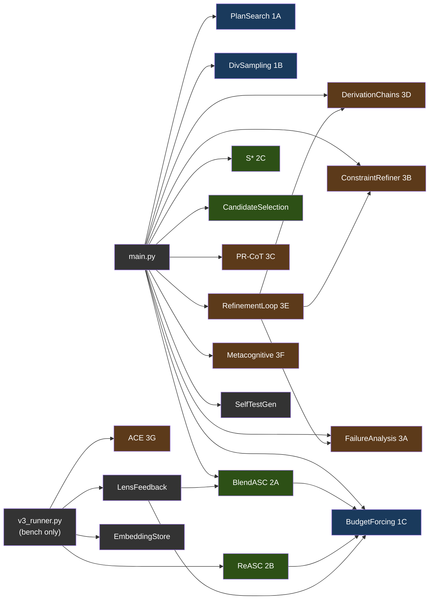

凡例: 青 = フェーズ1（生成）、緑 = フェーズ2（選択）、茶 = フェーズ3（修復）、グレー = ユーティリティ。`v3_runner.py` から供給されるモジュールはベンチランナー専用で、サービスはそれらを呼び出しません。

---

## 5. Geometric Lens

モデルの埋め込みの幾何構造を分析することで、コードを実行せずにその品質を評価するニューラルスコアリングシステム。完全に CPU 上で動作します。プロジェクトインデキシング、検索、信頼度ルーティング、パターンキャッシングのための RAG API としても機能します。

#### なぜ「Geometric Lens」なのか?

Geometric Lens の背後にある核心的なアイデアは、シンプルな前提から来ています: モデルのスケーリングをやめ、賢いインフラで包み始めること。Jose Crespo の[「Everyone's Wrong About AI Programming」](https://www.josecrespophd.org/p/everyones-wrong-about-ai-programming)は、現在の LLM が正しいコードパスと正しくないコードパスのコストが同じになるフラットな埋め込み空間で動作するため、AI 生成コードはエラーへと漂流すると論じています。解決策は、正しいコードが「下り坂」で正しくないコードが「上り坂」になるようなエネルギー地形をモデルの周りに構築することです。

Anthropic の[Manipulating Manifolds](https://transformer-circuits.pub/2025/linebreaks/index.html)研究は、トランスフォーマーがすでに埋め込み空間に操作可能な幾何構造を作り出しているという証拠を提供しています — 原材料はすでにそこにあります。Bar らの[Geometric Unification of Generative AI](https://arxiv.org/html/2510.00666v1)は、データ多様体上の距離関数がどのように学習され、スコアリングに使えるかを定式化しています。

ATLAS はこれを2つの補完的なモデルで実装します。C(x) は、モデル自身の埋め込み上の学習されたエネルギー関数（4096-to-512-to-128-to-1 の MLP）です。各コード候補は llama-server によって埋め込まれ、C(x) はそれがその幾何のどこに位置するかをスコア化します。低いエネルギーは候補が既知の正しいコードとクラスタリングすることを意味します。高いエネルギーは既知の正しくないコードとクラスタリングすることを意味します。外部オラクルも実行も不要 — ただモデル自身の表現の幾何だけです。

G(x) は品質予測器です — PCA で次元削減した埋め込み上の XGBoost 分類器で、候補が削減後の空間のどこに位置するかから合格/不合格を予測します。C(x) が「この候補はどれくらい良いか?」に答えるのに対し、G(x) は「この候補は合格しそうか?」に答えます。コードには計量テンソルのパスも存在しますが、デプロイはされていません: PCA 空間における対角テンソル（XGBoost アーティファクトが存在しない場合のフォールバックとしてのみロードされる）と、多様体の曲率に沿って候補を下り坂方向へステアする幾何を意識した勾配ステップ（`-α · G⁻¹ · ∇C`）を計算する補正エンジンです。公開されているのはテンソルのスカラーの correctability スコアだけで（`/internal/lens/correctability`）、勾配ステップによる補正はサービスには配線されていません。

### スコアリングモデル

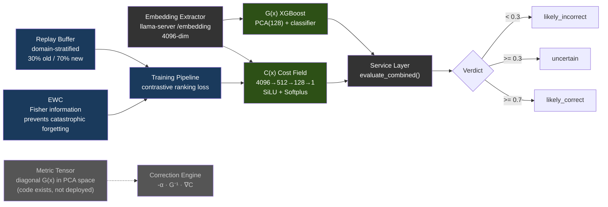

| モデル | アーキテクチャ | トレーニングデータ | 性能 |
|-------|-------------|---------------|-------------|
| **C(x)** | 4096→512→128→1 MLP（SiLU, Softplus） | 597 個の LCB 埋め込み（504 PASS, 93 FAIL） | Val AUC 0.9467、分離 2.04x |
| **G(x)** | PCA(4096→128) + XGBoost | 13,398 個の埋め込み（4,835 PASS, 8,563 FAIL） | PCA 80.8% 分散 |

C(x) の正規化: `1 / (1 + exp(-(energy - 19.0) / 2.0))` → [0, 1]。パラメータ数: 2,163,457 — `cost_field.pt` は**ディスク上 8.3 MiB**（10進で 8.65 MB）。計算: 4096·512+512 + 512·128+128 + 128·1+1 = 2,163,457 × 4B float32 = 8.25 MiB。

> **注:** モデルの重み（.pt、.pkl ファイル）はリポジトリにコミットされていません — トレーニング中にビルドされ、コンテナイメージに焼き込まれるか、実行時にマウントされます。モデルファイルが存在しない場合、サービスは緩やかにデグレードします: C(x) は中立エネルギーを返し、G(x) は `gx_score: 0.5` と `verdict: "unavailable"` を返します。トレーニングデータと重みは [HuggingFace](https://huggingface.co/datasets/itigges22/ATLAS) で公開しています。

### RAG / PageIndex V2

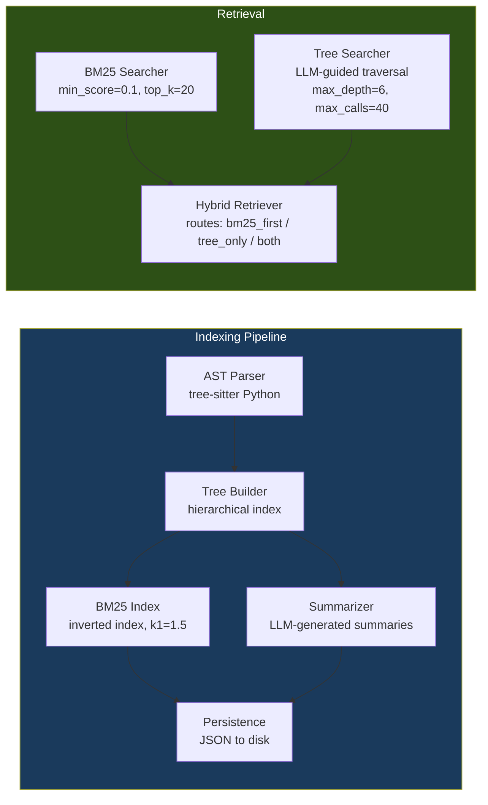

### 信頼度ルーター & パターンキャッシュ

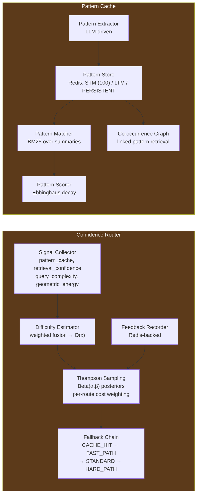

コスト加重 Thompson Sampling による4つのルート: CACHE_HIT（cost=1, k=0）→ FAST_PATH（cost=50, k=1）→ STANDARD（cost=300, k=5）→ HARD_PATH（cost=1500, k=20）。

---

## 6. サンドボックス

コンパイル、テスト、リントを伴う分離されたコード実行。

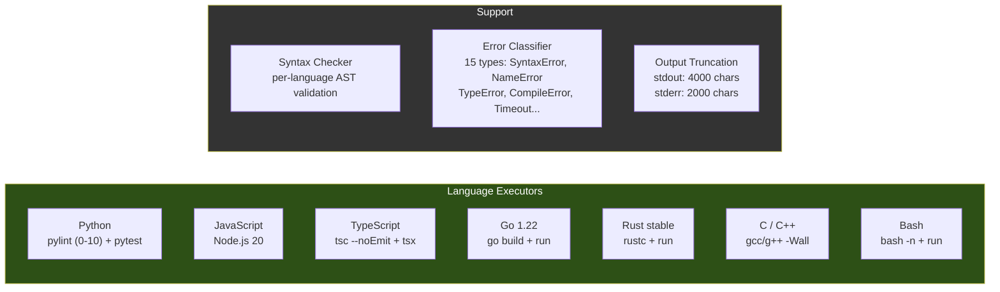

受け付ける言語エイリアス: `py`/`python3`（Python）、`js`/`node`（JavaScript）、`ts`（TypeScript）、`golang`（Go）、`rs`（Rust）、`c++`（C++）、`sh`/`shell`（Bash）。最大実行時間: Docker デプロイでは300秒（compose がプロキシの `run_command` の5分上限に合わせて `MAX_EXECUTION_TIME=${ATLAS_SANDBOX_MAX_EXECUTION_TIME:-300}` を設定します; 素のコードのデフォルトは60秒）。最大メモリ: 512 MB。2つのワークスペースパス: **`/execute`**（V3 候補テストパス）は `/tmp/sandbox`（tmpfs）下の一時的なスクラッチディレクトリを使用; **`/shell`**（PC-188 によるエージェントの `run_command` ルート、加えてバックグラウンドプロセス向けの `/jobs/*`）は `/workspace` — `ATLAS_PROJECT_DIR`（Docker）または hostPath `${ATLAS_PROJECTS_DIR}`（K3s）からバインドマウントされたプロジェクトルートで、プロキシが見るのと同じパス — に対して実行します。

---

## 7. VRAM 予算

RTX 5060 Ti 16GB 上で Docker Compose のデフォルト（32K コンテキスト）で実行:

| コンポーネント | VRAM |
|-----------|------|
| Qwen3.5-9B-Q6_K モデル重み | 約 6.9 GB |
| KV キャッシュ（32K コンテキスト） | 約 1.3 GB |
| **llama-server 合計** | **約 8.2 GB** |
| Geometric Lens | 0（CPU 専用、モデル用に約 12 MB RAM、PyTorch ランタイム用に約 128 MB） |
| v3-service | 0（CPU 専用） |
| sandbox | 0（CPU 専用） |
| atlas-proxy | 0（Go バイナリ、約 30 MB RAM） |
| **空き VRAM** | **約 7.8 GB** |

llama-server 以外のすべての計算は CPU 上で動作します。GPU は LLM 推論と埋め込み抽出に専ら使われます。

### 7.1 バックエンドごとの VRAM 予算

上記の 8.2 GB / 空き 7.8 GB の分割は NVIDIA RTX 5060 Ti 16GB のベースラインです。他のバックエンドは構造的に異なります:

| バックエンド | 報告される「VRAM」 | 負荷時の現実的な予算 | 備考 |
|---|---|---|---|
| **CUDA**（専用 VRAM） | ハードウェアスペック（標準構成の 5060 Ti では 16 GB） | スペックの約95%（ドライバが約 500 MB を予約） | 上の表の数値がそのまま適用される。 |
| **ROCm**（専用 VRAM） | ハードウェアスペック | スペックの約90〜95%（HIP ランタイムは CUDA よりわずかに重い） | RX 7900 XTX（24 GB）→ 14B Q5 + 32K コンテキストを2並列スロットで余裕をもって実行。 |
| **Metal**（Apple ユニファイド） | システム RAM 合計 | システム RAM の**約70%** | OS + ブラウザ + IDE が約30%を消費する。16 GB の MBP は*現実的に* 11 GB の予算 — Qwen3.5-9B Q6_K（7.5 GB + 2〜4 GB の KV キャッシュ）には厳しすぎる。16 GB 以下では Q4_K_M（5 GB）を使う; Q6_K は 24 GB 以上のユニファイドメモリが必要。 |
| **SYCL**（Intel Arc） | ハードウェアスペック | 不明 — 出荷時に未定 | A770（16 GB）ターゲットは NVIDIA 16 GB と保守的に同等。 |

---

## 8. デプロイ

### 8.1 Docker Compose — NVIDIA（デフォルト）

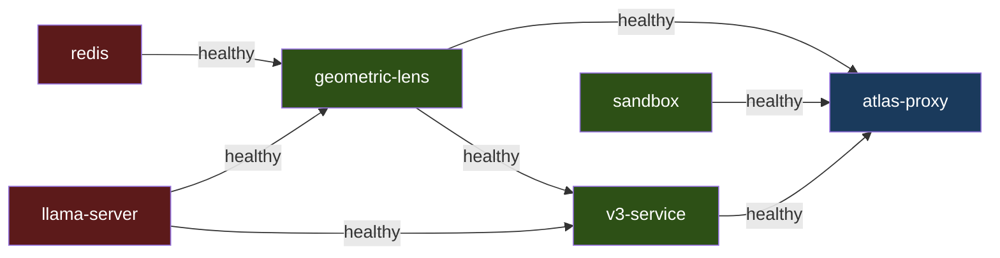

`redis`、`llama-server`、`sandbox` は独立して起動します。`geometric-lens` は `redis` と `llama-server` が healthy になるのを待ちます; `v3-service` は `llama-server` と `geometric-lens` を待ちます; `atlas-proxy` は `llama-server`、`geometric-lens`、`v3-service`、`sandbox` を待ちます。初回実行ではコンテナイメージをビルドします（数分）。以降の起動は高速です。標準の `docker compose up -d` で立ち上げます — ベースの `docker-compose.yml` は `driver: nvidia` の GPU 予約を宣言しており、これはホスト上の `nvidia-container-toolkit` 経由で機能します。

### 8.2 Docker Compose — AMD ROCm（V3.1.1）

8.1 と同じサービスグラフですが、ROCm オーバーライドを上に重ねて立ち上げます:

```bash
docker compose -f docker-compose.yml -f docker-compose.rocm.yml up -d
```

オーバーライド（`docker-compose.rocm.yml`）は3つのことを行います:
1. `llama-server` のイメージを `atlas-llama-rocm` に、ビルドを `Dockerfile.rocm`（HIP バックエンド、RDNA3/RDNA2/CDNA2 をカバーするデフォルトの肥大ビルド）に切り替える。
2. `!reset []` を使ってベースファイルから NVIDIA の `deploy.resources.reservations.devices` ブロックをクリアし、`/dev/kfd` + `/dev/dri` のデバイスパススルーを追加する。
3. コンテナが ROCm デバイスにアクセスできるよう `group_add: [video, render]` を追加する。
4. エントリーポイントが HIP チューニング分岐を取るよう、コンテナ環境で `ATLAS_BACKEND=rocm` を強制する。

`atlas-bootstrap.sh` と `atlas init` はどちらも AMD GPU を自動検出し、オーバーライドを透過的に使います; 手動のユーザーは両方の `-f` フラグを指定するだけです。

ROCm には `nvidia-container-toolkit` に相当する別個のコンテナランタイムはありません — パススルーだけで十分で、インストールの対応面を簡素化します。ホストの前提条件（amdgpu-dkms カーネルドライバ、`render` + `video` グループ）は SETUP.md を参照してください。

### 8.3 ベアメタル

`atlas` CLI（`pip install -e .`）は、各サービスにデフォルトポートで直接話しかけます。bash ランチャースクリプトは、すべてのサービスをローカルプロセスとして起動して atlas-tui フロントエンドを立ち上げるか、稼働中の Docker Compose スタックを検出してそれに接続できます。ベアメタルは、正しいバックエンドに対してビルドされた llama-server バイナリが `PATH` 上にある限り、どのバックエンド（NVIDIA、ROCm、Metal）でも動作します。

### 8.4 macOS ネイティブ（提供中 — ハイブリッド Metal パス、[#32](https://github.com/itigges22/ATLAS/issues/32)）

macOS は GPU を Docker コンテナにパススルーできないため、llama-server は Docker *内で* Metal アクセラレートして動作できません。代わりに ATLAS は**ハイブリッド**パスを出荷します: 推論性能のために llama-server はホスト上でネイティブ（Metal）に動作し、スタックの残りは Docker に留まり、小さな socat フォワーダ（`llama-server:8080` → `host.docker.internal:8080`）を介してそれに到達します。他のサービスは既存の `http://llama-server:8080` URL を保ったまま、ホストプロセスと話していることを知る必要がありません。完全なガイド: [SETUP_MACOS.md](SETUP_MACOS.md)。

- **llama-server**: `scripts/atlas-setup-macos.sh`（Homebrew 依存 + llama.cpp `LLAMA_METAL=1`）によって Metal でネイティブビルドされ、`~/.atlas/macos/bin/llama-server-metal` にインストールされ、`scripts/atlas-llama-macos.sh` によって起動される。
- **proxy / v3-service / geometric-lens / sandbox**: 変更なし — Linux と全く同じく Docker 内で動作し、`docker-compose.macos.yml` の socat フォワーダ経由でホストの llama-server を指す。
- **モデル**: 16 GB の Mac はユニファイドメモリ予算に収めるためデフォルトで Q4_K_M（約 5 GB）を使う; 24 GB 以上の Mac は Linux のデフォルトのように Q6_K を実行できる。
- **`atlas doctor`**: `metal-native` チェックが、ネイティブバイナリが存在し、実行され、:8080 でリッスンしていることを検証する。

Apple Silicon では、`atlas init` は Docker-GPU パスではなく `ATLAS_BACKEND=metal` と macOS ハイブリッドの配線を書き込みます（`atlas/cli/commands/init.py` のハイブリッド Metal 分岐を参照）。セットアップスクリプトを実行した後、`docker compose -f docker-compose.yml -f docker-compose.macos.yml up -d` でスタックを立ち上げます。

### 8.5 K3s

`templates/*.yaml.tmpl` 内のマニフェストは、`atlas.conf` に対する `envsubst` を使って `scripts/generate-manifests.sh`（または `install.sh` の `process_templates` ステップ）によって `manifests/*.yaml` にレンダリングされます。サービスは `atlas` ネームスペースの Pod としてデプロイされ、外部アクセスは NodePort（`ATLAS_PROXY_NODEPORT`、`ATLAS_LLAMA_NODEPORT`、`ATLAS_LENS_NODEPORT`、`ATLAS_SANDBOX_NODEPORT`、`ATLAS_V3_NODEPORT`）経由です。K3s のエントリーポイントは Docker Compose 下で使われるのと同じ `inference/entrypoint-v3.1.sh` です — コンテキストサイズ、KV キャッシュ量子化、flash attention、mlock はすべて環境変数（`ATLAS_CONTEXT_LENGTH`、`ATLAS_FLASH_ATTENTION` など）で駆動されるため、挙動はデプロイモードをまたいで同一です。プロキシとサンドボックスの Pod はどちらも `${ATLAS_PROJECTS_DIR}` を `/workspace` に `hostPath` マウントするため、エージェントのツールコールは両 Pod で同じファイルを見ます。

`scripts/deploy-9b.sh` は `--backend cuda|rocm`（または `ATLAS_BACKEND` 環境変数）を受け付け、適切な環境変数セットでいずれかのイメージをデプロイします。ROCm の K8s Pod はさらに、Pod スペックでの `/dev/kfd` + `/dev/dri` の hostPath マウントと `render`/`video` グループ所属が必要です — このためのマニフェストテンプレートは V3.1.2 の作業です; 環境変数のパッチだけでは ROCm K3s デプロイの動作には不十分です。

---

## 9. データフロー

### T1: 単純なファイル書き込み

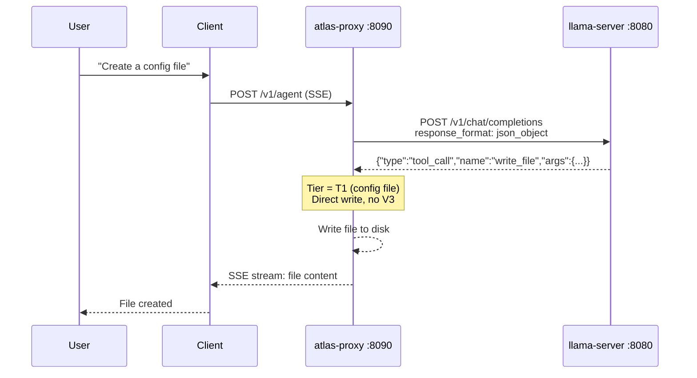

1回の LLM 呼び出し。V3 オーバーヘッドなし。

### T2: 機能ファイル書き込み

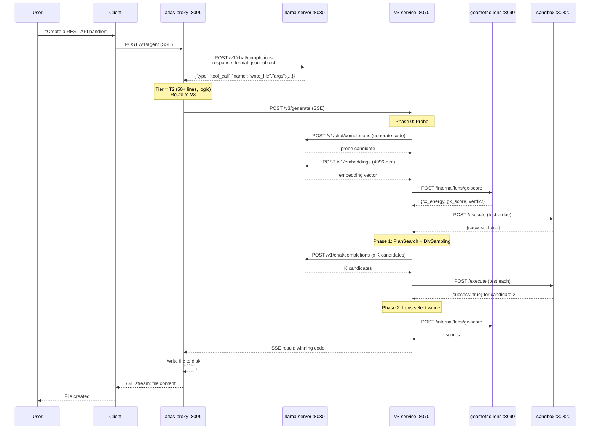

最低3回の llama-server 呼び出し（probe 生成1回 + セルフテスト生成1回 + 埋め込み抽出1回）。フェーズ3の修復がすべての戦略を発動させると最大30回以上。

### 既存コードの編集

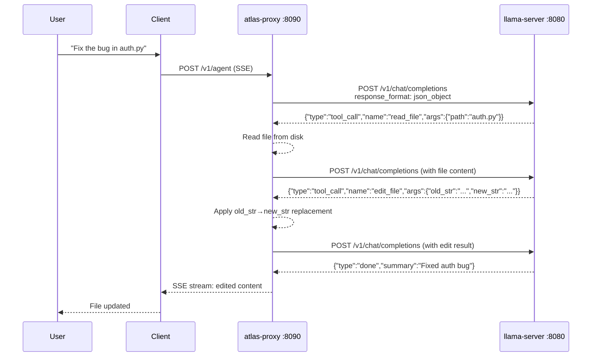

5行を超える既存ファイルは `write_file` で拒否されます — モデルは `edit_file`（外科的、≤10 行）または `ast_edit`（ノード全体の書き換え、.py/.html/.htm のみ）を使う必要があります。`.py`/`.html`/`.htm` ファイルでは、ステップごとの文法ゲート（BiasBusters #2）が次の判断のためにツール名のプロダクションから `edit_file`/`write_file` を能動的に禁止し、モデルが間違ったショートカットに逆戻りできないようにします。
