> **[English](../../ARCHITECTURE.md)** | **[简体中文](../zh-CN/ARCHITECTURE.md)** | **[日本語](../ja/ARCHITECTURE.md)** | **한국어**

# ATLAS 아키텍처

ATLAS V3.1.0의 시스템 아키텍처입니다. 2계층 설계로, 바깥쪽 에이전트 루프가 도구 호출 오케스트레이션을 담당하고, 안쪽 V3 파이프라인이 빌드 검증과 에너지 기반 선택을 통해 다양한 코드 후보를 생성합니다.

---

## 1. 시스템 개요

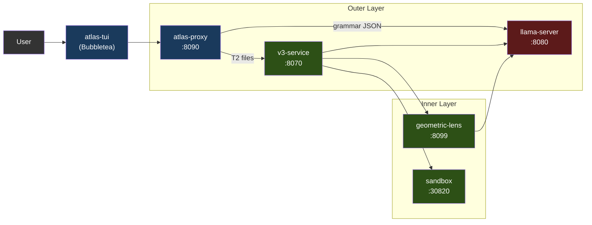

서비스는 Docker Compose(권장)를 통해 컨테이너로 실행되거나, `atlas` 런처를 통해 로컬 프로세스로 실행됩니다. GPU를 사용하는 것은 llama-server뿐입니다. 나머지는 모두 CPU에서 돌아갑니다.

채팅 프론트엔드는 **atlas-tui**(Bubbletea, PC-062)입니다. `/v1/agent`(턴별 채팅 SSE)와 `/events`(파이프라인 패널용 전역 타입 봉투 피드)를 소비하는 네이티브 Go 터미널 UI입니다. `atlas`(대화형 기본값) 또는 `atlas tui`(명시적)로 실행합니다. 파이프라인 패널은 V3 단계를 실시간으로 보여주고, 채팅 패널은 어시스턴트 마크다운을 glamour로 렌더링합니다. 슬래시 명령 `/add /diff /commit /run` 등이 로컬 파일 컨텍스트와 셸 호출을 처리합니다. 모드 인식 입력(채팅 / `!bash` / `/slash`)에 힌트 드롭다운이 함께 제공됩니다.

프록시의 `/v1/chat/completions`는 llama-server로 향하는 투명한 패스스루입니다. SDK 호환성을 위해 유지되지만 에이전트 루프를 실행하지는 않습니다. 도구 호출 + V3 파이프라인을 원하는 서드파티 클라이언트는 `/v1/agent`를 직접 대상으로 삼아야 합니다. 계약은 [API.md](API.md)에 문서화되어 있으며, PC-063은 완전히 정리된 레시피와 OpenAPI 스펙 제작을 추적합니다.

### 1.1 지원 가속기

llama-server는 GPU를 사용하는 유일한 서비스입니다. 다른 모든 ATLAS 서비스는 CPU에서 돌아갑니다(프록시는 Go, v3-service / geometric-lens / sandbox는 Python). 덕분에 다중 백엔드 표면이 작게 유지됩니다 — 새 가속기를 추가한다는 것은 파이프라인을 변경하는 것이 아니라 새 Dockerfile + 엔트리포인트 환경 변수 분기를 추가하는 것을 의미합니다.

| 백엔드 | 상태 (V3.1.x) | 이미지 / 빌드 경로 | Compose 오버라이드 | 테스트된 카드 |
|---|---|---|---|---|
| **CUDA** (NVIDIA) | V3.1.0부터 제공 | `inference/Dockerfile.v31` → `atlas-llama` | (기본값) | RTX 5060 Ti 16GB (정규), RTX 30xx/40xx/50xx |
| **ROCm / HIP** (AMD) | V3.1.1에서 제공 | `inference/Dockerfile.rocm` → `atlas-llama-rocm` | `docker-compose.rocm.yml` | RX 7900 XTX (커뮤니티 스모크 테스트, GH #26) |
| **Metal** (Apple Silicon) | 제공 ([#32](https://github.com/itigges22/ATLAS/issues/32)) | 하이브리드: 네이티브 llama-server (Metal) + 나머지는 Docker (macOS는 컨테이너로 GPU 패스스루 불가) | `docker-compose.macos.yml` | M 시리즈; ≤16 GB에서 Q4_K_M, ≥24 GB 통합 메모리에서 Q6_K |
| **SYCL** (Intel Arc) | 로드맵 | 미정 | 미정 | Arc A770 16 GB (목표) |

**백엔드 선택은 런타임이 아니라 설치 시점에 이루어집니다.** `atlas init`는 `tier.detect_gpu()`(`atlas/cli/commands/tier.py` 참고)를 실행해 감지된 모든 벤더 중 VRAM이 가장 큰 GPU를 고르고(`ATLAS_GPU_VENDOR` / `ATLAS_GPU_INDEX`로 재정의), `.env`에 `ATLAS_BACKEND={cuda|rocm|metal|sycl}`를 기록합니다. 각 백엔드는 자체 사전 빌드 이미지를 가지므로, 사용자는 모든 백엔드의 라이브러리를 담은 무거운 이미지를 실행하지 않습니다. 마법사는 지원되지 않는 백엔드 호스트에서 부팅되지 않을 `.env`를 쓰는 대신 거부합니다.

**자체 모델 반입(BYO model) 표면 (V3.1.1).** `atlas lens check`는 실행 중인 llama-server에 대한 저렴한 사전 점검으로, 로드된 모델이 Lens 호환인지 보고합니다(PC-057). `atlas lens build --samples <path>`는 `geometric-lens/geometric_lens/training.py`를 감싸 모델의 네이티브 임베딩 차원에 맞춰 새로운 `cost_field.pt` 아티팩트를 학습시킵니다(PC-058). 이 둘을 함께 쓰면 사용자가 lens 코드를 포크하지 않고도 기본이 아닌 GGUF를 갈아 끼울 수 있습니다 — C(x) 생성자가 임의의 `input_dim`을 받기 때문에, 모델마다 바뀌는 것은 학습된 가중치뿐입니다. 사용자 대상 흐름은 [CLI.md § atlas lens](CLI.md#atlas-lens-pc-057--pc-058)를 참고하세요. PC-059(레지스트리 반영 기록)와 PC-060(HF 중개 배포)은 루프를 닫는 V3.1.2+ 후속 작업입니다.

**벤더 비의존적인 것**(모든 백엔드에서 동작): 문법 제약 JSON, 셀프 임베딩(`/embedding`), 레이어별 히든 스테이트(PC-202 패치), ASA 제어 벡터(백엔드와 무관하게 llama.cpp의 `control_vector_load`로 로드), KV 캐시 양자화, 바깥쪽 에이전트 루프 전체, V3 파이프라인, Geometric Lens, 샌드박스.

**백엔드별로 다른 것:**
- **Flash attention.** CUDA + ROCm: 완전 지원. Metal: 제한적(llama.cpp Metal 백엔드는 일부 head size에 대해 flash-attn을 지원하며, 지원되지 않으면 기본 비활성화). SYCL: 미정.
- **고정(pinned) 호스트 메모리.** `GGML_CUDA_NO_PINNED`는 CUDA + ROCm에 적용됩니다(HIP는 GGML 호환 계층에서 CUDA 경로를 미러링). Metal/SYCL은 고정을 사용하지 않습니다.
- **멀티 GPU + 텐서 병렬화.** V1은 모든 백엔드에서 단일 GPU만 지원합니다. 멀티 GPU는 특정 벤더에 묶이지 않은 GH #34입니다.
- **Apple 통합 메모리.** macOS는 GPU+시스템 메모리를 공유합니다. "VRAM" 계산은 실제로는 "총 16 GB에서 OS + 앱을 뺀 것"입니다. §7 참고.

K3s 배포 경로(`scripts/install.sh`, `templates/`의 매니페스트)는 V3.1.1 시점에 CUDA 전용입니다 — ROCm K8s 레시피는 V3.1.2 일정에 있습니다(`/dev/kfd` + `/dev/dri` hostPath 마운트와 `render`/`video` 그룹 멤버십, 즉 `docker-compose.rocm.yml`의 클러스터 수준 등가물이 필요).

---

## 2. 서비스

| 서비스 | 포트 | 언어 | 용도 |
|---------|------|----------|---------|
| **llama-server** | 8080 | C++ (llama.cpp) | LLM 추론(CUDA / ROCm / Metal / Vulkan; SYCL은 로드맵 — §1.1 참고), 문법 제약 JSON, 셀프 임베딩, 레이어별 residual 히든 스테이트(PC-202) |
| **atlas-proxy** | 8090 | Go | 에이전트 루프, 도구 호출 라우팅, 등급 분류, `/v1/agent` SSE, `/events` 타입 SSE, `/cancel`. `/v1/chat/completions`는 변경 없이 llama-server로 패스스루. |
| **atlas-tui** | (클라이언트) | Go | Bubbletea TUI; `/events`와 `/v1/agent` SSE 스트림을 소비. PC-062. |
| **v3-service** | 8070 | Python | V3 파이프라인 HTTP 래퍼(PlanSearch, DivSampling, PR-CoT 등) |
| **geometric-lens** | 8099 | Python (FastAPI) | C(x) 에너지 스코어링, G(x) XGBoost 품질 예측, RAG/프로젝트 인덱싱 |
| **sandbox** | 30820 (호스트) / 8020 (컨테이너) | Python (FastAPI) | 격리된 코드 실행, 컴파일, 린팅, 테스트 실행 |
| **redis** | 6379 (내부) | C (Redis 7) | 패턴 캐시, 동시 발생 그래프, 태스크 큐, 라우터 상태; geometric-lens의 백킹 스토어 |

---

## 3. atlas-proxy (바깥 계층)

프록시는 채팅 프론트엔드의 진입점입니다. `/v1/agent`에서 사용자 메시지를 받아들이고(타입 이벤트 스트림 — TUI가 사용하는 것), llama-server를 호출하고 도구 호출을 파싱·실행해 이벤트를 다시 스트리밍하는 내부 에이전트 루프를 실행합니다. 레거시 `/v1/chat/completions` 엔드포인트는 llama-server로 향하는 투명한 패스스루입니다. 전체 이벤트 타입 카탈로그는 [API.md](API.md)를 참고하세요.

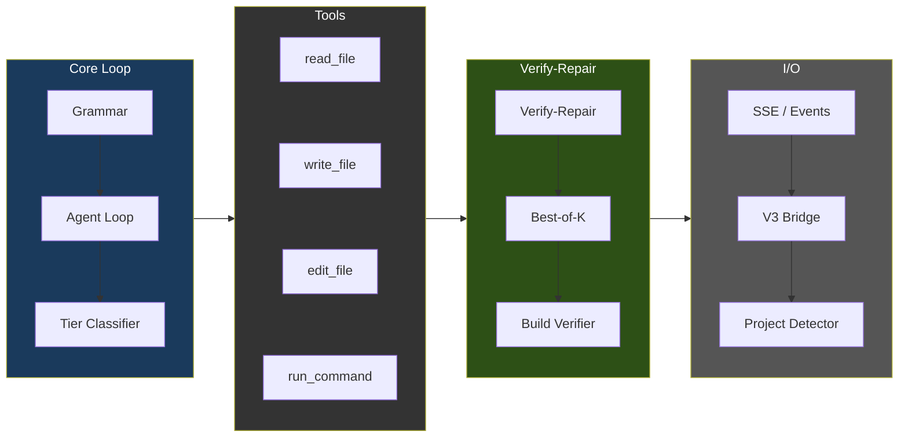

### 에이전트 루프 흐름

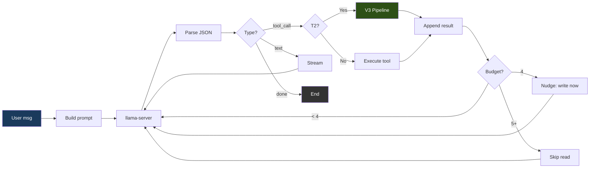

### 문법 강제

llama-server의 `response_format: {"type": "json_object"}`는 모든 모델 출력이 세 가지 유효한 JSON 형태 중 정확히 하나가 되도록 강제합니다:

```json
{"type": "tool_call", "name": "<tool_name>", "args": {...}}
{"type": "text", "content": "<message>"}
{"type": "done", "summary": "<summary>"}
```

JSON 스키마는 `additionalProperties: false`와 함께 `oneOf`를 사용하며, 레지스트리에서 도구 이름을 열거합니다. 모델은 유효하지 않은 JSON을 생성할 수 없습니다 — 토큰 생성이 llama-server 수준에서 문법 제약을 받기 때문입니다.

### 도구

`proxy/tools.go`에 등록된 14개의 도구:

| 도구 | 용도 | 읽기 전용 |
|------|---------|-----------|
| `read_file` | 파일 내용 읽기(선택적 offset/limit 포함) | 예 |
| `outline_file` | 파일의 최상위 함수/클래스를 본문 없이 줄 범위와 함께 나열(`.py`는 tree-sitter, 그 외는 최선 노력 스캔). 정밀 읽기의 진입점: 먼저 아웃라인하고, 그다음 offset/limit으로 `read_file` | 예 |
| `write_file` | 새(NEW) 파일 생성(5줄 초과의 기존 파일에 대해서는 거부 — 안전 제한 참고) | 아니오 |
| `edit_file` | ≤10줄 변경을 위한 정밀 인라인 문자열 치환(old_str/new_str) | 아니오 |
| `ast_edit` | tree-sitter 셀렉터(`function:NAME`, `class:NAME`, `<tag>`)를 통한 함수/클래스/HTML 요소 전체 재작성; 노드 전체 교체에는 edit_file보다 필수(REQUIRED). GH #39, v1에서는 .py/.html/.htm만 | 아니오 |
| `delete_file` | 파일 또는 빈 디렉토리 삭제(이후 루프 종료를 강제) | 아니오 |
| `move_file` | 워크스페이스 내에서 파일 이동 또는 이름 변경(예: `index.html` → `templates/`). 순수 재배치 — V3/정밀 편집 게이트를 우회하며, 기존 대상을 덮어쓰는 것은 거부. 셸 `mv`/`cp`가 거부되므로 "파일 재구성"을 위한 지원 경로 | 아니오 |
| `find_file` | 파일 **이름**/경로에 대한 정규식 검색(저렴한 존재 확인 + 위치 파악). 파일 내용을 grep하는 `search_files`와 구별됨. PC-028 | 예 |
| `search_files` | 파일 내용 전체에 대한 정규식 검색(최대 200개 일치, .git/node_modules 건너뜀) | 예 |
| `list_directory` | 타입과 크기와 함께 디렉토리 내용 나열 | 예 |
| `run_command` | 샌드박스 컨테이너를 통한 셸 명령 실행(PC-188); 5분 타임아웃 상한 | 아니오 |
| `run_background` | PC-196 — 샌드박스에서 장기 실행 프로세스(예: `python app.py`) 시작; 즉시 `job_id` 반환 | 아니오 |
| `tail_background` | PC-196 — `job_id`로 백그라운드 작업의 새 stdout/stderr 가져오기 | 예 |
| `stop_background` | PC-196 — `job_id`로 백그라운드 작업을 SIGTERM/SIGKILL | 아니오 |

### 도구 선택 편향 완화 (2026년 5월 BiasBusters 종합)

Qwen3.5-9B는 ast_edit가 옳은 경우에도 `ast_edit`보다 `edit_file`을
선호하는 문서화된 편향이 있습니다(BiasBusters arxiv 2510.00307 — 인접한
도구 이름의 임베딩이 경쟁하며, 설명이 이름보다 더 중요함). 프록시에서
네 가지 방어책이 결합됩니다:

1. **설명 재작성**(`proxy/tools.go`). edit_file의 설명은 파일 전체/함수
   전체 용도에 대해 경고하고, ast_edit의 설명은 >10줄 / 노드 전체 교체에
   필수(REQUIRED)라고 명시하며, write_file의 설명은 새(NEW) 파일 전용임을
   명시합니다.
2. **조건부 GBNF 문법**(`proxy/grammar.go`,
   `proxy/agent.go:stepExclusions`). 5줄 초과의 기존 .py/.html/.htm
   파일에 대한 write_file가 거부되면, 다음 LLM 호출은 도구 이름 생성
   규칙에서 edit_file와 write_file를 금지하는 GBNF 문법으로 제약됩니다.
   모델은 물리적으로 그것들을 내보낼 수 없습니다. 제한은 한 번의
   결정 후 만료됩니다.
3. **단계별 도구 목록 필터**(동일 트리거). 일시적인
   `[system note]` 사용자 메시지가 주입되어, 이 단계에서는 ast_edit가
   유일한 구조적 편집 도구임을 모델에 상기시킵니다.
4. **ASA 스티어링 벡터**(`geometric-lens/asa_calibration/`).
   활성화 스티어링이 residual-stream 분포를 상류에서 이동시켜, 어떤
   거부도 발생하기 전인 첫 시도 결정에서도 ast_edit가 선호되도록 합니다.
   파일이 존재하면 `inference/entrypoint-v3.1.sh`가
   `/models/ast_edit_steering.gguf`에서 자동 로드합니다 — 운영자가
   `geometric-lens/asa_calibration/README.md`의 워크플로를 통해 벡터를
   빌드해 배치하면 항상 켜져 있습니다. `ATLAS_CONTROL_VECTOR*` 환경
   변수로 path/scale/layer-range를 재정의합니다.

   **모델별 결합(PC-061, V3.1.2).** 각 ASA 벡터는 특정 모델의
   residual-stream 기하 구조에 대해 학습됩니다. 제공되는
   `ast_edit_steering.gguf`는 Qwen3.5-9B(4096차원, 36레이어)에 맞춰
   캘리브레이션되어 있습니다 — 다른 모델을 갈아 끼우면 벡터는 잘해야
   no-op이고, 최악의 경우 능동적으로 잘못된 스티어링을 합니다. `atlas asa check`는
   구성된 벡터를 로드된 모델의 임베딩 차원과 대조해 탐침하고, GGUF
   메타데이터에서 레이어 수 + `model_hint`를 파싱하여 `compat` /
   `needs-build` / `incompatible`을 보고합니다. `atlas asa build`는
   캘리브레이션 워크플로를 (PC-202 히든 스테이트 클라이언트를 갖춘) lens
   컨테이너 안에서 실행되는 단일 CLI 호출로 감쌉니다. `atlas asa publish`는
   학습된 아티팩트를 HF로 보내고 레지스트리 PR을 생성합니다 —
   PC-057/058/059에서 추가된 `atlas lens` 계열과 병행됩니다. [CLI.md § atlas asa](CLI.md#atlas-asa-pc-061) 참고.

네 가지 완화책은 모두 결합됩니다: ASA는 상류에서 제안 분포를 편향시키고
(항목 4), 문법은 거부 후의 강한 금지이며(항목 2), 시스템 노트는 모델의
작업 팔레트를 집중시키고(항목 3), 설명은 프롬프트 자체에서 항상 적용
가능한 스티어링 신호를 제공합니다(항목 1).

### 파일별 등급 분류

각 `write_file`/`edit_file` 호출은 독립적으로 분류됩니다:

| 등급 | 최대 턴 | 동작 |
|------|-----------|--------|
| T0 (대화형) | 5 | 텍스트 응답만 |
| T1 (단순) | 0 (무제한) | 직접 쓰기 — V3 오버헤드 없음 |
| T2 (기능) | 0 (무제한) | V3 파이프라인 실행 |
| T3 (난이도 높음) | 0 (무제한) | V3 파이프라인 실행 |

2026년 5월 강화 작업에서 `absoluteMaxTurns` 상한을 제거하고 등급별 T1/T2/T3 상한을 0("무제한")으로 낮췄습니다. 이는 이제 루프 내부의 8개 디텍터 스택이 언제 중단할지를 결정하기 때문입니다: lens 회귀(`agent_lens_intervention`), 추론 반복(`agent_reasoning_intervention`), 도구 호출 반복(`agent_repeat_intervention`), 경로 인식 에러 브레이커, 동작 없는 done 게이트, 주장 검증 게이트, 계획 준수 임계값, 빈 응답 폴백. 운영자는 일회성 "앱 전체 수정" 프롬프트를 위해 여전히 `ATLAS_MAX_TURNS=<n>`으로 재정의할 수 있습니다 — `proxy/types.go::envOverrideMaxTurns` 참고.

분류기는 `proxy/tools.go`(`classifyFileTier`)에 있고, 로직 패턴 매처는 같은 파일(`hasLogicIndicators`)에 있습니다.

**항상 T1 (직접 쓰기):**
- 이름으로 식별되는 설정 파일(코드에 총 29개): `package.json`, `tsconfig.json`, `next.config.{js,ts,mjs}`, `tailwind.config.{ts,js}`, `postcss.config.{js,mjs}`, `vite.config.{ts,js}`, `.eslintrc.json`, `.prettierrc`, `jest.config.{ts,js}`, `cargo.toml`, `go.mod`, `go.sum`, `makefile`, `cmakelists.txt`, `pyproject.toml`, `setup.py`, `setup.cfg`, `requirements.txt`, `pipfile`, `.editorconfig`, `.gitignore`, `dockerfile`, `docker-compose.{yml,yaml}`
- 확장자로 식별되는 데이터 파일: `.json`, `.yaml`, `.yml`, `.toml`, `.csv`, `.xml`, `.env`
- 스타일 파일: `.css`, `.scss`, `.less`
- 문서: `.md`, `.txt`, `.rst`
- 셸 스크립트: `.sh`, `.bash`
- 사소하게 작은 파일: **10줄 미만**(그 크기에서는 V3가 의미 있게 다양화할 것이 없음 — 이전의 50줄 하한은 너무 보수적이었음; 7개 라우트를 가진 33줄짜리 flask `app.py`는 V3가 도와야 할 바로 그런 경우)
- 로직 지표가 없는 미지의 확장자

**T2 (V3 파이프라인)** — 파일이 ≥10줄이고 다음 중 하나에 해당하면 자격을 충족합니다:
- `hasLogicIndicators(content)`가 true 반환 — 다음 패턴 패밀리 전반에서 **2개 이상 일치**로 정의(작지만 라우팅된 파일이 빠져나가고 있어서 3에서 낮춤):
  - **함수/메서드 정의:** `def `, `func `, `function `, `fn `, `async `
  - **제어 흐름:** `if `, `else `, `switch `, `match `, `for `, `while `
  - **에러 처리:** `try `, `catch `, `except `, `throw `, `raise `
  - **Flask / FastAPI / Django 라우팅:** `@app.route`, `@app.get`, `@app.post`, `@app.put`, `@app.delete`, `@blueprint`, `render_template`, `url_for`, `request.method`, `flask.`, `from flask`
  - **Express / Node API:** `export default`, `export async`, `module.exports`, `app.get`, `app.post`, `app.put`, `app.delete`, `router.`, `handler`, `NextResponse`, `Response(`, `Request`
  - **React 상태/데이터:** `useState`, `useEffect`, `useRef`, `useCallback`, `setState`, `dispatch`, `reducer`
  - **검증:** `validate`, `schema`, `parse`, `zod.`
  - **데이터베이스:** `query(`, `insert(`, `.select(`, `.update(`
  - **JSX / React 컴포넌트 패턴:** `return (`, `return <`, `className=`, `onClick`, `onChange`, `onSubmit`, `.map(`, `.filter(`, `.reduce(`
  - **임포트:** `import {`
- 또는 파일이 인식되는 소스 코드 / 마크업 확장자를 가지고 있고 로직 지표가 발동하지 않은 경우 — T2에서 의심의 혜택을 받습니다(12줄짜리 컴포넌트 셸 같은 최소하지만 실제인 파일을 포괄). 확장자: `.py`, `.go`, `.rs`, `.ts`, `.tsx`, `.js`, `.jsx`, `.c`, `.cpp`, `.cc`, `.h`, `.hpp`, `.java`, `.kt`, `.swift`, `.rb`, `.php`, `.vue`, `.svelte`, `.html`, `.htm`

**T3 (난이도 높음)** — 현재 분류기는 단독으로 T3를 내보내지 않습니다. 순환 복잡도(cyclomatic-complexity) 리파이너(`refineTierWithCC`, GH #39 항목 2의 `/internal/cyclomatic_complexity` 경유)가 McCabe CC가 실제 분기 밀도를 나타낼 때 T2 → T3로 *상향*할 수 있습니다. 절대 하향하지 않습니다.

### Plan 모드 (턴별 사전 점검)

Plan 모드는 첫 도구 호출 **이전에** 에이전트 턴마다 한 번 실행되는 계획 단계입니다. 플래너는 서로 다른 온도에서 LLM으로부터 3개의 후보 계획을 샘플링하고, 각각을 휴리스틱하게 채점한 뒤 최선을 고릅니다. 우승 계획은 시스템 프롬프트로 들어가고, 모델이 계획을 벗어나 헤맬 때 자동으로 수정하는 준수 게이트의 씨앗이 됩니다.

두 가지 실패 모드를 해결하도록 설계되었습니다:

1. **탐색 헤맴(Discovery thrashing).** 계획이 없으면 처음 2~4개의 도구 호출이 종종 `read_file → list_directory → search_files → read_file → …` — 행동 대신 탐색입니다. 계획이 있으면 시스템 프롬프트가 모델에게 명시적으로 말합니다: 이것을 읽고, 저것을 편집하고, curl로 검증하라.
2. **증거 없는 `done`.** 계획의 `verify_step`은 수정 증명입니다. 검증 게이트(PC-179)는 그 단계가 성공적으로 실행될 때까지 `done`을 거부합니다.

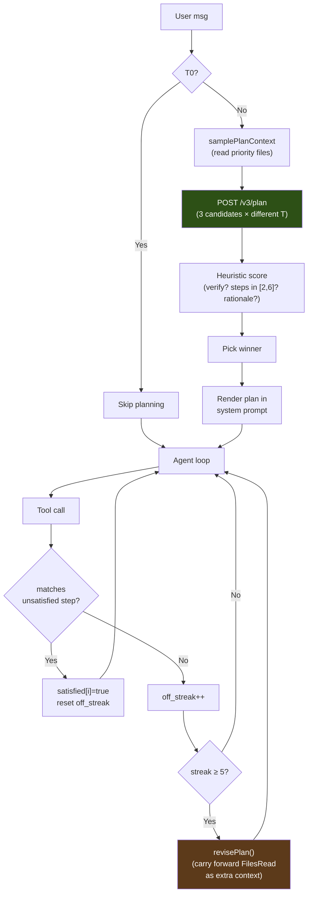

**v3-service `/v3/plan` (Python).** `v3-service/main.py`는 사용자 메시지 + 작업 디렉토리 + 잘린 우선순위 파일로 `PLAN_PROMPT_TEMPLATE`를 렌더링한 뒤, 시드 오프셋과 온도 `[0.3, 0.5, 0.7]`로 LLM을 3회 호출합니다. 기본 모드는 llama-server에 `chat_template_kwargs: {enable_thinking: false}`를 보냅니다. 사고가 켜져 있으면 Qwen3.5가 `<think>` 블록을 `delta.reasoning_content`(chat-completions 소비자가 보지 못함)로 라우팅하므로, 2048토큰 예산이 추론에 전부 소진되어 JSON이 전혀 나오지 않기 때문입니다. 프롬프트 안의 `/nothink` 지시어만으로는 신뢰할 수 없습니다. `ATLAS_PLAN_THINKING=1`을 설정하면 둘 다 뒤집힙니다: 사고 활성화, 플래너 예산을 8192토큰으로 증액(PC-206 — 빠른 하드웨어에서만 유용; 빠듯한 GPU에서는 플래너 지연이 후보당 ~5-30초에서 >4분으로 증가). 각 원시 응답은 마크다운 펜스 허용 + 중괄호 깊이 인식 추출기(`_parse_plan_json`)로 파싱된 뒤 `_score_plan`으로 채점됩니다:

- **+0.3** `verify_step` 보유 시
- **+0.2** `len(steps) ∈ [2, 6]`인 경우
- **+0.2** verify 단계가 알려진 검증 명령(`pytest`, `python`, `curl`, `go test`, …)을 참조하는 경우
- **+0.1 per step** 사용자가 지명한 파일을 대상으로 하는 단계당(+0.2에서 상한)
- **+0.1** 비어 있지 않은 `rationale`에 대해

가장 높은 점수가 이깁니다. 동점이면 더 적은 단계(군더더기가 덜한 쪽)가 우선합니다. 3개 후보가 모두 파싱에 실패하면 핸들러는 1단계 폴백(`{action: "investigate the request and act"}`)을 반환하므로, 에이전트 루프는 플래너 실패로 절대 막히지 않습니다. API 계약: [API.md § POST /v3/plan](API.md#post-v3plan).

**프록시 구성요소 (Go).**

| 파일 | 역할 |
|---|---|
| `proxy/v3_bridge.go` | `callV3PlanStreaming(v3URL, req, onProgress)` — SSE 스트림을 열고, 진행 이벤트를 콜백으로 전달하며, `event: result` 프레임에서 최종 `Plan`을 반환 |
| `proxy/types.go` | `V3PlanRequest`, `Plan`, `PlanStep` 타입. `AgentContext`는 `Plan`, `PlanStepsSatisfied[]`, `PlanOffStreak`, `PlanRevisions`를 추가로 가짐 |
| `proxy/agent.go` | `samplePlanContext()`는 플래너를 위해 우선순위 파일(`app.py`, `templates/index.html`, `package.json`, …)을 순회. `shouldGeneratePlan()`은 등급 + 메시지 길이로 게이트. `generatePlan()`은 브리지를 실행하고 전체 단계 목록과 함께 `plan_loaded`를 내보냄 |
| `proxy/plan_adherence.go` | `matchPlanStep()`(느슨한 도구 이름 + 경로 접미사 일치), `recordPlanAdherence()`(도구 호출별 회계), `revisePlan()`(`FilesRead`를 추가 컨텍스트로 이월하여 재생성) |

시스템 프롬프트 렌더링은 `buildSystemPrompt`에서 `## Plan` 제목 아래 이루어집니다. 각 단계는 `i. [marker] **action** target — why`이며, 일반 단계는 `marker = " "`, verify 단계는 `marker = "✓"`입니다. verify 단계는 검증 게이트가 `done`에 대해 지키는 "수정 증거" 단계로 표시됩니다. (TUI의 채팅 행 렌더링은 `tui/plan.go`에서 더 풍부한 글리프 — ☐ 미충족, ✓ 충족, ⚐ verify 단계 — 를 사용하지만, 그것들은 모델이 보는 시스템 프롬프트가 아니라 클라이언트에 존재합니다.)

**튜닝 가능 항목.**

| 상수 | 출처 | 기본값 | 근거 |
|---|---|---|---|
| `planAutoReviseThreshold` | `proxy/plan_adherence.go` | `5` | 자동 수정이 발동하기 전 계획을 벗어난 도구 호출 수 |
| `planMaxRevisions` | `proxy/plan_adherence.go` | `2` | 루프당 자동 수정 상한. 이를 넘으면 `revisePlan`은 no-op — 마지막으로 성공한 계획이 활성 상태로 유지되고 준수 회계는 계속되지만, 더 이상의 재계획은 발동하지 않음. |
| `n_candidates` | `v3-service/main.py` | `3` | 온도 `[0.3, 0.5, 0.7]`에서의 다양한 샘플링; 후보가 많을수록 → 더 많은 벽시계 시간(~5초/후보) |
| 후보당 `max_tokens` | `v3-service/main.py` | `2048` | 근거 포함 6단계 계획을 포괄; 초기 테스트에서 1024는 JSON 중간에 잘림 |

**건너뛰기 조건**(`shouldGeneratePlan`):

1. `ctx.Tier == Tier0Conversational` — 사소한 채팅("안녕", "고마워")은 절대 계획하지 않음.
2. `len(message) < 12` — 이전 턴의 계획에 의존하는 짧은 수긍("응 해줘", "좋아 보여")은 다시 계획하지 않음.

그 외에는 모든 턴이 계획합니다. 실패(`/v3/plan` 5xx, 네트워크 에러, 폴백 너머의 모든 후보 파싱 불가)는 조용히 성능 저하됩니다 — 루프는 `ctx.Plan` 없이 실행되며, Plan 모드 도입 이전과 동일하게 동작합니다.

**비용.** 따뜻한 GPU에서 3후보 스윕의 벽시계 시간은 ~15초입니다(후보당 ~5초). 토큰 비용 ≈ 후보당 1500토큰 × 3 = ~4500 실제 토큰(예산 6144). 둘 다 에이전트의 첫 도구 호출 이전에 선불로 지불됩니다. 모델이 쓸모없는 탐색 라운드 하나를 건너뛰는 순간 회수됩니다. 절약된 도구 호출 하나하나가 ~5-10초의 LLM 왕복에 도구 실행까지 더한 것이기 때문입니다.

### 안전 제한

| 제한 | 값 | 용도 |
|-------|-------|---------|
| 대화 트림 | 슬롯 크기에 맞춘 슬라이딩 윈도우: 시스템 + 가장 최근 사용자 지시 + **활성 파일의 내용** + `슬롯당 컨텍스트 − ATLAS_MAX_TOKENS − 2048`에 들어가는 만큼의 후행 메시지를 유지(하한: 8개 유지; `ATLAS_AGENT_HISTORY_BUDGET`을 통한 선택적 하드 상한). 가장 최근 사용자 메시지 AND 가장 최근 파일 내용 읽기를 고정하는 것이 핵심 — 파일 고정이 없으면 긴 루프가 편집 중인 파일을 떨어뜨리고, 약한 모델이 더 이상 볼 수 없는 심볼/줄을 환각하며 깜깜이로 편집함 | 편집 중인 파일을 굶기지 않으면서 컨텍스트 오버플로 방지 |
| 중복 읽기 단락(short-circuit) | 변경되지 않은 파일의 파일 전체 `read_file`는 **내용이 여전히 라이브 대화에 있을 때만**(파일의 가장 긴 줄로 탐침) 간결한 "이미 컨텍스트에 있음" 포인터를 반환; 트림으로 빠져나갔다면 모델이 깜깜이로 편집하지 않도록 전체 파일을 다시 제공(`ATLAS_DEDUP_READS=0`으로 비활성화). 페이지 읽기와 변경된 파일은 항상 실제 내용 제공 | 잃어버린 내용을 가졌다고 모델에 거짓말하지 않으면서, 변경되지 않은 파일을 매 턴 재인코딩하는 것을 회피 |
| 트레이스백 위치 파악 → 지시된 편집 (#39 / 옵션 3) | run_command가 Python 트레이스백을 드러내면, 프록시는 가장 깊은 프로젝트 내 프레임(file:line:function)을 추출하고, 문제의 줄을 인용하며, 지시된 스티어를 주입("여기 `function:X`를 수정하라; 다른 곳을 편집하거나 하드코딩하지 말라"). 모델이 변경되지 않은 코드를 다시 실행하면, 실행 도구는 **다음 결정의 문법에서 금지됨**(`tracebackExclusion`)되어 편집을 강제 | 약한 모델이 실패하는 위치 파악(잘못된 함수를 환각함)을 모델이 잘하는 지시된 편집으로 전환 — 스택 프레임이 곧 위치 파악이므로 LLM 추론이 필요 없음 |
| 누락 모듈 설치 스티어 | 실행이 "No module named X"로 실패하면(샌드박스는 앱 라이브러리를 탑재하지 않음), 프록시는 동일한 실패 명령을 다시 실행하는 대신 모델에게 먼저 `pip install X`를 하라고 — 매니페스트가 있으면 `pip install -r requirements.txt`를(`missingModuleSteer`) — 알림. tracebackSteer는 의도적으로 ModuleNotFoundError를 무시함(코드 버그가 아님); 이 스티어가 빠져 있던 긍정적 가이드를 공급 | 미설치 의존성 루프를 끊음(`flask run` ×3 후 `run_background flask run` ×3 관측 → 반복 브레이커가 작업 완료 전에 세션을 종료) |
| 누락 파일 대소문자 불일치 스티어 | 실패한 run_command가 실제 워크스페이스 파일과 대소문자만 다른 파일을 지명하는 "No such file or directory"를 드러내면(예: 파일이 `requirements.txt`인데 `pip install -r Requirements.txt`를 실행), 프록시는 올바른 파일을 지명하고 정확한 이름으로 다시 실행하라고 모델에 알림(`missingFileSteer`). 대소문자 변형이 실제로 존재할 때만 발동 — 정말로 없는 파일에 대해서는 앵커를 만들어내지 않음 | run-ban 없이 대소문자 오타 루프를 끊음(반복 브레이커 발동 전 잘못된 이름의 동일 재실행 5회 관측). 여기서는 모델이 *다시 실행해야* 하기 때문 — 다만 올바른 이름으로 |
| V3 대화형 벽시계 상한 | 에이전트 경로에서의 단일 V3 파이프라인 호출은 `ATLAS_V3_TIMEOUT`(기본 180초)으로 상한; 타임아웃 시 프록시는 차단하는 대신 모델 자체의 구문 게이트를 통과한 내용으로 폴백 | 롱테일 Phase-3 수리 정체(103줄 쓰기에서 ~11분 관측)를 제한해 대화형 세션이 응답성을 유지; `0`은 오프라인 벤치를 위해 비활성화 |
| 읽기/아웃라인 시 콜그래프 푸터 (#39) | `ATLAS_CALL_GRAPH`가 켜지면, `.py`의 `outline_file`과 파일 전체 `read_file`는 각 심볼의 파일 내 호출 엣지(`calls:` / `called by:`)에 스티어("잘못된 반환값은 그것이 호출하는 함수에서 올 수 있음 — 엣지를 따라가라")를 첨부. 해당 한 파일로 범위 한정되어, 대상을 놓치는 저장소 전체 스캔 없음 | 위치 파악 결정 시점에서 구조를 드러냄 — 모델이 무엇을 편집할지 고르기 직전에 검사하는 산출물 |
| ast_edit 심볼 그라운딩 | 0개 노드와 일치하는 셀렉터에 대해, 에러는 무미건조한 "존재하는지 확인하라" 대신 파일의 실제 심볼을 나열("`get_inventory_count` 없음; 이 파일은 `item_subtotal`, `total_value`, …를 정의함") | 환각된 심볼 재시도를 모델이 고를 수 있는 실제 이름에 접지 |
| 세션 시작 시 KV 슬롯 삭제 | 슬롯 0뿐 아니라 모든 `--parallel` 슬롯이 삭제됨(`/slots/N?action=erase`) — llama-server는 prefix match/LRU로 요청당 슬롯을 고르므로 새 세션이 어느 슬롯에든 도달할 수 있음 | 세션 간 격리(PC-045): 이전 세션의 KV prefix가 새 세션으로 스며들지 않음 |
| ast_edit 폭주 콘텐츠 가드 | `content` > 8 KB AND > 파일 전체 크기의 4배일 때 거부; 거부 텍스트는 "교체 노드만 내보내라"고 스티어 | 추론 누출 덩어리(관측: 3줄 함수에 대한 "교체"로 69 KB의 사고 사슬)가 디스크나 V3에 닿기 전에 포착 |
| 무동작(no-op) 편집 가드 | 편집 후 파일이 편집 전 파일과 바이트 단위로 동일할 때 ast_edit + edit_file 실패; 거부 텍스트는 버그가 여전히 존재한다고 알림 | 약한 모델은 기존의 깨진 코드를 "수정"으로 재발행함; 거기서 성공을 보고하면 수정이 적용됐다고 믿고 넘어감 |
| 빈 콘텐츠 가드 | ast_edit(프록시 + v3-service)는 빈/공백 `content`를 노드에 이어붙이는 대신 거부 | `content`를 생략하면 선택된 함수/클래스가 조용히 삭제됨 — 라이브에서 관측됨(Qwen이 `__main__`이 여전히 호출하는데도 calc.py의 두 함수를 삭제); 구문 게이트(파일은 여전히 파싱됨)와 no-op 가드(내용 변경됨)를 통과하므로 다른 무엇도 포착 못 함 |
| Python 구문 게이트 | ast_edit(v3-service, 이어붙이기 후)와 edit_file(프록시 → `/internal/pycheck`, 최선 노력/실패 시 통과)는 더 이상 파싱되지 않는 `.py` 파일 쓰기를 거부; 거부에는 SyntaxError 줄과 메시지가 실림 | Tree-sitter는 에러 허용적임: 쓰레기 인용 교체(`item["id""]`, `&quot;`)가 "성공적으로" 이어붙여져 이전에 실행 가능했던 파일에 SyntaxError를 출하 — 한 테스트 배치에서 두 번 관측 |
| edit_file 가장 가까운 줄 앵커 | old_str가 빗나가면, 에러는 식별자 중첩이 가장 높은(공유 토큰 ≥2개 그리고 탐침의 ≥절반) 파일 줄을 줄 번호와 함께 인용하며 "파일에서 실제 줄을 복사하라 — 기억으로 쓰지 말라"를 덧붙임 | 파일에 대한 기억으로 편집하는 모델(관측: old_str `item = items[id + 1]` 대 실제 `return jsonify(items[item_id + 1])`)은 그렇지 않으면 정밀 편집을 포기하고 같은 잘못된 기억으로 노드 전체를 재작성함 |
| 턴별 추론 예산 | 내용을 전혀 내보내지 않고 ~6144 추론 토큰(`ATLAS_REASONING_BUDGET`, 0은 비활성화) 후 스트림을 끊음; 복구는 추론에서 내장된 tool_call을 추출하거나 다시 프롬프트함 | 추론 나선(관측: 24줄 파일을 14분 / ~17K 토큰 숙고하다 도구 호출 없이 끝남)을 제한 |
| 기존 파일에 대한 write_file | 파일이 5줄 초과면 거부(PC-159 강화); .py/.html/.htm에서는 거부 텍스트 + 단계별 문법 게이트가 `ast_edit`로 스티어 | 타겟 변경을 위해 ast_edit(노드 전체) 또는 edit_file(정밀)을 강제 |
| /workspace 유령 디렉토리 게이트 | run_command + run_background는 `/workspace`가 프로젝트 루트가 아닐 때 이를 참조하는 명령을 거부 | Qwen3.5의 학습 데이터 사전 편향(`/workspace`를 일반 샌드박스 경로로 보는 것)을 포착; 거부는 실제 workingDir를 지명해 모델이 한 번의 왕복으로 스스로 수정하게 함 |
| ast_edit `<html>` doctype 제거 | 셀렉터가 `<html>`일 때 `content` 시작의 `<!DOCTYPE>`를 감지해 쓰기 전에 제거 | 디스크에서 doctype 중복 방지 — `<html>` 셀렉터는 선행 doctype이 아니라 `<html>` 요소만 교체 |
| 의심스러운 축소 가드 | `oldSize >= 100B`이고 `newSize < 64B`일 때 ast_edit + edit_file 거부(`proxy/guardrails.go:271-281::validateNotSuspiciouslyShrunk`). 임계값 이력: v1 newSize<32B(5월 9일 — 32B 스텁이 빠져나감), v2 newSize<128B(정당한 80B 한 줄 리팩터를 잘못 거부), v3 newSize<64B(현재). | 2026년 5월 9일의 파괴적 스텁 버그를 포착 — 모델이 json_object 문법 압박 아래 `<html>` 전체 재작성에 `<!DOCTYPE html>\n`만 내보내고, ast_edit가 "성공"하며, 파일이 파괴됨 |
| ast_edit / edit_file V3 라우팅 | 편집 적용 후, 파일이 T2+이고 결과가 진정으로 복잡할 때(`cc >= 8`, 또는 복잡도를 측정할 수 없을 때 `>= 80`줄) 편집 후 전체 파일에 V3(lens 스코어 + 샌드박스 + 수리) 실행 | PC-042를 미러링; 복잡도 게이트는 다분짜리 PlanSearch를 사소한 파일에서 떼어놓음 — 9줄 스크립트도 400줄 모듈처럼 T2로 분류되며, 거기서 V3를 돌리면 개선할 수 없는 정밀 편집을 재현하느라 수 분을 소비 |
| 잘림 감지 | 도구 인자에 대한 JSON 파스 점검 | 잘린 모델 출력 포착 |
| 에러 루프 브레이커 | 연속 3회 실패 | 폭주하는 실패 사이클 중단 |
| 탐색 예산 경고 | 연속 4회 읽기 전용 호출 | "지금 변경 사항을 쓰라" 주입 |
| 탐색 예산 건너뛰기 | 연속 5회 이상 읽기 전용 호출 | 읽기를 건너뛰고 경고 반환 |
| 명령 stdout | 최대 8,000자 | 컨텍스트 범람 방지 |
| 명령 stderr | 최대 4,000자 | 컨텍스트 범람 방지 |
| 검색 결과 | 최대 200개 일치 | 컨텍스트 범람 방지 |
| 파일 검색 | 1 MB 초과 파일 건너뛰기 | 성능 |

---

## 4. V3 파이프라인 (안쪽 계층)

T2+ 파일에 대해 `write_file`/`edit_file` 실행기 안에서 활성화됩니다. 파이프라인은 네 개의 페이즈를 가지며, 모든 단계에 조기 종료 지점이 있습니다.

### 파이프라인 흐름

```mermaid
flowchart LR
    Entry["T2 detected"] --> Probe["Probe"] --> Score1["C(x)/G(x)"] --> SB1["Sandbox"]
    SB1 --> Pass1{"Pass?"}
    Pass1 -->|"Yes"| Done["Done"]

    Pass1 -->|"No"| PS["PlanSearch"] --> DS["DivSampling"] --> BF["BudgetForcing"] --> Build["Build Check"] --> Score2["Score K"] --> SB2["Test K"]

    SB2 --> AnyPass{"Passed?"}
    AnyPass -->|"2+"| SStar["S* Tiebreak"] --> Done
    AnyPass -->|"1"| Select["Lens Select"] --> Done

    AnyPass -->|"0"| FA["Failure Analysis"] --> PRCOT["PR-CoT"]
    PRCOT --> PRPass{"Pass?"}
    PRPass -->|"Yes"| Done
    PRPass -->|"No"| Refine["Refinement"]
    Refine --> RefPass{"Pass?"}
    RefPass -->|"Yes"| Done
    RefPass -->|"No"| Derive["Derivation"] --> Done

    style Entry fill:#1a3a5c,color:#fff
    style Done fill:#333,color:#fff
    style Probe fill:#1a3a5c,color:#fff
    style PS fill:#1a3a5c,color:#fff
    style DS fill:#1a3a5c,color:#fff
    style BF fill:#1a3a5c,color:#fff
    style SStar fill:#2d5016,color:#fff
    style Select fill:#2d5016,color:#fff
    style Score1 fill:#2d5016,color:#fff
    style Score2 fill:#2d5016,color:#fff
    style SB1 fill:#2d5016,color:#fff
    style SB2 fill:#2d5016,color:#fff
    style Build fill:#2d5016,color:#fff
    style PRCOT fill:#5c3a1a,color:#fff
    style Refine fill:#5c3a1a,color:#fff
    style Derive fill:#5c3a1a,color:#fff
    style FA fill:#5c3a1a,color:#fff
```

범례: 파랑 = 생성, 초록 = 검증/선택, 갈색 = 수리.

### 페이즈 상세

**Phase 0: Probe**는 점진적 재시도(light → standard → /nothink)로 단일 기준 후보를 생성합니다. C(x)/G(x)로 채점하고 샌드박스에서 테스트합니다. 통과하면 파이프라인은 즉시 종료합니다.

**Phase 1: 제약 기반 생성(Constraint-Driven Generation)**

- **PlanSearch**는 서로 다른 제약 집합을 추출하여 구조적으로 다른 3개의 구현 계획을 생성합니다
- **DivSampling**은 섭동 다양성을 적용합니다: 4개 역할(competitive_programmer, systems_engineer, mathematician, pragmatist) + 4개 지시(step_by_step, edge_case_first, complexity_aware, constraint_driven) + 4개 스타일(functional, pythonic, optimize_iteratively, structured)
- **Budget Forcing**은 사고 토큰 할당을 제어합니다:

| 등급(Tier) | 사고 토큰 | Wait 주입 |
|------|----------------|----------------|
| nothink | 0 | /nothink 프롬프트 |
| light | 1,024 | 없음 |
| standard | 2,048 | 사고가 < 512 토큰에서 끝나면 |
| hard | 4,096 | 사고가 < 1,024 토큰에서 끝나면 |
| extreme | 8,192 | 사고가 < 2,048 토큰에서 끝나면 |

Wait 주입은 "Wait, let me reconsider.\n"을 덧붙여 더 긴 사고를 강제합니다. 등급 선택은 C(x) 에너지에 의해 구동됩니다.

**Phase 2: 검증 및 선택**

- **빌드 검증**: Python(`py_compile`), TypeScript(`tsc --noEmit`), JavaScript(`node --check`), Go(`go build`), Rust(`cargo check`), C/C++(`gcc/g++ -fsyntax-only`), Shell(`bash -n`). Next.js, React, Flask, Django, Express에 대한 프레임워크 재정의.
- **S* 타이브레이킹**(2개 이상 통과): 엣지 케이스 입력을 생성해 두 후보를 모두 실행하고, 다수결로 승자 결정
- **Lens 선택**(1개 통과 또는 폴백): C(x) 에너지로 정렬, 가장 낮은 것이 이김

**Phase 3: 수리**(0/K 통과 시) — 세 가지 전략, 조기 종료를 동반한 순차 실행:

- **실패 분석(Failure Analysis)**: 실패를 분류(wrong_algorithm, implementation_bug, edge_case_miss, time_limit, format_error, partial_correct)
- **메타인지 평가(Metacognitive Evaluation)**: 알려진 Qwen3.5 실패 패턴으로부터 보상 제약을 주입
- **PR-CoT**: 4개 관점(logical_consistency, information_completeness, biases, alternative_solutions) x (분석 + 수리) = ~8회 LLM 호출, 최대 3라운드
- **Refinement 루프**: 실패 분석 → 제약 정제 → 코드 생성 → 테스트 → 학습. 2회 반복, 120초 예산, 각 ~5회 이상 LLM 호출. 코사인 거리 필터링(>= 0.15)으로 가설 반복 방지
- **Derivation 체인**: 최대 5개의 하위 문제로 분해, 각각 샌드박스 검증, 최종 합성. ~7회 이상 LLM 호출

### 모듈 맵

`benchmark/v3/`의 18개 Python 모듈. `v3-service/main.py`가 그중 13개를 오케스트레이션하며, `reasc`, `ace_pipeline`, `lens_feedback`, `embedding_store`는 오프라인 벤치 러너(`benchmark/v3_runner.py`)에서만 실행되고, `ablation_analysis`는 독립 실행형 분석 스크립트입니다(다이어그램에는 없음):

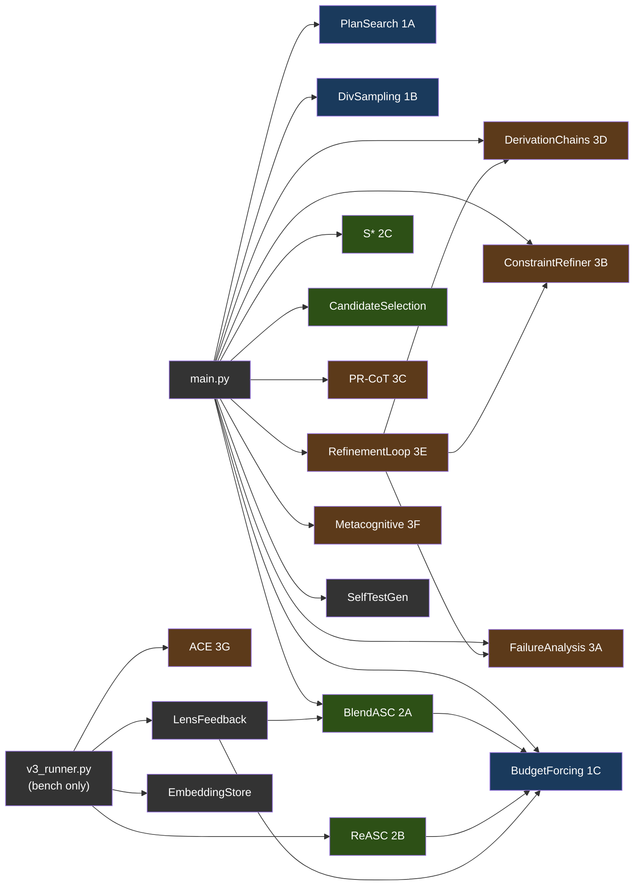

범례: 파랑 = Phase 1(생성), 초록 = Phase 2(선택), 갈색 = Phase 3(수리), 회색 = 유틸리티. `v3_runner.py`가 공급하는 모듈은 벤치 러너 전용이며, 서비스는 이를 호출하지 않습니다.

---

## 5. Geometric Lens

모델 임베딩의 기하 구조를 분석하여 코드를 실행하지 않고도 코드 품질을 평가하는 신경 스코어링 시스템입니다. 전적으로 CPU에서 돌아갑니다. 또한 프로젝트 인덱싱, 검색, 신뢰도 라우팅, 패턴 캐싱을 위한 RAG API 역할도 합니다.

#### 왜 "Geometric Lens"인가?

Geometric Lens의 핵심 아이디어는 간단한 전제에서 출발합니다: 모델을 키우는 것을 멈추고 지능적인 인프라로 감싸기 시작하라. Jose Crespo의 ["Everyone's Wrong About AI Programming"](https://www.josecrespophd.org/p/everyones-wrong-about-ai-programming)은, 현재 LLM이 올바른 코드 경로와 잘못된 코드 경로의 비용이 같은 평평한 임베딩 공간에서 작동하기 때문에 AI 생성 코드가 오류 쪽으로 표류한다고 주장합니다. 해법은 올바른 코드가 "내리막"이고 잘못된 코드가 "오르막"인 에너지 지형을 모델 주위에 구축하는 것입니다.

Anthropic의 [Manipulating Manifolds](https://transformer-circuits.pub/2025/linebreaks/index.html) 연구는 트랜스포머가 이미 임베딩 공간에 조작 가능한 기하 구조를 만든다는 증거를 제공합니다 — 원재료는 이미 거기 있습니다. Bar 등의 [Geometric Unification of Generative AI](https://arxiv.org/html/2510.00666v1)는 데이터 매니폴드 위의 거리 함수를 학습하고 스코어링에 사용하는 방법을 형식화합니다.

ATLAS는 이를 두 개의 상호 보완적 모델로 구현합니다. C(x)는 모델 자체 임베딩 위의 학습된 에너지 함수(4096-512-128-1 MLP)입니다. 각 코드 후보는 llama-server에 의해 임베딩되고, C(x)는 그것이 그 기하 구조에서 어디에 위치하는지 스코어링합니다. 낮은 에너지는 후보가 알려진 정답 코드와 군집함을 의미합니다. 높은 에너지는 알려진 오답 코드와 군집함을 의미합니다. 외부 오라클도, 실행도 필요 없습니다 — 모델 자체 표현의 기하 구조만 필요합니다.

G(x)는 품질 예측기입니다 — PCA로 축소된 임베딩 위의 XGBoost 분류기로, 후보가 축소된 공간에서 어디에 위치하는지로부터 통과/실패를 예측합니다. C(x)가 "이 후보가 얼마나 좋은가?"에 답한다면, G(x)는 "이 후보가 통과할 가능성이 있는가?"에 답합니다. 코드에는 메트릭 텐서(metric tensor) 경로도 존재하지만 배포되어 있지는 않습니다: PCA 공간의 대각 텐서(XGBoost 아티팩트가 없을 때만 폴백으로 로드됨)와, 기하 인식 그래디언트 스텝(`-α · G⁻¹ · ∇C`)을 계산해 매니폴드의 곡률을 따라 후보를 내리막으로 스티어링하는 보정 엔진이 그것입니다. 텐서에서는 스칼라 보정 가능성 점수만 노출되며(`/internal/lens/correctability`), 그래디언트 스텝 보정은 서비스에 연결되어 있지 않습니다.

### 스코어링 모델

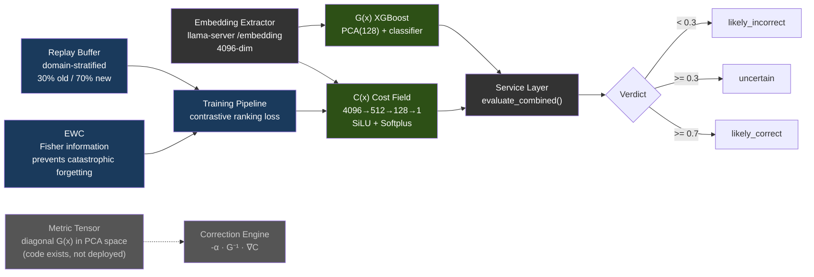

| 모델 | 아키텍처 | 학습 데이터 | 성능 |
|-------|-------------|---------------|-------------|
| **C(x)** | 4096→512→128→1 MLP (SiLU, Softplus) | 597개 LCB 임베딩 (504 PASS, 93 FAIL) | Val AUC 0.9467, sep 2.04x |
| **G(x)** | PCA(4096→128) + XGBoost | 13,398개 임베딩 (4,835 PASS, 8,563 FAIL) | PCA 80.8% 분산 |

C(x) 정규화: `1 / (1 + exp(-(energy - 19.0) / 2.0))` → [0, 1]. 파라미터: 2,163,457개 — `cost_field.pt`는 디스크에서 **8.3 MiB**(10진수 8.65 MB). 계산: 4096·512+512 + 512·128+128 + 128·1+1 = 2,163,457 × 4B float32 = 8.25 MiB.

> **참고:** 모델 가중치(.pt, .pkl 파일)는 저장소에 커밋되지 않습니다 — 학습 중에 빌드되어 컨테이너 이미지에 구워지거나 런타임에 마운트됩니다. 모델 파일이 없으면 서비스는 우아하게 성능 저하됩니다: C(x)는 중립 에너지를 반환하고, G(x)는 `gx_score: 0.5`와 `verdict: "unavailable"`을 반환합니다. 학습 데이터와 가중치는 [HuggingFace](https://huggingface.co/datasets/itigges22/ATLAS)에서 제공됩니다.

### RAG / PageIndex V2

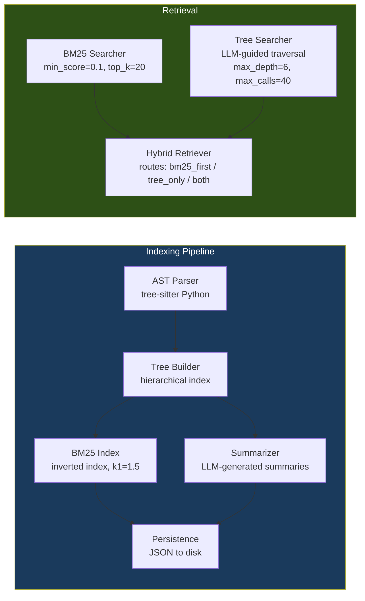

### 신뢰도 라우터 & 패턴 캐시

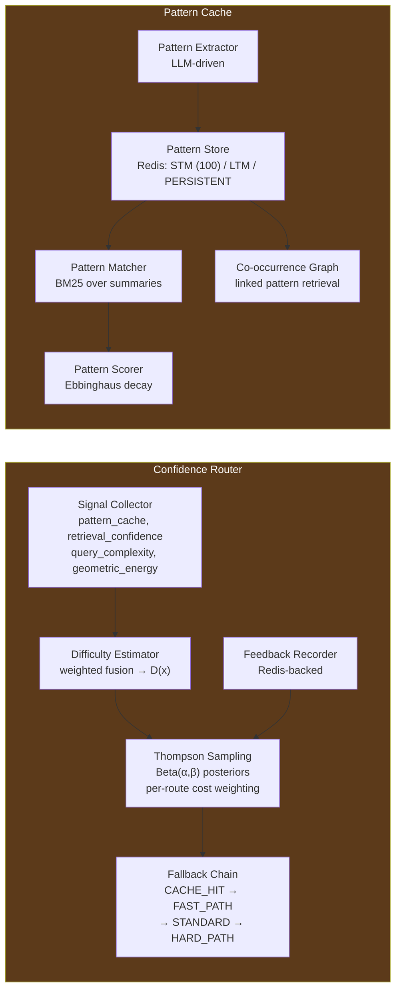

비용 가중 Thompson Sampling을 사용하는 4개 라우트: CACHE_HIT (cost=1, k=0) → FAST_PATH (cost=50, k=1) → STANDARD (cost=300, k=5) → HARD_PATH (cost=1500, k=20).

---

## 6. Sandbox

컴파일, 테스트, 린팅을 갖춘 격리된 코드 실행 환경입니다.

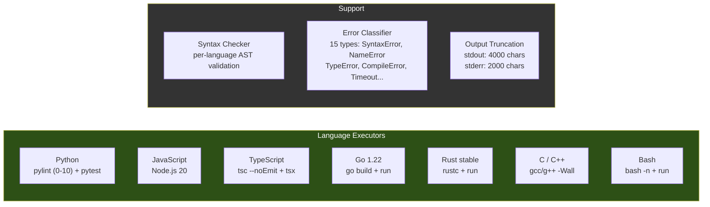

허용되는 언어 별칭: `py`/`python3` (Python), `js`/`node` (JavaScript), `ts` (TypeScript), `golang` (Go), `rs` (Rust), `c++` (C++), `sh`/`shell` (Bash). 최대 실행 시간: Docker 배포에서는 300초(compose가 프록시의 5분 `run_command` 상한에 맞춰 `MAX_EXECUTION_TIME=${ATLAS_SANDBOX_MAX_EXECUTION_TIME:-300}`를 설정; 순수 코드 기본값은 60초). 최대 메모리: 512 MB. 두 개의 워크스페이스 경로: **`/execute`**(V3 후보 테스트 경로)는 `/tmp/sandbox`(tmpfs) 아래의 일시적 스크래치 디렉토리를 사용; **`/shell`**(PC-188 기준 에이전트의 `run_command` 경로, 그리고 백그라운드 프로세스용 `/jobs/*`)은 `/workspace`에 대해 실행됩니다 — `ATLAS_PROJECT_DIR`(Docker)에서 바인드 마운트된 프로젝트 루트 또는 hostPath `${ATLAS_PROJECTS_DIR}`(K3s)로, 프록시가 보는 것과 동일한 경로입니다.

---

## 7. VRAM 예산

Docker Compose 기본값(32K 컨텍스트)으로 RTX 5060 Ti 16GB에서 실행:

| 구성요소 | VRAM |
|-----------|------|
| Qwen3.5-9B-Q6_K 모델 가중치 | ~6.9 GB |
| KV 캐시 (32K 컨텍스트) | ~1.3 GB |
| **llama-server 총합** | **~8.2 GB** |
| Geometric Lens | 0 (CPU 전용, 모델용 ~12 MB RAM, PyTorch 런타임용 ~128 MB) |
| v3-service | 0 (CPU 전용) |
| sandbox | 0 (CPU 전용) |
| atlas-proxy | 0 (Go 바이너리, ~30 MB RAM) |
| **여유 VRAM** | **~7.8 GB** |

llama-server 외부의 모든 연산은 CPU에서 돌아갑니다. GPU는 오로지 LLM 추론과 임베딩 추출에만 사용됩니다.

### 7.1 백엔드별 VRAM 예산

위의 8.2 GB / 7.8 GB 여유 분할은 NVIDIA RTX 5060 Ti 16GB 기준선입니다. 다른 백엔드는 구조적으로 다릅니다:

| 백엔드 | 보고되는 "VRAM" | 부하 시 현실적 예산 | 비고 |
|---|---|---|---|
| **CUDA** (전용 VRAM) | 하드웨어 스펙(정규 5060 Ti에서 16 GB) | 스펙의 ~95%(드라이버가 ~500 MB 예약) | 위 표의 수치가 직접 적용됨. |
| **ROCm** (전용 VRAM) | 하드웨어 스펙 | 스펙의 ~90–95%(HIP 런타임이 CUDA보다 약간 무거움) | RX 7900 XTX (24 GB) → 14B Q5 + 32K 컨텍스트를 2개 병렬 슬롯으로 여유롭게 실행. |
| **Metal** (Apple 통합) | 총 시스템 RAM | 시스템 RAM의 **~70%** | OS + 브라우저 + IDE가 ~30%를 잡아먹음. 16 GB MBP의 *현실적* 예산은 11 GB — Qwen3.5-9B Q6_K(7.5 GB + 2-4 GB KV 캐시)에는 너무 빠듯함. ≤16 GB에서는 Q4_K_M(5 GB) 사용; Q6_K는 ≥24 GB 통합 메모리를 원함. |
| **SYCL** (Intel Arc) | 하드웨어 스펙 | 미상 — 출시 시 미정 | A770 (16 GB) 목표는 NVIDIA 16 GB와 보수적으로 동등. |

---

## 8. 배포

### 8.1 Docker Compose — NVIDIA (기본)

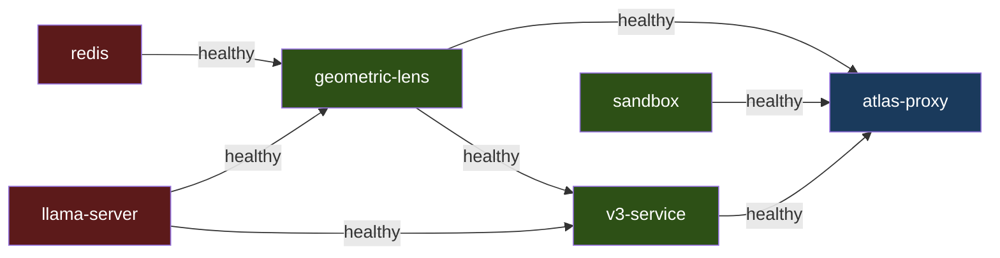

`redis`, `llama-server`, `sandbox`는 독립적으로 시작합니다. `geometric-lens`는 `redis`와 `llama-server`가 healthy해지기를 기다리고, `v3-service`는 `llama-server`와 `geometric-lens`를, `atlas-proxy`는 `llama-server`, `geometric-lens`, `v3-service`, `sandbox`를 기다립니다. 첫 실행은 컨테이너 이미지를 빌드하고(수 분 소요), 이후 시작은 빠릅니다. 표준 `docker compose up -d`로 기동하세요 — 베이스 `docker-compose.yml`이 `driver: nvidia` GPU 예약을 선언하며, 이는 호스트의 `nvidia-container-toolkit`을 통해 동작합니다.

### 8.2 Docker Compose — AMD ROCm (V3.1.1)

8.1과 동일한 서비스 그래프이지만, ROCm 오버라이드를 위에 얹어 기동합니다:

```bash
docker compose -f docker-compose.yml -f docker-compose.rocm.yml up -d
```

오버라이드(`docker-compose.rocm.yml`)는 세 가지를 합니다:
1. `llama-server`의 이미지를 `atlas-llama-rocm`으로, 빌드를 `Dockerfile.rocm`(HIP 백엔드, RDNA3/RDNA2/CDNA2를 포괄하는 기본 fat 빌드)으로 전환.
2. `!reset []`을 사용해 베이스 파일에서 NVIDIA `deploy.resources.reservations.devices` 블록을 비운 뒤, `/dev/kfd` + `/dev/dri` 디바이스 패스스루를 추가.
3. 컨테이너가 ROCm 디바이스에 접근할 수 있도록 `group_add: [video, render]` 추가.
4. 엔트리포인트가 HIP 튜닝 분기를 타도록 컨테이너 환경에 `ATLAS_BACKEND=rocm` 강제.

`atlas-bootstrap.sh`와 `atlas init`는 모두 AMD GPU를 자동 감지하여 오버라이드를 투명하게 사용합니다. 수동 사용자는 두 `-f` 플래그만 공급하면 됩니다.

ROCm은 `nvidia-container-toolkit`에 상응하는 별도의 컨테이너 런타임이 없습니다 — 패스스루만으로 충분하여 설치 표면을 단순화합니다. 호스트 사전 요구 사항(amdgpu-dkms 커널 드라이버, `render` + `video` 그룹)은 SETUP.md를 참고하세요.

### 8.3 베어메탈

`atlas` CLI(`pip install -e .`)는 기본 포트의 서비스와 직접 통신합니다. bash 런처 스크립트는 모든 서비스를 로컬 프로세스로 시작하고 atlas-tui 프론트엔드를 실행하거나, 실행 중인 Docker Compose 스택을 감지해 연결할 수 있습니다. 베어메탈은 올바른 백엔드에 대해 빌드된 llama-server 바이너리가 `PATH`에 있는 한 모든 백엔드(NVIDIA, ROCm, Metal)에서 동작합니다.

### 8.4 macOS 네이티브 (제공 중 — 하이브리드 Metal 경로, [#32](https://github.com/itigges22/ATLAS/issues/32))

macOS는 Docker 컨테이너로 GPU를 패스스루할 수 없으므로 llama-server는 Docker *내부에서* Metal 가속 실행을 할 수 없습니다. 대신 ATLAS는 **하이브리드** 경로를 제공합니다: llama-server는 추론 성능을 위해 호스트에서 네이티브로(Metal) 실행되고, 나머지 스택은 Docker에 남아 작은 socat 포워더(`llama-server:8080` → `host.docker.internal:8080`)를 통해 그것에 도달합니다. 다른 서비스는 기존의 `http://llama-server:8080` URL을 유지하며, 자신이 호스트 프로세스와 통신한다는 것을 알 필요가 없습니다. 전체 가이드: [SETUP_MACOS.md](SETUP_MACOS.md).

- **llama-server**: `scripts/atlas-setup-macos.sh`(Homebrew 의존성 + llama.cpp `LLAMA_METAL=1`)에 의해 Metal로 네이티브 빌드되어 `~/.atlas/macos/bin/llama-server-metal`에 설치되고, `scripts/atlas-llama-macos.sh`에 의해 실행됨.
- **proxy / v3-service / geometric-lens / sandbox**: 변경 없음 — Linux에서와 똑같이 Docker에서 실행되며, `docker-compose.macos.yml`의 socat 포워더를 통해 호스트 llama-server를 가리킴.
- **모델**: 16 GB Mac은 통합 메모리 예산에 맞추기 위해 기본적으로 Q4_K_M(~5 GB)을 사용; ≥24 GB Mac은 Linux 기본값처럼 Q6_K를 실행 가능.
- **`atlas doctor`**: `metal-native` 점검이 네이티브 바이너리가 존재하고, 실행되며, :8080에서 수신 대기 중인지 검증.

Apple Silicon에서는 `atlas init`가 Docker-GPU 경로 대신 `ATLAS_BACKEND=metal`과 macOS 하이브리드 배선을 기록합니다(`atlas/cli/commands/init.py`의 hybrid-metal 분기 참고). 설정 스크립트를 실행한 뒤 `docker compose -f docker-compose.yml -f docker-compose.macos.yml up -d`로 스택을 기동하세요.

### 8.5 K3s

`templates/*.yaml.tmpl`의 매니페스트는 `scripts/generate-manifests.sh`(또는 `install.sh`의 `process_templates` 단계)가 `atlas.conf`에 대해 `envsubst`를 사용해 `manifests/*.yaml`로 렌더링합니다. 서비스는 `atlas` 네임스페이스에 Pod로 배포되고, 외부 접근은 NodePort(`ATLAS_PROXY_NODEPORT`, `ATLAS_LLAMA_NODEPORT`, `ATLAS_LENS_NODEPORT`, `ATLAS_SANDBOX_NODEPORT`, `ATLAS_V3_NODEPORT`)를 통합니다. K3s 엔트리포인트는 Docker Compose에서 쓰는 것과 동일한 `inference/entrypoint-v3.1.sh`입니다 — 컨텍스트 크기, KV 캐시 양자화, flash attention, mlock이 모두 환경 변수(`ATLAS_CONTEXT_LENGTH`, `ATLAS_FLASH_ATTENTION` 등)로 구동되므로 배포 모드 전반에서 동작이 동일합니다. 프록시와 샌드박스 Pod는 둘 다 `${ATLAS_PROJECTS_DIR}`를 `/workspace`에 `hostPath`-마운트하여 에이전트의 도구 호출이 두 Pod에서 같은 파일을 보게 합니다.

ROCm K8s Pod는 `/dev/kfd` + `/dev/dri` hostPath 마운트와 Pod 스펙의 `render`/`video` 그룹 멤버십이 필요합니다 — 이를 위한 매니페스트 템플릿은 V3.1.2 작업입니다; 환경 변수 패치만으로는 동작하는 ROCm K3s 배포에 충분하지 않습니다.

---

## 9. 데이터 흐름

### T1: 단순 파일 쓰기

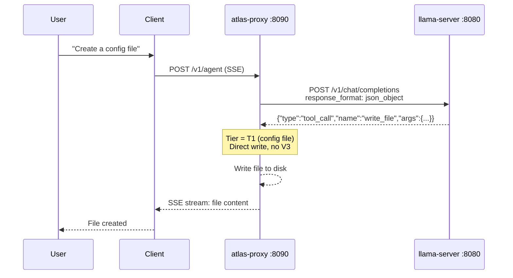

LLM 호출 1회. V3 오버헤드 없음.

### T2: 기능 파일 쓰기

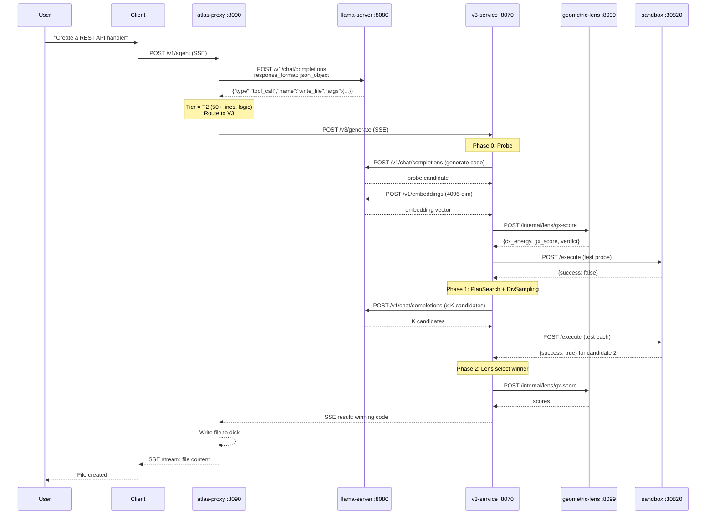

최소 3회의 llama-server 호출(probe 생성 1회 + 셀프 테스트 생성 1회 + 임베딩 추출 1회). Phase 3 수리가 모든 전략을 동원하면 최대 30회 이상.

### 기존 코드 편집

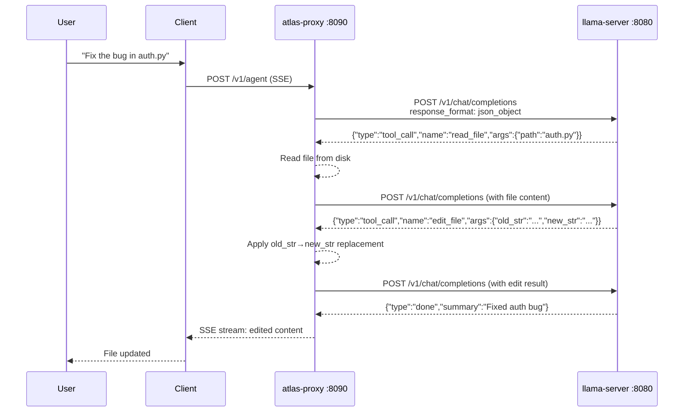

5줄을 초과하는 기존 파일은 `write_file`에 대해 거부됩니다 — 모델은 `edit_file`(정밀, ≤10줄) 또는 `ast_edit`(노드 전체 재작성, .py/.html/.htm만)를 사용해야 합니다. `.py`/`.html`/`.htm` 파일에서는 단계별 문법 게이트(BiasBusters #2)가 다음 결정에 대해 도구 이름 생성 규칙에서 `edit_file`/`write_file`를 능동적으로 금지하여 모델이 잘못된 지름길로 되돌아가지 못하게 합니다.
