> **[English](../../ARCHITECTURE.md)** | **简体中文** | **[日本語](../ja/ARCHITECTURE.md)** | **[한국어](../ko/ARCHITECTURE.md)**

# ATLAS 架构

ATLAS V3.1.0 的系统架构。采用双层设计：外层 agent 循环负责工具调用的编排，内层 V3 pipeline 则生成多样化的代码候选，并配合构建验证与基于能量的选择。

---

## 1. 系统概览

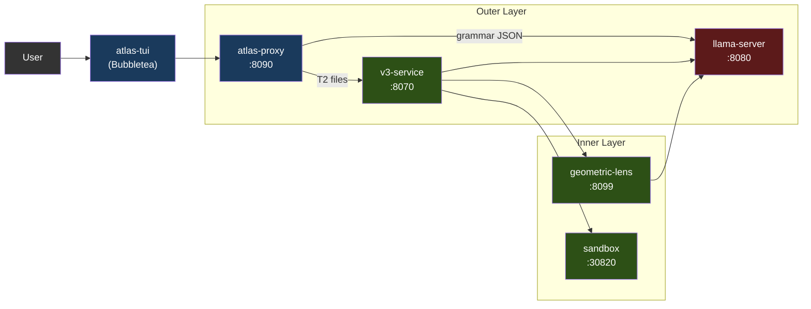

各服务既可以通过 Docker Compose（推荐）作为容器运行，也可以通过 `atlas` 启动器作为本地进程运行。只有 llama-server 使用 GPU，其余所有组件都跑在 CPU 上。

聊天前端是 **atlas-tui**（Bubbletea，PC-062）：一个原生 Go 终端 UI，消费 `/v1/agent`（按轮次的聊天 SSE）和 `/events`（面向 pipeline 窗格的全局类型化信封事件流）。用 `atlas`（默认交互模式）或 `atlas tui`（显式指定）启动。Pipeline 窗格实时展示 V3 各阶段；聊天窗格通过 glamour 渲染助手的 markdown；斜杠命令 `/add /diff /commit /run` 等负责处理本地文件上下文与 shell 调用。输入是模式感知的（chat / `!bash` / `/slash`），并带有提示下拉。

代理上的 `/v1/chat/completions` 是对 llama-server 的透明透传 —— 保留它是为了 SDK 兼容性，但它并不运行 agent 循环。希望使用工具调用 + V3 pipeline 的第三方客户端应直接对接 `/v1/agent`。该契约记录在 [API.md](API.md) 中；PC-063 负责跟进产出一份完整可用的范例与 OpenAPI 规范。

### 1.1 支持的加速器

llama-server 是唯一使用 GPU 的服务；其余每个 ATLAS 服务都跑在 CPU 上（代理是 Go，v3-service / geometric-lens / sandbox 是 Python）。这让多后端的表面积保持很小 —— 添加一个新加速器意味着一个新的 Dockerfile 加上一个入口点环境变量分支，而不是改动整个 pipeline。

| 后端 | 状态 (V3.1.x) | 镜像 / 构建路径 | Compose override | 已测试显卡 |
|---|---|---|---|---|
| **CUDA** (NVIDIA) | 自 V3.1.0 起发布 | `inference/Dockerfile.v31` → `atlas-llama` | （默认） | RTX 5060 Ti 16GB（基准），RTX 30xx/40xx/50xx |
| **ROCm / HIP** (AMD) | V3.1.1 发布 | `inference/Dockerfile.rocm` → `atlas-llama-rocm` | `docker-compose.rocm.yml` | RX 7900 XTX（社区冒烟测试，GH #26） |
| **Metal** (Apple Silicon) | 已发布 ([#32](https://github.com/itigges22/ATLAS/issues/32)) | 混合方案：原生 llama-server (Metal) + 其余组件用 Docker（macOS 无法将 GPU 直通给容器） | `docker-compose.macos.yml` | M 系列；≤16 GB 用 Q4_K_M，≥24 GB 统一内存用 Q6_K |
| **SYCL** (Intel Arc) | 路线图 | 待定 | 待定 | Arc A770 16 GB（目标） |

**后端选择发生在安装时，而非运行时。** `atlas init` 运行 `tier.detect_gpu()`（见 `atlas/cli/commands/tier.py`），在所有检测到的厂商中挑选显存最大的 GPU（可用 `ATLAS_GPU_VENDOR` / `ATLAS_GPU_INDEX` 覆盖），并把 `ATLAS_BACKEND={cuda|rocm|metal|sycl}` 写入 `.env`。每个后端都有自己预构建的镜像；用户不会运行一个打包了所有后端库的臃肿镜像。在不受支持的后端主机上，向导会拒绝运行，而不是写出一个无法启动的 `.env`。

**自带模型的表面（V3.1.1）。** `atlas lens check` 是针对运行中的 llama-server 的一次廉价预检，用于报告当前加载的模型是否与 Lens 兼容 (PC-057)。`atlas lens build --samples <path>` 封装了 `geometric-lens/geometric_lens/training.py`，按模型原生的嵌入维度训练全新的 `cost_field.pt` 工件 (PC-058)。二者结合让用户无需 fork lens 代码即可换入非默认的 GGUF —— C(x) 构造函数接受任意 `input_dim`，因此逐模型变化的只有训练出来的权重。面向用户的流程见 [CLI.md § atlas lens](CLI.md#atlas-lens-pc-057--pc-058)；PC-059（注册表写回）与 PC-060（HF 中间人分发）是 V3.1.2+ 的后续工作，用以闭环。

**与厂商无关的部分**（在每个后端上都可用）：语法约束的 JSON、自嵌入（`/embedding`）、逐层隐藏状态（PC-202 补丁）、ASA 控制向量（由 llama.cpp 的 `control_vector_load` 加载，与后端无关）、KV 缓存量化、整个外层 agent 循环、V3 pipeline、Geometric Lens 以及 sandbox。

**逐后端有差异的部分：**
- **Flash attention。** CUDA + ROCm：完整支持。Metal：受限（llama.cpp 的 Metal 后端对部分 head 尺寸支持 flash-attn；不支持时默认关闭）。SYCL：待定。
- **固定（pinned）主机内存。** `GGML_CUDA_NO_PINNED` 适用于 CUDA + ROCm（HIP 在 GGML 兼容层镜像了 CUDA 的路径）。Metal/SYCL 不使用固定内存。
- **多 GPU + 张量并行。** V1 在每个后端上都只支持单 GPU；多 GPU 是 GH #34，不绑定到特定厂商。
- **Apple 统一内存。** macOS 共享 GPU+系统内存；"VRAM" 的算法实际上是"总共 16 GB 减去操作系统 + 应用"。见 §7。

K3s 部署路径（`scripts/install.sh`，清单在 `templates/` 中）截至 V3.1.1 仅支持 CUDA —— ROCm K8s 方案在 V3.1.2 的待办清单上（需要 `/dev/kfd` + `/dev/dri` hostPath 挂载以及 `render`/`video` 组成员身份，相当于集群级别的 `docker-compose.rocm.yml`）。

---

## 2. 服务

| 服务 | 端口 | 语言 | 用途 |
|---------|------|----------|---------|
| **llama-server** | 8080 | C++ (llama.cpp) | LLM 推理（CUDA / ROCm / Metal / Vulkan；SYCL 在路线图上 —— 见 §1.1）、语法约束的 JSON、自嵌入、逐层残差隐藏状态 (PC-202) |
| **atlas-proxy** | 8090 | Go | agent 循环、工具调用路由、tier 分类、`/v1/agent` SSE、`/events` 类型化 SSE、`/cancel`。`/v1/chat/completions` 原样透传给 llama-server。 |
| **atlas-tui** | （客户端） | Go | Bubbletea TUI；消费 `/events` 和 `/v1/agent` SSE 流。PC-062。 |
| **v3-service** | 8070 | Python | V3 pipeline 的 HTTP 封装（PlanSearch、DivSampling、PR-CoT 等） |
| **geometric-lens** | 8099 | Python (FastAPI) | C(x) 能量打分、G(x) XGBoost 质量预测、RAG/项目索引 |
| **sandbox** | 30820（主机）/ 8020（容器） | Python (FastAPI) | 隔离的代码执行、编译、检查、测试运行 |
| **redis** | 6379（内部） | C (Redis 7) | 模式缓存、共现图、任务队列、路由器状态；geometric-lens 的后备存储 |

---

## 3. atlas-proxy（外层）

代理是聊天前端的入口点。它在 `/v1/agent` 上接收用户消息（类型化事件流 —— TUI 使用的就是它），并运行一个内部 agent 循环：调用 llama-server、解析工具调用、执行它们，然后把事件流式回传。遗留的 `/v1/chat/completions` 端点是对 llama-server 的透明透传。完整的事件类型目录见 [API.md](API.md)。

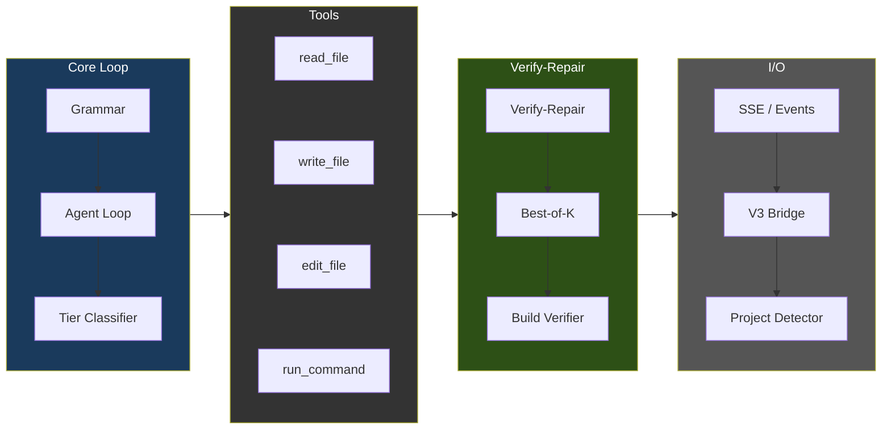

### Agent 循环流程

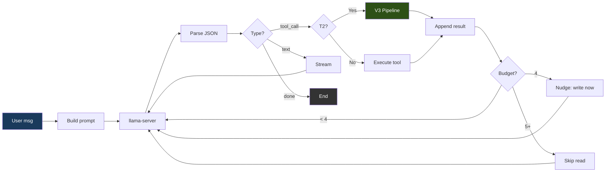

### 语法强制执行

llama-server 的 `response_format: {"type": "json_object"}` 强制每一次模型输出恰好是三种有效 JSON 形态之一：

```json
{"type": "tool_call", "name": "<tool_name>", "args": {...}}
{"type": "text", "content": "<message>"}
{"type": "done", "summary": "<summary>"}
```

该 JSON schema 使用带 `additionalProperties: false` 的 `oneOf`，并从注册表中枚举工具名。模型无法产生无效的 JSON —— token 生成在 llama-server 层面就受语法约束。

### 工具

`proxy/tools.go` 中注册了 15 个工具：

| 工具 | 用途 | 只读 |
|------|---------|-----------|
| `read_file` | 读取文件内容（可选 offset/limit） | 是 |
| `outline_file` | 列出文件的顶层函数/类及其行号范围，不含函数体（`.py` 使用 tree-sitter，其余为尽力而为的扫描）。外科式读取的入口点：先 outline，再用带 offset/limit 的 `read_file` | 是 |
| `write_file` | 创建一个新文件（对超过 5 行的已有文件会被拒绝 —— 见安全限制） | 否 |
| `edit_file` | 针对 ≤10 行改动的外科式内联字符串替换（old_str/new_str） | 否 |
| `ast_edit` | 通过 tree-sitter 选择器（`function:NAME`、`class:NAME`、`<tag>`）对整个函数/类/HTML 元素进行重写；对整节点替换而言，优先于 edit_file 使用。GH #39，v1 中仅支持 .py/.html/.htm | 否 |
| `delete_file` | 删除文件或空目录（之后强制退出循环） | 否 |
| `move_file` | 在工作区内移动或重命名文件（例如 `index.html` → `templates/`）。纯粹的重定位 —— 绕过 V3/外科式编辑门控，拒绝覆盖已存在的目标。由于 shell `mv`/`cp` 会被拒绝，这是"重新组织文件"的受支持路径 | 否 |
| `find_file` | 按文件**名**/路径做正则搜索（廉价的存在性检查 + 定位）。区别于在文件内容中 grep 的 `search_files`。PC-028 | 是 |
| `search_files` | 跨文件内容做正则搜索（最多 200 个匹配，跳过 .git/node_modules） | 是 |
| `list_directory` | 列出目录内容及其类型和大小 | 是 |
| `run_command` | 通过 sandbox 容器执行 shell 命令 (PC-188)；5 分钟超时上限 | 否 |
| `run_background` | PC-196 —— 在 sandbox 中启动一个长时间运行的进程（例如 `python app.py`）；立即返回一个 `job_id` | 否 |
| `tail_background` | PC-196 —— 通过 `job_id` 获取某个后台任务新增的 stdout/stderr | 是 |
| `stop_background` | PC-196 —— 通过 `job_id` 对某个后台任务发送 SIGTERM/SIGKILL | 否 |
| `plan_tasks` | 将工作分解为带依赖关系的并行任务 | 否 |

### 工具选择偏差缓解（2026 年 5 月 BiasBusters 综合方案）

Qwen3.5-9B 有一个有据可查的偏差：即便 ast_edit 才是正确选择，它也倾向于用 `edit_file` 而非 `ast_edit`（BiasBusters arxiv 2510.00307 —— 相邻工具名的嵌入会相互竞争；描述比名称更重要）。代理中组合了四道防线：

1. **描述重写**（`proxy/tools.go`）。edit_file 的描述
   警告不要用于整文件/整函数；ast_edit 的描述
   声明对 >10 行 / 整节点替换是必需的；write_file 的描述
   声明仅用于新文件。
2. **条件式 GBNF 语法**（`proxy/grammar.go`，
   `proxy/agent.go:stepExclusions`）。当一个 write_file 对
   一个 >5 行的已有 .py/.html/.htm 文件被拒绝时，下一次 LLM 调用会
   被一个 GBNF 语法约束，该语法从工具名产生式中禁掉
   edit_file 和 write_file。模型在物理上无法发出
   它们。该限制在一次决策后失效。
3. **逐步工具列表过滤**（同一触发条件）。注入一条临时的
   `[system note]` 用户消息，提醒模型在这一步
   ast_edit 是唯一的结构性编辑工具。
4. **ASA 操控向量**（`geometric-lens/asa_calibration/`）。
   激活操控会在上游移动残差流分布，
   因此即使在任何拒绝触发之前的首次尝试决策中，也会偏好 ast_edit。
   若 `/models/ast_edit_steering.gguf` 文件存在，便由 `inference/entrypoint-v3.1.sh`
   自动加载 —— 一旦运维人员通过 `geometric-lens/asa_calibration/README.md`
   中的工作流构建并放入该向量，它就始终生效。
   可通过 `ATLAS_CONTROL_VECTOR*` 环境变量覆盖路径/缩放/层范围。

   **逐模型耦合 (PC-061, V3.1.2)。** 每个 ASA 向量都是针对
   某个特定模型的残差流几何结构训练出来的。随附的
   `ast_edit_steering.gguf` 是为 Qwen3.5-9B（4096 维，36
   层）校准的 —— 换入另一个模型，该向量好的情况下是空操作，
   坏的情况下会主动产生误导。`atlas asa check` 会探测已配置的
   向量与已加载模型的嵌入维度，解析 GGUF 元数据以获取
   层数 + `model_hint`，并报告 `compat` / `needs-build` /
   `incompatible`。`atlas asa build` 把校准工作流封装为
   一次 CLI 调用，运行在 lens 容器内部（该容器拥有
   PC-202 的隐藏状态客户端）。`atlas asa publish` 将训练好的
   工件发布到 HF 并生成一个注册表 PR —— 与 PC-057/058/059 中
   加入的 `atlas lens` 系列并行。见 [CLI.md § atlas asa](CLI.md#atlas-asa-pc-061)。

四道缓解措施相互组合：ASA 在上游偏置提案分布
（第 4 项），语法是拒绝之后的硬性禁令（第 2 项），
系统提示让模型的工作调色板保持聚焦（第 3 项），
而描述则在提示词本身中提供始终适用的操控信号
（第 1 项）。

### 逐文件 Tier 分类

每一次 `write_file`/`edit_file` 调用都被独立分类：

| Tier | 最大轮次 | 动作 |
|------|-----------|--------|
| T0（对话型） | 5 | 仅文本回复 |
| T1（简单） | 0（无上限） | 直接写入 —— 无 V3 开销 |
| T2（功能） | 0（无上限） | 触发 V3 pipeline |
| T3（困难） | 0（无上限） | 触发 V3 pipeline |

2026 年 5 月的加固扫荡移除了 `absoluteMaxTurns` 上限，并把逐 tier 的 T1/T2/T3 上限降为零（"无上限"），因为循环内部的 8 检测器栈现在会决定何时中断：lens 回退（`agent_lens_intervention`）、推理重复（`agent_reasoning_intervention`）、工具调用重复（`agent_repeat_intervention`）、路径感知的错误熔断器、无动作即 done 门控、claim-check 门控、计划遵循阈值，以及空回复回退。对于一次性的"修复整个应用"提示，运维人员仍可用 `ATLAS_MAX_TURNS=<n>` 覆盖 —— 见 `proxy/types.go::envOverrideMaxTurns`。

分类器在 `proxy/tools.go`（`classifyFileTier`）；逻辑模式匹配器在同一文件中（`hasLogicIndicators`）。

**始终为 T1（直接写入）：**
- 按名称匹配的配置文件（代码中共 29 个）：`package.json`、`tsconfig.json`、`next.config.{js,ts,mjs}`、`tailwind.config.{ts,js}`、`postcss.config.{js,mjs}`、`vite.config.{ts,js}`、`.eslintrc.json`、`.prettierrc`、`jest.config.{ts,js}`、`cargo.toml`、`go.mod`、`go.sum`、`makefile`、`cmakelists.txt`、`pyproject.toml`、`setup.py`、`setup.cfg`、`requirements.txt`、`pipfile`、`.editorconfig`、`.gitignore`、`dockerfile`、`docker-compose.{yml,yaml}`
- 按扩展名匹配的数据文件：`.json`、`.yaml`、`.yml`、`.toml`、`.csv`、`.xml`、`.env`
- 样式文件：`.css`、`.scss`、`.less`
- 文档：`.md`、`.txt`、`.rst`
- Shell 脚本：`.sh`、`.bash`
- 微不足道的极小文件：少于 **10 行**（在那种体量下 V3 没有任何可以有意义地多样化的东西 —— 此前 50 行的下限太保守了；一个 33 行、7 条路由的 flask `app.py` 正是 V3 应当帮上忙的情形）
- 没有逻辑指标的未知扩展名

**T2（V3 pipeline）** —— 当文件 ≥10 行且满足以下任一条件时合格：
- `hasLogicIndicators(content)` 返回 true —— 定义为在以下模式家族中出现 **2 次以上匹配**（从 3 次降下来，因为小但被路由的文件溜了过去）：
  - **函数/方法定义：** `def `、`func `、`function `、`fn `、`async `
  - **控制流：** `if `、`else `、`switch `、`match `、`for `、`while `
  - **错误处理：** `try `、`catch `、`except `、`throw `、`raise `
  - **Flask / FastAPI / Django 路由：** `@app.route`、`@app.get`、`@app.post`、`@app.put`、`@app.delete`、`@blueprint`、`render_template`、`url_for`、`request.method`、`flask.`、`from flask`
  - **Express / Node API：** `export default`、`export async`、`module.exports`、`app.get`、`app.post`、`app.put`、`app.delete`、`router.`、`handler`、`NextResponse`、`Response(`、`Request`
  - **React 状态/数据：** `useState`、`useEffect`、`useRef`、`useCallback`、`setState`、`dispatch`、`reducer`
  - **校验：** `validate`、`schema`、`parse`、`zod.`
  - **数据库：** `query(`、`insert(`、`.select(`、`.update(`
  - **JSX / React 组件模式：** `return (`、`return <`、`className=`、`onClick`、`onChange`、`onSubmit`、`.map(`、`.filter(`、`.reduce(`
  - **导入：** `import {`
- 或者该文件具有受识别的源代码 / 标记语言扩展名，且没有触发逻辑指标 —— 在 T2 给予它疑点利益（覆盖诸如 12 行组件骨架这类极简但真实的文件）。扩展名：`.py`、`.go`、`.rs`、`.ts`、`.tsx`、`.js`、`.jsx`、`.c`、`.cpp`、`.cc`、`.h`、`.hpp`、`.java`、`.kt`、`.swift`、`.rb`、`.php`、`.vue`、`.svelte`、`.html`、`.htm`

**T3（困难）** —— 目前分类器自身从不直接发出 T3；圈复杂度精炼器（`refineTierWithCC`，经由 GH #39 第 2 点的 `/internal/cyclomatic_complexity`）可以在 McCabe CC 表明存在真实的分支密度时将 T2 *升级* 为 T3。从不降级。

### Plan 模式（按轮次预检）

Plan 模式是一个规划步骤，在每个 agent 轮次中、在第一次工具调用**之前**运行一次。规划器从 LLM 以不同温度采样 3 个候选计划，对每个进行启发式打分，并选出最佳。获胜的计划会进入系统提示，并播下一个遵循门控，当模型偏离计划而胡乱折腾时自动修订。

旨在应对两种失败模式：

1. **探索折腾。** 没有计划时，前 2–4 次工具调用往往是 `read_file → list_directory → search_files → read_file → …` —— 在探索而不是在行动。有了计划，系统提示会明确告诉模型：读这个，编辑那个，用 curl 验证。
2. **无证据的 `done`。** 计划的 `verify_step` 就是修复的证据。验证门控 (PC-179) 在该步骤成功运行之前拒绝 `done`。

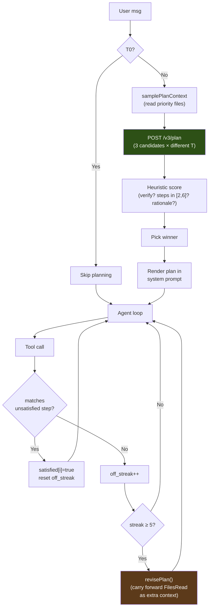

**v3-service `/v3/plan`（Python）。** `v3-service/main.py` 用用户消息 + 工作目录 + 截断的优先文件渲染 `PLAN_PROMPT_TEMPLATE`，然后以 seed 偏移和温度 `[0.3, 0.5, 0.7]` 调用 LLM 3 次。默认模式向 llama-server 发送 `chat_template_kwargs: {enable_thinking: false}`，因为当思考开启时，Qwen3.5 会把它的 `<think>` 块路由进 `delta.reasoning_content`（chat-completions 消费者看不到它），于是一个 2048 token 的预算会全部烧在推理上而吐不出任何 JSON。仅靠提示词中的 `/nothink` 指令并不可靠。设置 `ATLAS_PLAN_THINKING=1` 可同时翻转两者：开启思考，规划器预算提升到 8192 token（PC-206 —— 仅在快速硬件上有用；在吃紧的 GPU 上，规划器延迟会从约 5-30 秒升至每个候选 >4 分钟）。每个原始回复都用一个容忍 markdown 围栏 + 感知花括号深度的提取器（`_parse_plan_json`）解析，再用 `_score_plan` 打分：

- **+0.3** 拥有 `verify_step`
- **+0.2** `len(steps) ∈ [2, 6]`
- **+0.2** 验证步骤引用了一个已知的验证命令（`pytest`、`python`、`curl`、`go test`、…）
- **+0.1 每步** 针对用户点名的文件（上限 +0.2）
- **+0.1** 拥有一个非空的 `rationale`

最高分获胜；平局时归于步骤更少者（少废话）。如果全部 3 个候选都解析失败，处理器返回一个单步回退（`{action: "investigate the request and act"}`），这样 agent 循环永远不会因规划器失败而阻塞。API 契约：[API.md § POST /v3/plan](API.md#post-v3plan)。

**代理组件（Go）。**

| 文件 | 角色 |
|---|---|
| `proxy/v3_bridge.go` | `callV3PlanStreaming(v3URL, req, onProgress)` —— 打开 SSE 流，将进度事件转发给回调，从 `event: result` 帧返回最终的 `Plan` |
| `proxy/types.go` | `V3PlanRequest`、`Plan`、`PlanStep` 类型。`AgentContext` 新增 `Plan`、`PlanStepsSatisfied[]`、`PlanOffStreak`、`PlanRevisions` |
| `proxy/agent.go` | `samplePlanContext()` 为规划器遍历优先文件（`app.py`、`templates/index.html`、`package.json`、…）。`shouldGeneratePlan()` 按 tier + 消息长度门控。`generatePlan()` 运行 bridge 并发出带完整步骤列表的 `plan_loaded` |
| `proxy/plan_adherence.go` | `matchPlanStep()`（宽松的工具名 + 路径后缀匹配）、`recordPlanAdherence()`（逐工具调用记账）、`revisePlan()`（携带 `FilesRead` 作为额外上下文向前重新生成） |

系统提示的渲染发生在 `buildSystemPrompt` 中、`## Plan` 标题之下。每个步骤是 `i. [marker] **action** target — why`，普通步骤的 `marker = " "`，验证步骤的 `marker = "✓"`。验证步骤被标记为"修复证据"步骤，验证门控就以它来抵挡 `done`。（TUI 在 `tui/plan.go` 中的聊天行渲染使用更丰富的字形 —— ☐ 未满足、✓ 已满足、⚐ 验证步骤 —— 但那些活在客户端里，而不是模型看到的系统提示中。）

**可调项。**

| 常量 | 来源 | 默认值 | 依据 |
|---|---|---|---|
| `planAutoReviseThreshold` | `proxy/plan_adherence.go` | `5` | 自动修订触发前的偏离计划工具调用数 |
| `planMaxRevisions` | `proxy/plan_adherence.go` | `2` | 每个循环的自动修订上限。超过此值，`revisePlan` 成为空操作 —— 最近一次成功的计划保持生效、遵循记账继续，但不再触发进一步的重新规划。 |
| `n_candidates` | `v3-service/main.py` | `3` | 在温度 `[0.3, 0.5, 0.7]` 下的多样化采样；候选越多 → 墙钟时间越长（约 5 秒/候选） |
| 每个候选的 `max_tokens` | `v3-service/main.py` | `2048` | 覆盖一个带依据的 6 步计划；早期测试中 1024 在 JSON 中途被截断 |

**跳过条件**（`shouldGeneratePlan`）：

1. `ctx.Tier == Tier0Conversational` —— 琐碎闲聊（"hi"、"thanks"）从不规划。
2. `len(message) < 12` —— 依赖上一轮计划的简短确认（"yes do it"、"looks good"）不再规划。

除此之外，每一轮都会规划。失败（`/v3/plan` 5xx、网络错误、所有候选在回退之外都无法解析）会静默降级 —— 循环在没有 `ctx.Plan` 的情况下运行，与引入 plan 模式之前的行为一致。

**成本。** 在热 GPU 上,一次 3 候选扫描的墙钟时间约 15 秒（每个候选约 5 秒）。token 成本 ≈ 1500 token/候选 × 3 = 约 4500 实际 token（预算 6144）。两者都在 agent 的第一次工具调用之前预付。一旦模型省去一轮无用的探索就回本了，因为每次省下的工具调用本身就是约 5–10 秒的 LLM 往返加上工具执行。

### 安全限制

| 限制 | 取值 | 用途 |
|-------|-------|---------|
| 对话裁剪 | 按 slot 调整大小的滑动窗口：保留系统消息 + 最近的用户指令 + **当前活动文件的内容** + 尽可能多的尾部消息以塞满 `per-slot context − ATLAS_MAX_TOKENS − 2048`（下限：保留 8；可选硬上限通过 `ATLAS_AGENT_HISTORY_BUDGET`）。同时钉住最近的用户消息和最近读取的文件内容至关重要 —— 没有文件钉住，长循环会丢掉正在编辑的文件，弱模型便会盲编辑，幻觉出它再也看不到的符号/行 | 在不让模型饿掉它正在编辑的文件的前提下，防止上下文溢出 |
| 冗余读取短路 | 对一个未改动文件的整文件 `read_file` 仅在**该内容仍在实时对话中**（以文件最长行探测）时才返回一个紧凑的"已在上下文中"指针；如果它已被裁剪掉，则重新提供完整文件，使模型永不盲编辑（`ATLAS_DEDUP_READS=0` 禁用）。分页读取和已改动文件始终提供真实内容 | 避免每轮重新编码一个未改动的文件，同时不对模型谎称它拥有已丢失的内容 |
| 回溯定位 → 定向编辑（#39 / 选项 3） | 当 run_command 暴露出一个 Python 回溯时，代理提取最深的项目内栈帧（file:line:function），引用出错的那一行，并注入一条定向操控（"在这里修复 `function:X`；不要在别处编辑或硬编码"）。如果模型随后重新运行未改动的代码，则下一次决策的语法中**禁用运行工具**（`tracebackExclusion`），强制其编辑 | 把弱模型做不好的定位（它会幻觉出错误的函数）转化为它擅长的定向编辑 —— 栈帧本身就是定位，无需 LLM 推理 |
| 缺失模块安装操控 | 当某次运行因"No module named X"失败时（sandbox 不附带任何应用库），代理告诉模型先 `pip install X` —— 或在存在清单文件时 `pip install -r requirements.txt`（`missingModuleSteer`）—— 而不是重新运行同一条失败命令。tracebackSteer 故意忽略 ModuleNotFoundError（不是代码 bug）；这一项补上了此前缺失的正向引导 | 打破未安装依赖的循环（观察到 `flask run` ×3 然后 `run_background flask run` ×3 → 重复熔断器在任务完成前杀掉会话） |
| 缺失文件大小写不匹配操控 | 当一个失败的 run_command 暴露出"No such file or directory"、其命名的文件与真实工作区文件仅大小写不同（例如运行了 `pip install -r Requirements.txt` 而文件是 `requirements.txt`）时，代理点出正确的文件名并告诉模型用确切名称重新运行（`missingFileSteer`）。仅在大小写变体确实存在时触发 —— 绝不为真正缺失的文件臆造锚点 | 打破大小写笔误循环（观察到错误名称被原样重新运行 5 次后重复熔断器才触发），且不施加运行禁令，因为这里模型*应当*重新运行 —— 只是用正确的名称 |
| V3 交互式墙钟上限 | 来自 agent 路径的单次 V3 pipeline 调用被限制在 `ATLAS_V3_TIMEOUT`（默认 180s）；超时时代理回退到模型自身的语法门控内容而不是阻塞 | 限定长尾的 Phase-3 修复停滞（观察到在一个 103 行写入上约 11 分钟），使交互式会话保持响应；`0` 为离线 bench 禁用 |
| 读取/大纲上的调用图页脚（#39） | 当 `ATLAS_CALL_GRAPH` 开启时，`outline_file` 和对一个 `.py` 的整文件 `read_file` 会附上每个符号的文件内调用边（`calls:` / `called by:`）外加一条操控（"错误的返回值可能来自它调用的某个函数 —— 沿着这些边走"）。范围限定在那一个文件，因此没有会漏掉目标的全仓扫描 | 在定位决策点上呈现结构 —— 这正是模型在选择编辑什么之前所检视的工件 |
| ast_edit 符号接地 | 当一个选择器匹配 0 个节点时,错误会列出该文件实际的符号（"没有 `get_inventory_count`；该文件定义了 `item_subtotal`、`total_value`、…"），而不是干巴巴的"确认它存在" | 把幻觉符号的重试接地到模型可以从中挑选的真实名称上 |
| 会话开始时擦除 KV slot | 所有 `--parallel` slot 都被擦除（`/slots/N?action=erase`），而不仅是 slot 0 —— llama-server 按前缀匹配/LRU 为每个请求挑选 slot，因此新会话可能落到任意 slot 上 | 跨会话隔离 (PC-045)：不让任何先前会话的 KV 前缀渗入一个全新会话 |
| ast_edit 失控内容守卫 | 当 `content` > 8 KB 且 > 4× 整个文件大小时拒绝；拒绝文本操控"仅发出替换节点" | 在推理泄漏块（观察到：69 KB 的思维链作为一个 3 行函数的"替换"）落盘或进入 V3 之前抓住它们 |
| 空操作编辑守卫 | 当编辑后文件与编辑前文件逐字节相同时，ast_edit + edit_file 失败；拒绝文本声明 bug 仍然存在 | 弱模型会把现有的损坏代码原样作为"修复"重新发出；在此报告成功会使它相信修复已落地并继续前进 |
| 空内容守卫 | ast_edit（代理 + v3-service）拒绝空/空白的 `content`，而不是把它拼接到节点上 | 省略 `content` 会悄无声息地删除所选函数/类 —— 现场观察到（Qwen 删除了 calc.py 中的两个函数，而 `__main__` 仍在调用它们）；它能通过语法门控（文件仍可解析）和空操作守卫（内容确实变了），因此没有别的东西能抓住它 |
| Python 语法门控 | ast_edit（在 v3-service 中,拼接后）和 edit_file（代理 → `/internal/pycheck`，尽力而为/失败放行）拒绝写出一个不再可解析的 `.py` 文件；拒绝信息携带 SyntaxError 的行号和消息 | Tree-sitter 容错：一个引号错乱的替换（`item["id""]`、`&quot;`）会"成功"拼接，并把一个 SyntaxError 送进一个先前可运行的文件 —— 在一个测试批次中观察到两次 |
| edit_file 最近行锚点 | 当 old_str 未命中时，错误引用标识符重叠度最高的文件行（共享 token ≥2 且 ≥探针的一半）外加其行号，并附"从文件中复制真实的行 —— 不要凭记忆写出它们" | 一个凭对文件的记忆来编辑的模型（观察到：old_str `item = items[id + 1]` vs 实际 `return jsonify(items[item_id + 1])`），否则会放弃外科式编辑、并基于同一份错误记忆重写整个节点 |
| 逐轮推理预算 | 在约 6144 个推理 token（`ATLAS_REASONING_BUDGET`，0 禁用）且没有发出任何内容后切断流；恢复时从推理中提取一个内嵌的 tool_call 或重新提示 | 限定推理螺旋（观察到：14 分钟 / 约 17K token 在一个 24 行文件上反复斟酌，最终没有任何工具调用） |
| 对已有文件的 write_file | 文件 > 5 行时拒绝（PC-159 加固）；在 .py/.html/.htm 上，拒绝文本 + 逐步语法门控操控转向 `ast_edit` | 强制对针对性改动使用 ast_edit（整节点）或 edit_file（外科式） |
| /workspace 幽灵目录门控 | 当 `/workspace` 不是项目根时，run_command + run_background 拒绝引用 `/workspace` 的命令 | 抓住 Qwen3.5 把 `/workspace` 当作通用 sandbox 路径的训练数据先验；拒绝信息点出实际的 workingDir，使模型能在一次往返内自我纠正 |
| ast_edit `<html>` doctype 剥离 | 当选择器为 `<html>` 时检测 `content` 开头的 `<!DOCTYPE>` 并在写入前剥离它 | 防止磁盘上出现重复的 doctype —— `<html>` 选择器只替换 `<html>` 元素，而不是其前面的 doctype |
| 可疑收缩守卫 | 当 `oldSize >= 100B` 且 `newSize < 64B` 时,ast_edit + edit_file 拒绝（`proxy/guardrails.go:271-281::validateNotSuspiciouslyShrunk`）。阈值历史：v1 newSize<32B（5 月 9 日 —— 漏过一个 32B 桩），v2 newSize<128B（误拒了一个合法的 80B 单行重构），v3 newSize<64B（当前）。 | 抓住 2026 年 5 月 9 日的破坏性桩 bug —— 模型在 json_object 语法压力下对整个 `<html>` 重写只发出 `<!DOCTYPE html>\n`，ast_edit "成功"，文件被销毁 |
| ast_edit / edit_file V3 路由 | 编辑应用之后，当文件为 T2+ 且结果确实复杂（`cc >= 8`，或无法测量复杂度时 `>= 80` 行）时，对编辑后的整文件运行 V3（lens 打分 + sandbox + 修复） | 镜像 PC-042；复杂度门控让多分钟的 PlanSearch 远离琐碎文件 —— 一个 9 行脚本与一个 400 行模块一样会被归为 T2，对它运行 V3 会花上数分钟去复现一个它无法改进的外科式编辑 |
| 截断检测 | 对工具参数做 JSON 解析检查 | 抓住被截断的模型输出 |
| 错误循环熔断器 | 连续 3 次失败 | 停止失控的失败循环 |
| 探索预算警告 | 连续 4 次只读调用 | 注入"现在写下你的改动" |
| 探索预算跳过 | 连续 5 次以上只读调用 | 跳过该读取，返回警告 |
| 命令 stdout | 最多 8,000 字符 | 防止上下文泛滥 |
| 命令 stderr | 最多 4,000 字符 | 防止上下文泛滥 |
| 搜索结果 | 最多 200 个匹配 | 防止上下文泛滥 |
| 文件搜索 | 跳过 > 1 MB 的文件 | 性能 |

---

## 4. V3 Pipeline（内层）

在 T2+ 文件的 `write_file`/`edit_file` 执行器内部激活。该 pipeline 有四个阶段，且在每个阶段都设有提前退出。

### Pipeline 流程

```mermaid
flowchart LR
    Entry["T2 detected"] --> Probe["Probe"] --> Score1["C(x)/G(x)"] --> SB1["Sandbox"]
    SB1 --> Pass1{"Pass?"}
    Pass1 -->|"Yes"| Done["Done"]

    Pass1 -->|"No"| PS["PlanSearch"] --> DS["DivSampling"] --> BF["BudgetForcing"] --> Build["Build Check"] --> Score2["Score K"] --> SB2["Test K"]

    SB2 --> AnyPass{"Passed?"}
    AnyPass -->|"2+"| SStar["S* Tiebreak"] --> Done
    AnyPass -->|"1"| Select["Lens Select"] --> Done

    AnyPass -->|"0"| FA["Failure Analysis"] --> PRCOT["PR-CoT"]
    PRCOT --> PRPass{"Pass?"}
    PRPass -->|"Yes"| Done
    PRPass -->|"No"| Refine["Refinement"]
    Refine --> RefPass{"Pass?"}
    RefPass -->|"Yes"| Done
    RefPass -->|"No"| Derive["Derivation"] --> Done

    style Entry fill:#1a3a5c,color:#fff
    style Done fill:#333,color:#fff
    style Probe fill:#1a3a5c,color:#fff
    style PS fill:#1a3a5c,color:#fff
    style DS fill:#1a3a5c,color:#fff
    style BF fill:#1a3a5c,color:#fff
    style SStar fill:#2d5016,color:#fff
    style Select fill:#2d5016,color:#fff
    style Score1 fill:#2d5016,color:#fff
    style Score2 fill:#2d5016,color:#fff
    style SB1 fill:#2d5016,color:#fff
    style SB2 fill:#2d5016,color:#fff
    style Build fill:#2d5016,color:#fff
    style PRCOT fill:#5c3a1a,color:#fff
    style Refine fill:#5c3a1a,color:#fff
    style Derive fill:#5c3a1a,color:#fff
    style FA fill:#5c3a1a,color:#fff
```

图例：蓝色 = 生成，绿色 = 验证/选择，棕色 = 修复。

### 各阶段细节

**Phase 0: Probe** 以渐进式重试（light → standard → /nothink）生成单个基线候选。用 C(x)/G(x) 打分并在 sandbox 中测试。如果通过，pipeline 立即退出。

**Phase 1: 约束驱动的生成**

- **PlanSearch** 通过提取不同的约束集合，生成 3 个结构上不同的实现计划
- **DivSampling** 施加扰动多样性：4 个角色（competitive_programmer、systems_engineer、mathematician、pragmatist）+ 4 条指令（step_by_step、edge_case_first、complexity_aware、constraint_driven）+ 4 种风格（functional、pythonic、optimize_iteratively、structured）
- **Budget Forcing** 控制思考 token 的分配：

| Tier | 思考 token | Wait 注入 |
|------|----------------|----------------|
| nothink | 0 | /nothink 提示 |
| light | 1,024 | 无 |
| standard | 2,048 | 若思考结束时 < 512 token |
| hard | 4,096 | 若思考结束时 < 1,024 token |
| extreme | 8,192 | 若思考结束时 < 2,048 token |

Wait 注入会追加 "Wait, let me reconsider.\n" 以强制更长的思考。Tier 选择由 C(x) 能量驱动。

**Phase 2: 验证与选择**

- **构建验证**：Python（`py_compile`）、TypeScript（`tsc --noEmit`）、JavaScript（`node --check`）、Go（`go build`）、Rust（`cargo check`）、C/C++（`gcc/g++ -fsyntax-only`）、Shell（`bash -n`）。针对 Next.js、React、Flask、Django、Express 有框架级覆盖。
- **S* 决胜**（2 个以上通过）：生成边界情形输入，运行两个候选，多数获胜
- **Lens 选择**（1 个通过或回退）：按 C(x) 能量排序，最低者获胜

**Phase 3: 修复**（若 0/K 通过）—— 三种策略，顺序执行并带提前退出：

- **失败分析**：对失败分类（wrong_algorithm、implementation_bug、edge_case_miss、time_limit、format_error、partial_correct）
- **元认知评估**：从已知的 Qwen3.5 失败模式中注入补偿性约束
- **PR-CoT**：4 个视角（logical_consistency、information_completeness、biases、alternative_solutions）×（分析 + 修复）= 约 8 次 LLM 调用，最多 3 轮
- **Refinement Loop**：失败分析 → 约束精炼 → 代码生成 → 测试 → 学习。2 次迭代，120s 预算，每次约 5+ 次 LLM 调用。余弦距离过滤（>= 0.15）防止假设重复
- **Derivation Chains**：分解为至多 5 个子问题，逐个用 sandbox 验证，组合出最终结果。约 7+ 次 LLM 调用

### 模块图

`benchmark/v3/` 中的 18 个 Python 模块。`v3-service/main.py` 编排其中的 13 个；`reasc`、`ace_pipeline`、`lens_feedback` 和 `embedding_store` 只在离线 bench 运行器（`benchmark/v3_runner.py`）下运行，而 `ablation_analysis` 是一个独立的分析脚本（未在图中显示）：

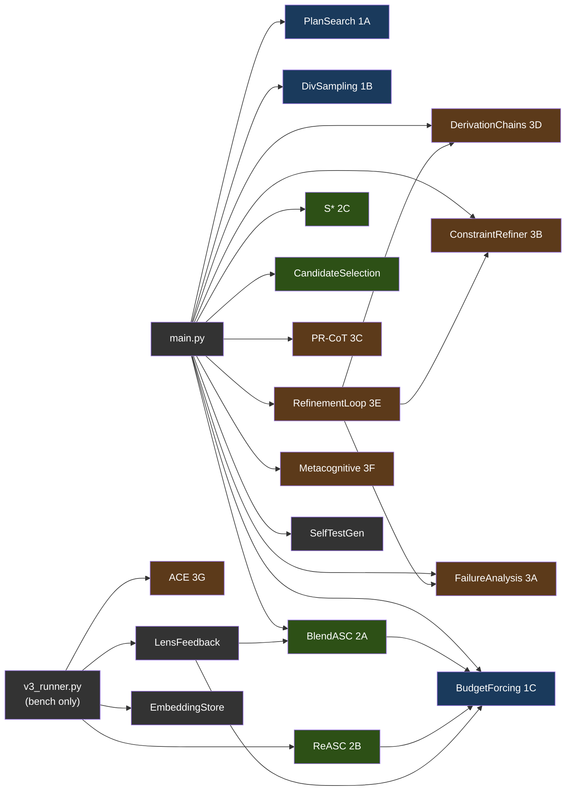

图例：蓝色 = Phase 1（生成），绿色 = Phase 2（选择），棕色 = Phase 3（修复），灰色 = 工具。由 `v3_runner.py` 供给的模块仅用于 bench 运行器；服务不会调用它们。

---

## 5. Geometric Lens

一个神经打分系统，通过分析模型嵌入的几何结构，在不执行代码的情况下评估代码质量。完全运行在 CPU 上。同时也作为项目索引、检索、置信度路由和模式缓存的 RAG API。

#### 为什么叫 "Geometric Lens"？

Geometric Lens 背后的核心理念源自一个简单的前提：停止扩大模型，转而用智能的基础设施把它们包裹起来。Jose Crespo 的 ["Everyone's Wrong About AI Programming"](https://www.josecrespophd.org/p/everyones-wrong-about-ai-programming) 论证了 AI 生成的代码会漂向错误，因为当前的 LLM 工作在扁平的嵌入空间中，正确与错误的代码路径代价相同。解决方案是在模型周围构建一个能量景观，让正确的代码处于"下坡"、错误的代码处于"上坡"。

Anthropic 的 [Manipulating Manifolds](https://transformer-circuits.pub/2025/linebreaks/index.html) 研究提供了证据，表明 transformer 已经在其嵌入空间中创造出可操纵的几何结构 —— 原材料早已存在。Bar 等人的 [Geometric Unification of Generative AI](https://arxiv.org/html/2510.00666v1) 形式化了如何在数据流形上学习并使用距离函数来打分。

ATLAS 用两个互补的模型实现这一点。C(x) 是建立在模型自身嵌入之上的一个习得的能量函数（4096-到-512-到-128-到-1 的 MLP）。每个代码候选都由 llama-server 嵌入，C(x) 给出它在那个几何结构中所处的位置打分。低能量意味着该候选与已知正确的代码聚成一类。高能量意味着它与已知错误的代码聚成一类。无需外部预言机，无需执行 —— 仅仅是模型自身表示的几何结构。

G(x) 是质量预测器 —— 一个建立在 PCA 降维嵌入之上的 XGBoost 分类器，根据候选在降维空间中所处的位置预测通过/失败。当 C(x) 回答"这个候选有多好？"时，G(x) 回答"这个候选可能通过吗？"代码中还存在一条度量张量路径，但未部署：PCA 空间中的一个对角张量（仅在没有 XGBoost 工件时作为回退加载），以及一个计算几何感知梯度步（`-α · G⁻¹ · ∇C`）、沿流形曲率把候选导向下坡的修正引擎。只有该张量的标量可修正性分数被暴露出来（`/internal/lens/correctability`）；梯度步修正并未接入服务。

### 打分模型

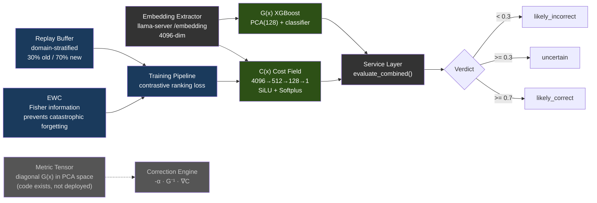

| 模型 | 架构 | 训练数据 | 性能 |
|-------|-------------|---------------|-------------|
| **C(x)** | 4096→512→128→1 MLP (SiLU, Softplus) | 597 个 LCB 嵌入（504 PASS，93 FAIL） | Val AUC 0.9467，分离度 2.04x |
| **G(x)** | PCA(4096→128) + XGBoost | 13,398 个嵌入（4,835 PASS，8,563 FAIL） | PCA 80.8% 方差 |

C(x) 归一化：`1 / (1 + exp(-(energy - 19.0) / 2.0))` → [0, 1]。参数量：2,163,457 —— `cost_field.pt` 在磁盘上为 **8.3 MiB**（十进制 8.65 MB）。算式：4096·512+512 + 512·128+128 + 128·1+1 = 2,163,457 × 4B float32 = 8.25 MiB。

> **注意：** 模型权重（.pt、.pkl 文件）未提交到仓库 —— 它们在训练期间构建，并烘焙进容器镜像或在运行时挂载。当模型文件缺失时，服务会优雅降级：C(x) 返回中性能量，G(x) 返回 `gx_score: 0.5` 和 `verdict: "unavailable"`。训练数据与权重可在 [HuggingFace](https://huggingface.co/datasets/itigges22/ATLAS) 获取。

### RAG / PageIndex V2

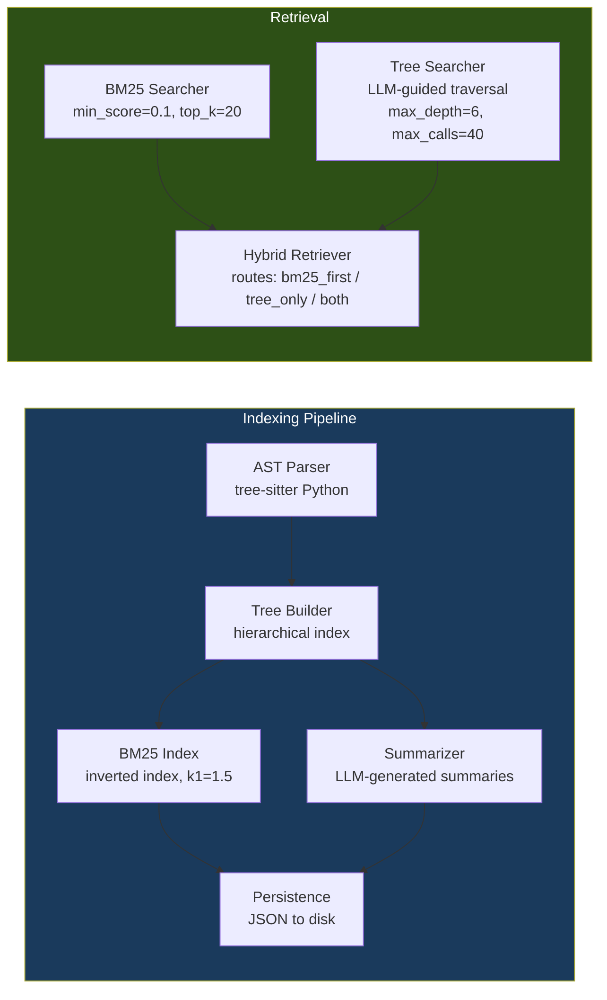

### 置信度路由器与模式缓存

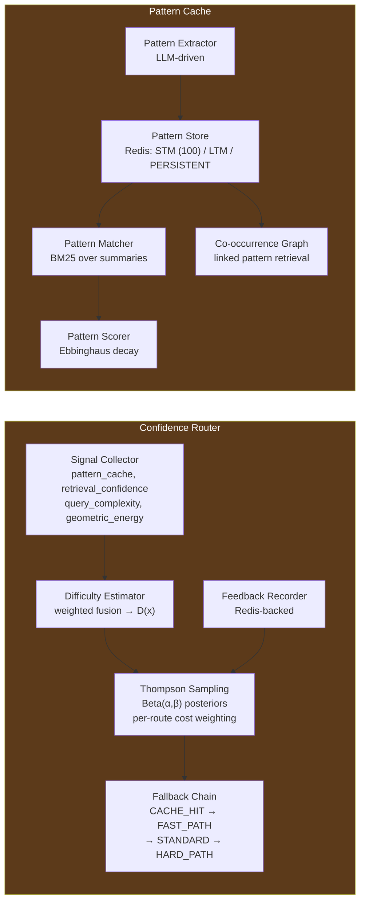

4 条路由采用代价加权的 Thompson Sampling：CACHE_HIT (cost=1, k=0) → FAST_PATH (cost=50, k=1) → STANDARD (cost=300, k=5) → HARD_PATH (cost=1500, k=20)。

---

## 6. Sandbox

带编译、测试和检查的隔离代码执行。

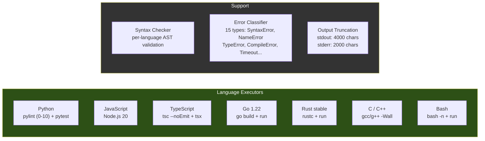

接受的语言别名：`py`/`python3`（Python）、`js`/`node`（JavaScript）、`ts`（TypeScript）、`golang`（Go）、`rs`（Rust）、`c++`（C++）、`sh`/`shell`（Bash）。最大执行时间：Docker 部署中为 300s（compose 设置 `MAX_EXECUTION_TIME=${ATLAS_SANDBOX_MAX_EXECUTION_TIME:-300}` 以匹配代理 5 分钟的 `run_command` 上限；裸代码默认值为 60s）。最大内存：512 MB。两个工作区路径：**`/execute`**（V3 候选测试路径）使用 `/tmp/sandbox`（tmpfs）下的一个临时草稿目录；**`/shell`**（agent 按 PC-188 的 `run_command` 路由，外加用于后台进程的 `/jobs/*`）针对 `/workspace` 运行 —— 即来自 `ATLAS_PROJECT_DIR`（Docker）或 hostPath `${ATLAS_PROJECTS_DIR}`（K3s）绑定挂载的项目根，与代理看到的是同一路径。

---

## 7. VRAM 预算

在 RTX 5060 Ti 16GB 上以 Docker Compose 默认值（32K 上下文）运行：

| 组件 | VRAM |
|-----------|------|
| Qwen3.5-9B-Q6_K 模型权重 | ~6.9 GB |
| KV 缓存（32K 上下文） | ~1.3 GB |
| **llama-server 合计** | **~8.2 GB** |
| Geometric Lens | 0（仅 CPU，模型约 12 MB RAM，PyTorch 运行时约 128 MB） |
| v3-service | 0（仅 CPU） |
| sandbox | 0（仅 CPU） |
| atlas-proxy | 0（Go 二进制，约 30 MB RAM） |
| **空闲 VRAM** | **~7.8 GB** |

llama-server 之外的所有计算都跑在 CPU 上。GPU 仅用于 LLM 推理和嵌入提取。

### 7.1 逐后端的 VRAM 预算

上面的 8.2 GB / 7.8 GB 空闲的拆分是 NVIDIA RTX 5060 Ti 16GB 的基线。其他后端在结构上有所不同：

| 后端 | 报告的 "VRAM" | 负载下的现实预算 | 备注 |
|---|---|---|---|
| **CUDA**（专用 VRAM） | 硬件规格（基准 5060 Ti 上为 16 GB） | 约规格的 95%（驱动保留约 500 MB） | 上表中的数字直接适用。 |
| **ROCm**（专用 VRAM） | 硬件规格 | 约规格的 90–95%（HIP 运行时比 CUDA 的略重） | RX 7900 XTX (24 GB) → 可以从容运行 14B Q5 + 32K 上下文，带 2 个并行 slot。 |
| **Metal**（Apple 统一内存） | 系统总 RAM | 系统 RAM 的 **约 70%** | 操作系统 + 浏览器 + IDE 吃掉约 30%。一台 16 GB 的 MBP 有约 11 GB 的*现实*预算 —— 对 Qwen3.5-9B Q6_K（7.5 GB + 2-4 GB KV 缓存）来说太紧。≤16 GB 用 Q4_K_M（5 GB）；Q6_K 想要 ≥24 GB 统一内存。 |
| **SYCL**（Intel Arc） | 硬件规格 | 未知 —— 发布时待定 | A770 (16 GB) 目标在保守意义上等价于 NVIDIA 16 GB。 |

---

## 8. 部署

### 8.1 Docker Compose —— NVIDIA（默认）

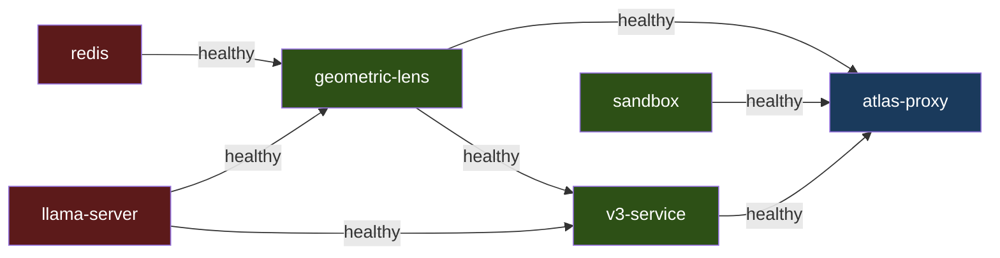

`redis`、`llama-server` 和 `sandbox` 独立启动。`geometric-lens` 等待 `redis` 和 `llama-server` 变为健康；`v3-service` 等待 `llama-server` 和 `geometric-lens`；`atlas-proxy` 等待 `llama-server`、`geometric-lens`、`v3-service` 和 `sandbox`。首次运行会构建容器镜像（数分钟）；后续启动很快。用标准的 `docker compose up -d` 拉起 —— 基础 `docker-compose.yml` 声明了 `driver: nvidia` 的 GPU 预留，它通过主机上的 `nvidia-container-toolkit` 生效。

### 8.2 Docker Compose —— AMD ROCm (V3.1.1)

与 8.1 相同的服务图，但在顶层叠加 ROCm override 来拉起：

```bash
docker compose -f docker-compose.yml -f docker-compose.rocm.yml up -d
```

该 override（`docker-compose.rocm.yml`）做三件事：
1. 把 `llama-server` 的镜像切换为 `atlas-llama-rocm`、构建切换为 `Dockerfile.rocm`（HIP 后端，默认覆盖 RDNA3/RDNA2/CDNA2 的臃肿构建）。
2. 用 `!reset []` 清除基础文件中 NVIDIA 的 `deploy.resources.reservations.devices` 块，然后加入 `/dev/kfd` + `/dev/dri` 设备直通。
3. 加入 `group_add: [video, render]`，使容器能访问 ROCm 设备。
4. 在容器环境中强制 `ATLAS_BACKEND=rocm`，使入口点走 HIP 调优分支。

`atlas-bootstrap.sh` 和 `atlas init` 都会自动检测 AMD GPU 并透明地使用该 override；手动用户只需同时提供两个 `-f` 标志。

ROCm 没有等价于 `nvidia-container-toolkit` 的独立容器运行时 —— 仅靠直通就足够，简化了安装表面。主机前置条件见 SETUP.md（amdgpu-dkms 内核驱动、`render` + `video` 组）。

### 8.3 裸机

`atlas` CLI（`pip install -e .`）直接与各服务在其默认端口上通信。bash 启动脚本既可以把所有服务作为本地进程启动并拉起 atlas-tui 前端，也可以检测到运行中的 Docker Compose 栈并连接到它。只要 `PATH` 上有一个针对正确后端构建的 llama-server 二进制，裸机就能在任何后端（NVIDIA、ROCm、Metal）上工作。

### 8.4 macOS 原生（已发布 —— 混合 Metal 路径，[#32](https://github.com/itigges22/ATLAS/issues/32)）

macOS 无法把 GPU 直通给 Docker 容器，因此 llama-server 无法在 Docker *内部* 跑 Metal 加速。ATLAS 转而提供一条**混合**路径：llama-server 为了推理性能在主机上原生运行（Metal），而其余的栈留在 Docker 中，并通过一个微小的 socat 转发器（`llama-server:8080` → `host.docker.internal:8080`）触达它。其他服务保留它们现有的 `http://llama-server:8080` URL，无需知道自己正在与一个主机进程通信。完整指南：[SETUP_MACOS.md](SETUP_MACOS.md)。

- **llama-server**：由 `scripts/atlas-setup-macos.sh` 用 Metal 原生构建（Homebrew 依赖 + llama.cpp `LLAMA_METAL=1`），安装到 `~/.atlas/macos/bin/llama-server-metal`，由 `scripts/atlas-llama-macos.sh` 启动。
- **proxy / v3-service / geometric-lens / sandbox**：保持不变 —— 它们在 Docker 中运行,与在 Linux 上完全一样，通过 `docker-compose.macos.yml` 中的 socat 转发器指向主机 llama-server。
- **模型**：16 GB 的 Mac 默认使用 Q4_K_M（约 5 GB）以契合统一内存预算；≥24 GB 的 Mac 可以像 Linux 默认那样运行 Q6_K。
- **`atlas doctor`**：一个 `metal-native` 检查验证原生二进制存在、可执行,并在 :8080 监听。

在 Apple Silicon 上，`atlas init` 写入 `ATLAS_BACKEND=metal` 以及 macOS 混合接线，而不是 Docker-GPU 路径（见 `atlas/cli/commands/init.py` 中的 hybrid-metal 分支）。运行 setup 脚本后，用 `docker compose -f docker-compose.yml -f docker-compose.macos.yml up -d` 拉起整个栈。

### 8.5 K3s

`templates/*.yaml.tmpl` 中的清单由 `scripts/generate-manifests.sh`（或 `install.sh` 的 `process_templates` 步骤）使用 `envsubst` 对照 `atlas.conf` 渲染为 `manifests/*.yaml`。各服务作为 Pod 部署在 `atlas` 命名空间；外部访问通过 NodePort（`ATLAS_PROXY_NODEPORT`、`ATLAS_LLAMA_NODEPORT`、`ATLAS_LENS_NODEPORT`、`ATLAS_SANDBOX_NODEPORT`、`ATLAS_V3_NODEPORT`）。K3s 入口点与 Docker Compose 下使用的 `inference/entrypoint-v3.1.sh` 相同 —— 上下文大小、KV 缓存量化、flash attention 和 mlock 都由环境变量（`ATLAS_CONTEXT_LENGTH`、`ATLAS_FLASH_ATTENTION` 等）驱动，因此跨部署模式行为一致。proxy 和 sandbox Pod 都把 `${ATLAS_PROJECTS_DIR}` 以 `hostPath` 挂载到 `/workspace`，使 agent 的工具调用在两个 Pod 中看到相同的文件。

`scripts/deploy-9b.sh` 接受 `--backend cuda|rocm`（或 `ATLAS_BACKEND` 环境变量）来部署设置了相应环境变量的任一镜像。ROCm K8s pod 还额外需要 `/dev/kfd` + `/dev/dri` hostPath 挂载，以及在其 Pod 规格中的 `render`/`video` 组成员身份 —— 这方面的清单模板是 V3.1.2 的工作；仅靠环境变量补丁不足以构成一个可工作的 ROCm K3s 部署。

---

## 9. 数据流

### T1：简单文件写入

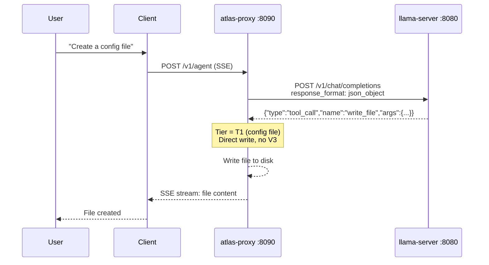

一次 LLM 调用。无 V3 开销。

### T2：功能文件写入

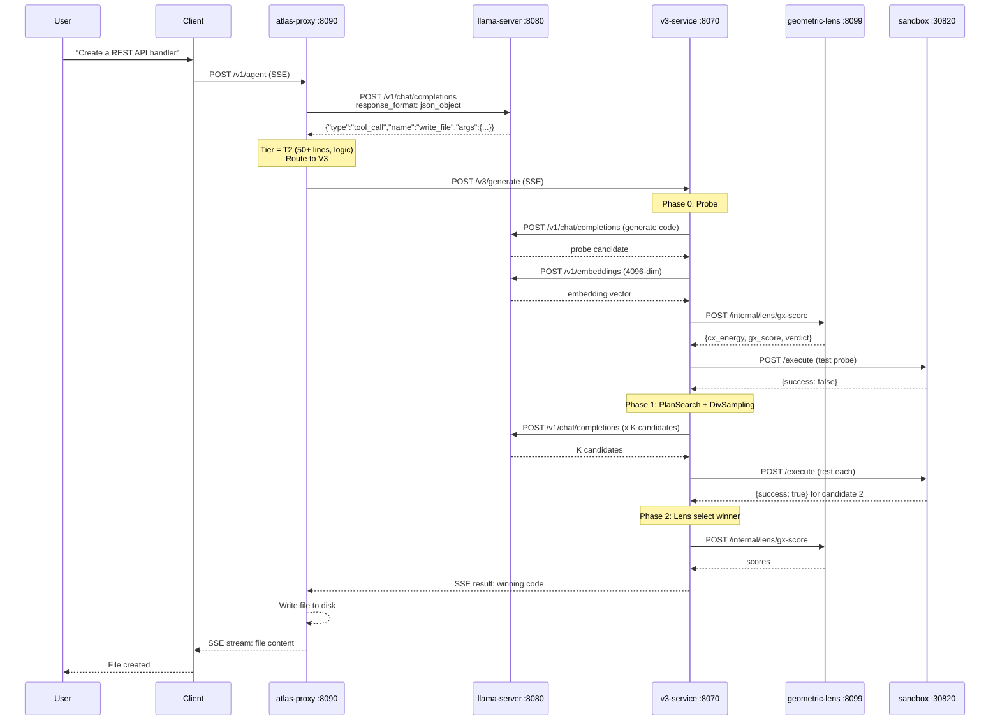

最少 3 次 llama-server 调用（1 次 probe 生成 + 1 次自测生成 + 1 次嵌入提取）。如果 Phase 3 修复启用了所有策略，最多 30+ 次。

### 编辑已有代码

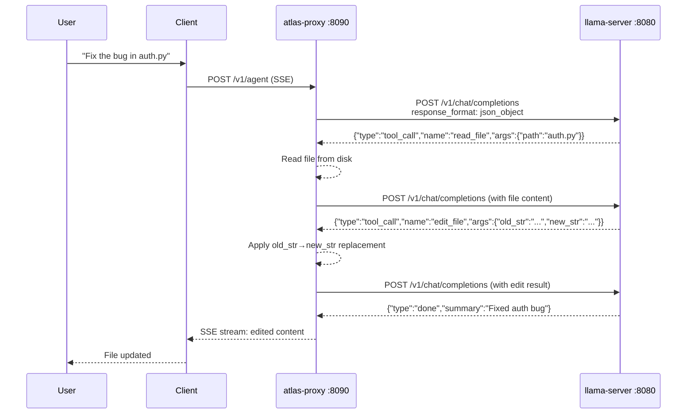

超过 5 行的已有文件对 `write_file` 会被拒绝 —— 模型必须使用 `edit_file`（外科式，≤10 行）或 `ast_edit`（整节点重写，仅 .py/.html/.htm）。在 `.py`/`.html`/`.htm` 文件上，逐步语法门控（BiasBusters #2）会在下一次决策中主动从工具名产生式里禁掉 `edit_file`/`write_file`，使模型无法退回到错误的捷径。
