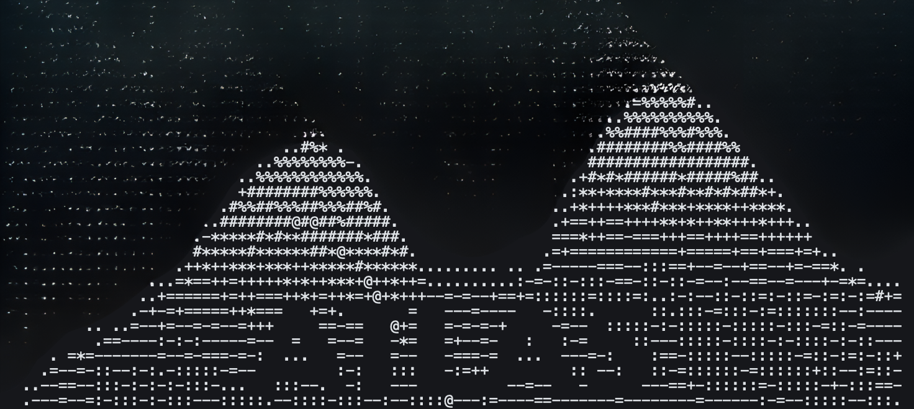

> **[English](../../../README.md)** | **简体中文** | **[日本語](../ja/README.md)** | **[한국어](../ko/README.md)**

  

  
  
  
  

<h1 align="center">A.T.L.A.S.</h1>

<b>Adaptive Test-time Learning and Autonomous Specialization</b>

ATLAS 是一个完全自托管的编程助手，由智能推理基础设施驱动。我们在一个冻结的本地模型之上，构建了约束驱动生成、基于能量的验证以及自验证修复机制 - 无需微调、无需 API 调用、无需云服务。ATLAS 旨在证明：有意义的 AI 工具并不需要前沿模型、云端 API 或巨额预算 - 只需围绕优秀的开源权重模型构建智能基础设施即可。

---

## 最新动态

- **2026-04-05** - **[V3.0.1 发布](../../../CHANGELOG.md)** - 交互式命令行、Docker Compose 部署、95.8% 可靠性
- **2026-04-03** - ["$500 GPU Beats Claude: Local AI Revolution for Web Devs"](https://ownet.it/blog/500-gpu-beats-claude-local-ai-revolution-for-web-devs) - ownet.it
- **2026-03-29** - ["A $500 GPU Just Outscored Claude Sonnet on Coding Benchmarks"](https://aivy.com.au/news/atlas-500-gpu-outperforms-claude-sonnet-coding/) - Aivy
- **2026-03-28** - ["Why a $500 GPU Can Beat Claude Sonnet on Coding Benchmarks"](https://medium.com/data-science-collective/why-a-500-gpu-can-beat-claude-sonnet-on-coding-benchmarks-6c8169ffe4fe) - Data Science Collective
- **2026-03-27** - ["ATLAS: A $500 GPU Outperforms Claude Sonnet"](https://clauday.com/article/b92c5551-b490-4d76-ae3d-d8dedf10d88b) - Clauday
- **2026-03-26** - [Hacker News 首页](https://news.ycombinator.com/item?id=47533297) - 489 点赞、285 条评论
- **2026-03-05** - **[V3.0 发布](../../reports/V3_ABLATION_STUDY.md)** - 在冻结的 Qwen3-14B 上实现 74.6% LiveCodeBench pass@1-v(k=3)
- **2026-02-18** - **[V2.0 发布](../../../CHANGELOG.md)** - 基准测试基础设施、HumanEval/MBPP/LiveCodeBench/GPQA/SciCode 评估套件

---

## ATLAS 的功能

1. **[atlas-proxy](../../ARCHITECTURE.md#3-atlas-proxy-outer-layer)** - 基于 Go 的代理循环，负责编排整个系统。
  - a. [工具调用路由](../../ARCHITECTURE.md#tools) - 按复杂度层级分类文件操作
  - b. [语法强制执行](../../ARCHITECTURE.md#grammar-enforcement) - GBNF 模式保证 100% 有效的 JSON 输出
  - c. [安全限制](../../ARCHITECTURE.md#safety-limits) - 轮次上限、token 预算、超时控制

2. **[V3 Pipeline](../../ARCHITECTURE.md#4-v3-pipeline-inner-layer)** - 多阶段代码生成流程，将单个提示词转化为经过验证的高质量输出。
  - a. [PlanSearch](../../reports/V3_ABLATION_STUDY.md#phase-1-constraint-driven-generation-124pp) - 约束驱动的结构化规划
  - b. [DivSampling](../../reports/V3_ABLATION_STUDY.md#phase-1-constraint-driven-generation-124pp) - 跨温度和策略的多样化候选生成
  - c. [Budget Forcing](../../reports/V3_ABLATION_STUDY.md#phase-1-constraint-driven-generation-124pp) - 按阶段控制思维 token 分配
  - d. [PR-CoT Repair](../../reports/V3_ABLATION_STUDY.md#pr-cot-repair-36-rescues) - 自生成测试用例的迭代修复循环
  - e. [Refinement Loops](../../reports/V3_ABLATION_STUDY.md#refinement-loop-6-rescues) - 反复进行沙箱验证与修正
  - f. [Derivation Chains](../../reports/V3_ABLATION_STUDY.md#derivation-chains-0-rescues) - 针对复杂问题的多步推理

3. **[Geometric Lens](../../ARCHITECTURE.md#5-geometric-lens)** - 基于能量的评分与检索系统，无需外部预言机。（[什么是 "Geometric Lens"？](../../ARCHITECTURE.md#why-geometric-lens)）
  - a. [C(x) Cost Field](../../ARCHITECTURE.md#scoring-models) - 从嵌入向量评分候选质量的 MLP
  - b. [G(x) Quality Prediction](../../ARCHITECTURE.md#scoring-models) - 用于选择决策的 XGBoost 模型
  - c. [RAG / PageIndex V2](../../ARCHITECTURE.md#rag--pageindex-v2) - AST 感知的代码检索与项目索引
  - d. [Confidence Router](../../ARCHITECTURE.md#confidence-router--pattern-cache) - Thompson Sampling 将算力分配到最需要的地方

4. **[Sandbox](../../ARCHITECTURE.md#6-sandbox)** - 用于构建验证的隔离执行环境。
  - a. 多语言执行 - 支持 Python、Rust、Go、C、Shell 等
  - b. 编译与检查 - 评分前进行语法验证
  - c. 测试运行 - 执行生成的和已有的测试套件

5. **[llama-server](../../CONFIGURATION.md#6-llama-server)** - 在单块消费级 GPU 上进行本地 LLM 推理。
  - a. CUDA 加速 - 量化模型推理（Q6_K / Q4_K_M）
  - b. 语法约束解码 - 在 token 级别实现结构化输出
  - c. 自嵌入 - 无需额外模型即可提取嵌入向量

6. **[交互式命令行](../../CLI.md)** - 在任意项目目录中输入 `atlas` 即可开始构建。
  - a. [工具调用代理循环](../../CLI.md#streaming-output) - 读取、写入、编辑、删除、运行命令
  - b. [流式输出](../../CLI.md#how-streaming-works) - 通过 SSE 实时响应
  - c. [项目感知上下文](../../CLI.md#proxy-file-access) - 自动发现和注入文件

完整文档（包括安装指南、架构说明、配置参考、故障排除和基准测试报告）位于 [docs/](../../) 目录中。

---

## 快速开始

ATLAS 需要一块 16GB+ 显存的 GPU、Docker（配合 nvidia-container-toolkit）或 Podman，以及 Python 3.9+。目前已在 NVIDIA GPU 上测试通过 - ATLAS 并非 NVIDIA 专用，AMD GPU 的 ROCm 支持已列入路线图。完整安装说明请参见 **[SETUP.md](../../SETUP.md)**，涵盖 Docker Compose、裸机和 K3s 部署方式。启动后，在任意项目目录中输入 `atlas` 即可开始构建。

---

## 已知限制

- **仅在 NVIDIA 上测试** - ATLAS 使用 llama.cpp 进行推理，该引擎支持多种加速后端。ROCm 支持是 V3.1 的优先事项。
- **9B 模型尚未正式基准测试** - 命令行工具搭载 Qwen3.5-9B 和完整的 V3 Pipeline，但正式的 LiveCodeBench 分数来自 14B 模型。9B 基准测试属于 V3.1 工作。
- **复杂功能添加可能失败** - 向现有项目添加功能的成功率约为 67%。模型有时过度探索而非编写代码。
- **语法约束推理速度** - 在 llama-server 上约 51 tok/s。更快的语法集成计划在 V3.1 中实现。

---

## 路线图

**V3.0.1** - 当前版本。交互式命令行、Docker Compose 部署、V3 Pipeline 集成。

**V3.1** - 开发中。
- ROCm 支持 - 通过 llama.cpp ROCm 后端实现 AMD GPU 推理
- 正式 9B 基准测试 - 在 Qwen3.5-9B 上运行 LiveCodeBench、GPQA Diamond、SciCode
- 命令行可靠性 - 扩展测试，目标 L6 >= 90%
- 语法速度 - C 端采样器链，实现更快的约束解码

---

## 参与贡献

我们以开源方式构建 ATLAS，并积极寻找贡献者和核心维护者。无论你是修复 bug、添加加速器支持，还是重新设计某个子系统 - 这里都有你的位置。如果你认为开源模型值得拥有更好的基础设施，欢迎加入我们一起构建。

详见 **[CONTRIBUTING.md](../../../CONTRIBUTING.md)**。

---

## 许可证

基于 [GNU Affero General Public License v3.0 (AGPL-3.0)](../../../LICENSE) 许可发布。
